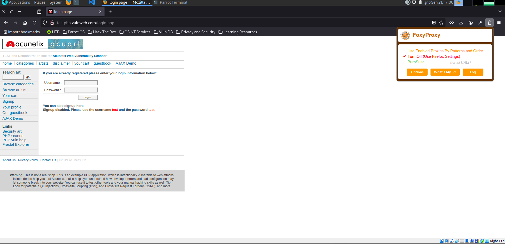
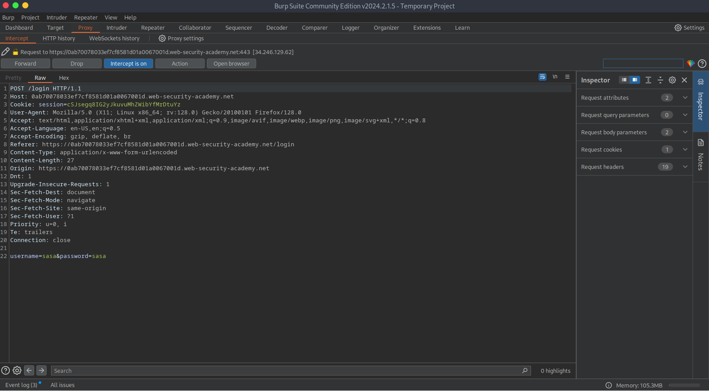
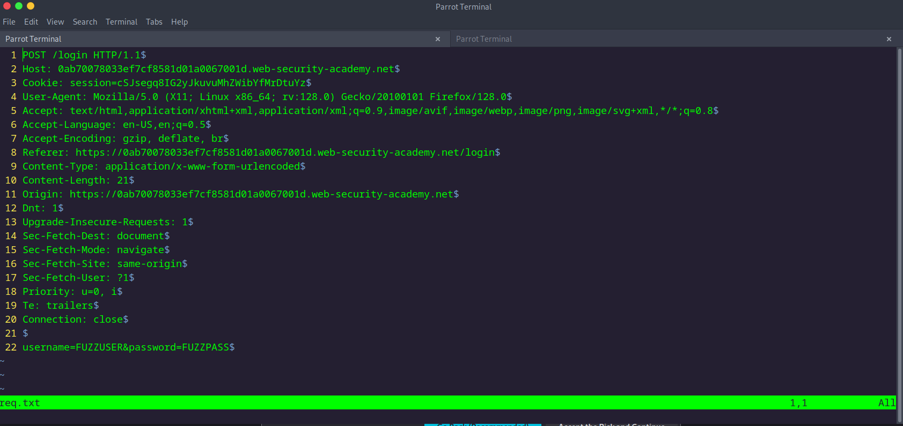

# Web Fuzzing with ffuf

There are many tools available for directory and parameter fuzzing and brute-forcing on web applications. One of these tools, and my personal favorite due to its versatility, speed, and ease of use, is FFUF, written in Go.

List of things that can be done with FFUF:

* _Fuzzing for directories_
* _Fuzzing for files and extensions_
* _Identifying hidden vhosts_
* _Fuzzing for PHP parameters_
* _Fuzzing for parameter value_

FFUF installation:

```bash
┌─[tofiq@parrot]─[~]
└──╼ $sudo apt install ffuf
Reading package lists... Done
Building dependency tree... Done
Reading state information... Done
ffuf is already the newest version (2.1.0-1parrot4).
The following packages were automatically installed and are no longer required:
  golang-1.21-go golang-1.21-src ibverbs-providers libboost-iostreams1.74.0
  libcephfs2 libfmt9 libgfapi0 libgfrpc0 libgfxdr0 libglusterfs0 libibverbs1
  libjsoncpp25 librados2 librdmacm1 samba-ad-provision samba-dsdb-modules
  samba-vfs-modules
Use 'sudo apt autoremove' to remove them.
0 upgraded, 0 newly installed, 0 to remove and 31 not upgraded.
```

Since it's our first time using it, let's find out information about the tool using the -h option:

```bash
┌─[tofiq@parrot]─[~]
└──╼ $ffuf -h
Fuzz Faster U Fool - v2.1.0-dev

HTTP OPTIONS:
  -H                  Header `"Name: Value"`, separated by colon. Multiple -H flags are accepted.
  -X                  HTTP method to use
  -b                  Cookie data `"NAME1=VALUE1; NAME2=VALUE2"` for copy as curl functionality.
  -cc                 Client cert for authentication. Client key needs to be defined as well for this to work
  -ck                 Client key for authentication. Client certificate needs to be defined as well for this to work
  -d                  POST data
  -http2              Use HTTP2 protocol (default: false)
  -ignore-body        Do not fetch the response content. (default: false)
  -r                  Follow redirects (default: false)
  -raw                Do not encode URI (default: false)
  -recursion          Scan recursively. Only FUZZ keyword is supported, and URL (-u) has to end in it. (default: false)
  -recursion-depth    Maximum recursion depth. (default: 0)
  -recursion-strategy Recursion strategy: "default" for a redirect based, and "greedy" to recurse on all matches (default: default)
  -replay-proxy       Replay matched requests using this proxy.
  -sni                Target TLS SNI, does not support FUZZ keyword
  -timeout            HTTP request timeout in seconds. (default: 10)
  -u                  Target URL
  -x                  Proxy URL (SOCKS5 or HTTP). For example: http://127.0.0.1:8080 or socks5://127.0.0.1:8080

GENERAL OPTIONS:
  -V                  Show version information. (default: false)
  -ac                 Automatically calibrate filtering options (default: false)
  -acc                Custom auto-calibration string. Can be used multiple times. Implies -ac
  -ach                Per host autocalibration (default: false)
  -ack                Autocalibration keyword (default: FUZZ)
  -acs                Custom auto-calibration strategies. Can be used multiple times. Implies -ac
  -c                  Colorize output. (default: false)
  -config             Load configuration from a file
  -json               JSON output, printing newline-delimited JSON records (default: false)
  -maxtime            Maximum running time in seconds for entire process. (default: 0)
  -maxtime-job        Maximum running time in seconds per job. (default: 0)
  -noninteractive     Disable the interactive console functionality (default: false)
  -p                  Seconds of `delay` between requests, or a range of random delay. For example "0.1" or "0.1-2.0"
  -rate               Rate of requests per second (default: 0)
  -s                  Do not print additional information (silent mode) (default: false)
  -sa                 Stop on all error cases. Implies -sf and -se. (default: false)
  -scraperfile        Custom scraper file path
  -scrapers           Active scraper groups (default: all)
  -se                 Stop on spurious errors (default: false)
  -search             Search for a FFUFHASH payload from ffuf history
  -sf                 Stop when > 95% of responses return 403 Forbidden (default: false)
  -t                  Number of concurrent threads. (default: 40)
  -v                  Verbose output, printing full URL and redirect location (if any) with the results. (default: false)

MATCHER OPTIONS:
  -mc                 Match HTTP status codes, or "all" for everything. (default: 200-299,301,302,307,401,403,405,500)
  -ml                 Match amount of lines in response
  -mmode              Matcher set operator. Either of: and, or (default: or)
  -mr                 Match regexp
  -ms                 Match HTTP response size
  -mt                 Match how many milliseconds to the first response byte, either greater or less than. EG: >100 or <100
  -mw                 Match amount of words in response

FILTER OPTIONS:
  -fc                 Filter HTTP status codes from response. Comma separated list of codes and ranges
  -fl                 Filter by amount of lines in response. Comma separated list of line counts and ranges
  -fmode              Filter set operator. Either of: and, or (default: or)
  -fr                 Filter regexp
  -fs                 Filter HTTP response size. Comma separated list of sizes and ranges
  -ft                 Filter by number of milliseconds to the first response byte, either greater or less than. EG: >100 or <100
  -fw                 Filter by amount of words in response. Comma separated list of word counts and ranges

INPUT OPTIONS:
  -D                  DirSearch wordlist compatibility mode. Used in conjunction with -e flag. (default: false)
  -e                  Comma separated list of extensions. Extends FUZZ keyword.
  -enc                Encoders for keywords, eg. 'FUZZ:urlencode b64encode'
  -ic                 Ignore wordlist comments (default: false)
  -input-cmd          Command producing the input. --input-num is required when using this input method. Overrides -w.
  -input-num          Number of inputs to test. Used in conjunction with --input-cmd. (default: 100)
  -input-shell        Shell to be used for running command
  -mode               Multi-wordlist operation mode. Available modes: clusterbomb, pitchfork, sniper (default: clusterbomb)
  -request            File containing the raw http request
  -request-proto      Protocol to use along with raw request (default: https)
  -w                  Wordlist file path and (optional) keyword separated by colon. eg. '/path/to/wordlist:KEYWORD'

OUTPUT OPTIONS:
  -debug-log          Write all of the internal logging to the specified file.
  -o                  Write output to file
  -od                 Directory path to store matched results to.
  -of                 Output file format. Available formats: json, ejson, html, md, csv, ecsv (or, 'all' for all formats) (default: json)
  -or                 Don't create the output file if we don't have results (default: false)

EXAMPLE USAGE:
  Fuzz file paths from wordlist.txt, match all responses but filter out those with content-size 42.
  Colored, verbose output.
    ffuf -w wordlist.txt -u https://example.org/FUZZ -mc all -fs 42 -c -v

  Fuzz Host-header, match HTTP 200 responses.
    ffuf -w hosts.txt -u https://example.org/ -H "Host: FUZZ" -mc 200

  Fuzz POST JSON data. Match all responses not containing text "error".
    ffuf -w entries.txt -u https://example.org/ -X POST -H "Content-Type: application/json" \
      -d '{"name": "FUZZ", "anotherkey": "anothervalue"}' -fr "error"

  Fuzz multiple locations. Match only responses reflecting the value of "VAL" keyword. Colored.
    ffuf -w params.txt:PARAM -w values.txt:VAL -u https://example.org/?PARAM=VAL -mr "VAL" -c

  More information and examples: https://github.com/ffuf/ffuf
```

We have a lot of things here.Let's start with the simplest usage. The wordlist we need to perform directory parameter brute-forcing is called SecLists. You can download it to your own machine from the [GitHub](https://github.com/danielmiessler/SecLists) repository.

I will provide my own examples based on HTB (Hack The Box) challenges.

```bash
┌─[tofiq@parrot]─[~]
└──╼ $ffuf -w /usr/share/seclists/Discovery/Web-Content/directory-list-2.3-medium.txt -u http://94.237.48.173:48020/webfuzzing_hidden_path/FUZZ

        /'___\  /'___\           /'___\
       /\ \__/ /\ \__/  __  __  /\ \__/
       \ \ ,__\\ \ ,__\/\ \/\ \ \ \ ,__\
        \ \ \_/ \ \ \_/\ \ \_\ \ \ \ \_/
         \ \_\   \ \_\  \ \____/  \ \_\
          \/_/    \/_/   \/___/    \/_/

       v2.1.0-dev
________________________________________________

 :: Method           : GET
 :: URL              : http://94.237.48.173:48020/webfuzzing_hidden_path/FUZZ
 :: Wordlist         : FUZZ: /usr/share/seclists/Discovery/Web-Content/directory-list-2.3-medium.txt
 :: Follow redirects : false
 :: Calibration      : false
 :: Timeout          : 10
 :: Threads          : 40
 :: Matcher          : Response status: 200-299,301,302,307,401,403,405,500
________________________________________________

#                       [Status: 403, Size: 158, Words: 17, Lines: 11, Duration: 99ms]
                        [Status: 403, Size: 158, Words: 17, Lines: 11, Duration: 95ms]
# directory-list-2.3-medium.txt [Status: 403, Size: 158, Words: 17, Lines: 11, Duration: 99ms]
# on at least 2 different hosts [Status: 403, Size: 158, Words: 17, Lines: 11, Duration: 99ms]
#                       [Status: 403, Size: 158, Words: 17, Lines: 11, Duration: 99ms]
# Attribution-Share Alike 3.0 License. To view a copy of this [Status: 403, Size: 158, Words: 17, Lines: 11, Duration: 99ms]
#                       [Status: 403, Size: 158, Words: 17, Lines: 11, Duration: 95ms]
# or send a letter to Creative Commons, 171 Second Street, [Status: 403, Size: 158, Words: 17, Lines: 11, Duration: 96ms]
# Suite 300, San Francisco, California, 94105, USA. [Status: 403, Size: 158, Words: 17, Lines: 11, Duration: 104ms]
# This work is licensed under the Creative Commons [Status: 403, Size: 158, Words: 17, Lines: 11, Duration: 104ms]
# Copyright 2007 James Fisher [Status: 403, Size: 158, Words: 17, Lines: 11, Duration: 106ms]
#                       [Status: 403, Size: 158, Words: 17, Lines: 11, Duration: 105ms]
# Priority ordered case-sensitive list, where entries were found [Status: 403, Size: 158, Words: 17, Lines: 11, Duration: 105ms]
# license, visit http://creativecommons.org/licenses/by-sa/3.0/ [Status: 403, Size: 158, Words: 17, Lines: 11, Duration: 106ms]
flag                    [Status: 301, Size: 0, Words: 1, Lines: 1, Duration: 95ms]
[WARN] Caught keyboard interrupt (Ctrl-C)
```

Now, let’s explain what we are doing:

* With the -w option, we provided our wordlist. The wordlist we used here is one of my most frequently used ones (directory-list-2.3-medium.txt).
* Using the -u option, we specified the target website's address and, if applicable, its port.
* Finally, we need to tell FFUF where to place the words from the wordlist, and for this, we append /FUZZ at the end of the URL.

In the simplest terms, this allows us to perform directory fuzzing. Now, let’s make things a bit more complex. As we know, sometimes extensions can be added to directories, so what do we do in this case?

There are a few different methods we can use, and the simplest one is to use the -e option:

```bash
┌─[tofiq@parrot]─[~]
└──╼ $ffuf -w /usr/share/seclists/Discovery/Web-Content/directory-list-2.3-medium.txt -u http://94.237.48.173:48020/webfuzzing_hidden_path/flag/FUZZ -e .html

        /'___\  /'___\           /'___\
       /\ \__/ /\ \__/  __  __  /\ \__/
       \ \ ,__\\ \ ,__\/\ \/\ \ \ \ ,__\
        \ \ \_/ \ \ \_/\ \ \_\ \ \ \ \_/
         \ \_\   \ \_\  \ \____/  \ \_\
          \/_/    \/_/   \/___/    \/_/

       v2.1.0-dev
________________________________________________

 :: Method           : GET
 :: URL              : http://94.237.48.173:48020/webfuzzing_hidden_path/flag/FUZZ
 :: Wordlist         : FUZZ: /usr/share/seclists/Discovery/Web-Content/directory-list-2.3-medium.txt
 :: Extensions       : .html
 :: Follow redirects : false
 :: Calibration      : false
 :: Timeout          : 10
 :: Threads          : 40
 :: Matcher          : Response status: 200-299,301,302,307,401,403,405,500
________________________________________________

#.html                  [Status: 200, Size: 104, Words: 6, Lines: 2, Duration: 85ms]
# directory-list-2.3-medium.txt.html [Status: 200, Size: 104, Words: 6, Lines: 2, Duration: 86ms]
#                       [Status: 200, Size: 104, Words: 6, Lines: 2, Duration: 87ms]
# Copyright 2007 James Fisher.html [Status: 200, Size: 104, Words: 6, Lines: 2, Duration: 88ms]
# This work is licensed under the Creative Commons [Status: 200, Size: 104, Words: 6, Lines: 2, Duration: 89ms]
#                       [Status: 200, Size: 104, Words: 6, Lines: 2, Duration: 89ms]
#.html                  [Status: 200, Size: 104, Words: 6, Lines: 2, Duration: 91ms]
# directory-list-2.3-medium.txt [Status: 200, Size: 104, Words: 6, Lines: 2, Duration: 91ms]
# This work is licensed under the Creative Commons.html [Status: 200, Size: 104, Words: 6, Lines: 2, Duration: 91ms]
# on at least 2 different hosts.html [Status: 200, Size: 104, Words: 6, Lines: 2, Duration: 90ms]
# Priority ordered case-sensitive list, where entries were found [Status: 200, Size: 104, Words: 6, Lines: 2, Duration: 92ms]
# on at least 2 different hosts [Status: 200, Size: 104, Words: 6, Lines: 2, Duration: 92ms]
# Copyright 2007 James Fisher [Status: 200, Size: 104, Words: 6, Lines: 2, Duration: 103ms]
                        [Status: 200, Size: 104, Words: 6, Lines: 2, Duration: 102ms]
#                       [Status: 200, Size: 104, Words: 6, Lines: 2, Duration: 103ms]
#.html                  [Status: 200, Size: 104, Words: 6, Lines: 2, Duration: 103ms]
#.html                  [Status: 200, Size: 104, Words: 6, Lines: 2, Duration: 103ms]
# Attribution-Share Alike 3.0 License. To view a copy of this [Status: 200, Size: 104, Words: 6, Lines: 2, Duration: 102ms]
# or send a letter to Creative Commons, 171 Second Street, [Status: 200, Size: 104, Words: 6, Lines: 2, Duration: 103ms]
# license, visit http://creativecommons.org/licenses/by-sa/3.0/.html [Status: 200, Size: 104, Words: 6, Lines: 2, Duration: 102ms]
#                       [Status: 200, Size: 104, Words: 6, Lines: 2, Duration: 104ms]
index.html              [Status: 200, Size: 104, Words: 6, Lines: 2, Duration: 103ms]
# Priority ordered case-sensitive list, where entries were found.html [Status: 200, Size: 104, Words: 6, Lines: 2, Duration: 107ms]
# license, visit http://creativecommons.org/licenses/by-sa/3.0/ [Status: 200, Size: 104, Words: 6, Lines: 2, Duration: 107ms]
# Suite 300, San Francisco, California, 94105, USA..html [Status: 200, Size: 104, Words: 6, Lines: 2, Duration: 107ms]
# or send a letter to Creative Commons, 171 Second Street,.html [Status: 200, Size: 104, Words: 6, Lines: 2, Duration: 107ms]
# Suite 300, San Francisco, California, 94105, USA. [Status: 200, Size: 104, Words: 6, Lines: 2, Duration: 107ms]
# Attribution-Share Alike 3.0 License. To view a copy of this.html [Status: 200, Size: 104, Words: 6, Lines: 2, Duration: 108ms]
flag.html               [Status: 200, Size: 100, Words: 2, Lines: 2, Duration: 106ms]
[WARN] Caught keyboard interrupt (Ctrl-C)
```

Here, I only used one extension, but you are free to use multiple. However, it's important to remember that when we increase the number of extensions, we end up sending tens or even hundreds of thousands of requests to the site continuously. This may not always be a good idea.

Now, let's discuss FFUF's recursion feature.

```bash
┌─[tofiq@parrot]─[~]
└──╼ $ffuf -w /usr/share/seclists/Discovery/Web-Content/directory-list-2.3-medium.txt -u http://94.237.61.58:57374/recursive_fuzz/FUZZ -recursion -recursion-depth 2 -rate 500 -ic

        /'___\  /'___\           /'___\
       /\ \__/ /\ \__/  __  __  /\ \__/
       \ \ ,__\\ \ ,__\/\ \/\ \ \ \ ,__\
        \ \ \_/ \ \ \_/\ \ \_\ \ \ \ \_/
         \ \_\   \ \_\  \ \____/  \ \_\
          \/_/    \/_/   \/___/    \/_/

       v2.1.0-dev
________________________________________________

 :: Method           : GET
 :: URL              : http://94.237.61.58:57374/recursive_fuzz/FUZZ
 :: Wordlist         : FUZZ: /usr/share/seclists/Discovery/Web-Content/directory-list-2.3-medium.txt
 :: Follow redirects : false
 :: Calibration      : false
 :: Timeout          : 10
 :: Threads          : 40
 :: Matcher          : Response status: 200-299,301,302,307,401,403,405,500
________________________________________________

                        [Status: 403, Size: 158, Words: 17, Lines: 11, Duration: 89ms]
level1                  [Status: 301, Size: 0, Words: 1, Lines: 1, Duration: 84ms]
[INFO] Adding a new job to the queue: http://94.237.61.58:57374/recursive_fuzz/level1/FUZZ

                        [Status: 403, Size: 158, Words: 17, Lines: 11, Duration: 91ms]
[INFO] Starting queued job on target: http://94.237.61.58:57374/recursive_fuzz/level1/FUZZ

                        [Status: 200, Size: 111, Words: 8, Lines: 2, Duration: 97ms]
level2                  [Status: 301, Size: 0, Words: 1, Lines: 1, Duration: 82ms]
[INFO] Adding a new job to the queue: http://94.237.61.58:57374/recursive_fuzz/level1/level2/FUZZ

[WARN] Caught keyboard interrupt (Ctrl-C)

[INFO] Starting queued job on target: http://94.237.61.58:57374/recursive_fuzz/level1/level2/FUZZ

[WARN] Caught keyboard interrupt (Ctrl-C)
```

As we can see, it found a directory named level1. The information provided in the INFO section is very valuable.

If you are using recursion, FFUF will start scanning every directory that returns a 301 status code with the same wordlist after the current scan is completed. After finding level1, we were able to discover level2 underneath it.


1. `recursion-depth`: This flag allows you to set a maximum depth for recursive exploration.
2. `-recursion-depth 2` limits fuzzing to two levels deep (the starting directory and its immediate subdirectories).
3. `-rate`: You can control the rate at which `ffuf` sends requests per second, preventing the server from being overloaded.
4. `-timeout`: This option sets the timeout for individual requests, helping to prevent the fuzzer from hanging on unresponsive targets.

Now, let's take a look at another feature of FFUF: **subdomain fuzzing**.

A sub-domain is any website underlying another domain. For example, security.c0nfig.net is the sub-domain of c0nfig.net

The SecLists wordlist will help us discover subdomains. Under `SecLists/Discovery/DNS`, it provides wordlists of different sizes for us to choose from.

```bash
┌─[tofiq@parrot]─[~]
└──╼ $ffuf -u https://inlanefreight.com -w /usr/share/seclists/Discovery/DNS/subdomains-top1million-5000.txt -H 'HOST:FUZZ.inlanefreight.com' -fs 0

        /'___\  /'___\           /'___\
       /\ \__/ /\ \__/  __  __  /\ \__/
       \ \ ,__\\ \ ,__\/\ \/\ \ \ \ ,__\
        \ \ \_/ \ \ \_/\ \ \_\ \ \ \ \_/
         \ \_\   \ \_\  \ \____/  \ \_\
          \/_/    \/_/   \/___/    \/_/

       v2.1.0-dev
________________________________________________

 :: Method           : GET
 :: URL              : https://inlanefreight.com
 :: Wordlist         : FUZZ: /usr/share/seclists/Discovery/DNS/subdomains-top1million-5000.txt
 :: Header           : Host: FUZZ.inlanefreight.com
 :: Follow redirects : false
 :: Calibration      : false
 :: Timeout          : 10
 :: Threads          : 40
 :: Matcher          : Response status: 200-299,301,302,307,401,403,405,500
 :: Filter           : Response size: 0
________________________________________________

www                     [Status: 200, Size: 22266, Words: 2903, Lines: 316, Duration: 3281ms]
```

For subdomain scanning, our syntax will look like this: FFUF can sometimes give us false positives. To filter these out, you can use -fs \[size] to exclude responses of a certain size, just like I did.

Parameter Fuzzing - **GET**

Similarly to how we have been fuzzing various parts of a website, we will use ffuf to enumerate parameters. Let us first start with fuzzing for GET requests, which are usually passed right after the URL, with a ? symbol, like:

http://admin.academy.htb:PORT/admin/admin.php?param1=key

So, all we have to do is replace param1 in the example above with FUZZ and rerun our scan. Before we can start, however, we must pick an appropriate wordlist. Once again, SecLists has just that in /opt/useful/SecLists/Discovery/Web-Content/burp-parameter-names.txt. With that, we can run our scan.\


```bash
┌─[tofiq@parrot]─[~]
└──╼ $ffuf -w /usr/share/seclists/Discovery/Web-Content/burp-parameter-names.txt:FUZZ -u http://admin.academy.htb:34583/admin/admin.php?FUZZ=key -fs 798

        /'___\  /'___\           /'___\
       /\ \__/ /\ \__/  __  __  /\ \__/
       \ \ ,__\\ \ ,__\/\ \/\ \ \ \ ,__\
        \ \ \_/ \ \ \_/\ \ \_\ \ \ \ \_/
         \ \_\   \ \_\  \ \____/  \ \_\
          \/_/    \/_/   \/___/    \/_/

       v2.1.0-dev
________________________________________________

 :: Method           : GET
 :: URL              : http://admin.academy.htb:34583/admin/admin.php?FUZZ=key
 :: Wordlist         : FUZZ: /usr/share/seclists/Discovery/Web-Content/burp-parameter-names.txt
 :: Follow redirects : false
 :: Calibration      : false
 :: Timeout          : 10
 :: Threads          : 40
 :: Matcher          : Response status: 200-299,301,302,307,401,403,405,500
 :: Filter           : Response size: 798
________________________________________________

user                    [Status: 200, Size: 783, Words: 221, Lines: 54, Duration: 87ms]
:: Progress: [6453/6453] :: Job [1/1] :: 453 req/sec :: Duration: [0:00:20] :: Errors: 0 ::
```

Now, let’s talk about one of my favorite features of FFUF: **brute forcing**.

For those who use Burp, you know that the Community Edition can be quite slow and often unusable. However, we can significantly speed up this process using FFUF for free.

First, we need to change our browser's proxy settings to work with Burp. For this, using the FoxyProxy tool is ideal.

<figure><figcaption></figcaption></figure>

After that, we open Burp Suite and ensure that 'Intercept is on' in the Proxy window. Now, our browser traffic is flowing through Burp Suite. Let's send a test request with a username and password to our site.

<figure><figcaption></figcaption></figure>

As we can see, we intercepted the request with Burp. We need to save this request to our machine. Then, we’ll need to make a small modification in the username and password.

<figure><figcaption></figcaption></figure>

We used the keywords FUZZUSER and FUZZPASS in the username and password fields. The reason for this is to inform FFUF which parameters to use when sending the words from the wordlist.

```bash
┌─[tofiq@parrot]─[~/Documents]
└──╼ $ffuf -request req.txt -request-proto https -mode clusterbomb -w username:FUZZUSER -w password:FUZZPASS

        /'___\  /'___\           /'___\
       /\ \__/ /\ \__/  __  __  /\ \__/
       \ \ ,__\\ \ ,__\/\ \/\ \ \ \ ,__\
        \ \ \_/ \ \ \_/\ \ \_\ \ \ \ \_/
         \ \_\   \ \_\  \ \____/  \ \_\
          \/_/    \/_/   \/___/    \/_/

       v2.1.0-dev
________________________________________________

 :: Method           : POST
 :: URL              : https://0ab70078033ef7cf8581d01a0067001d.web-security-academy.net/login
 :: Wordlist         : FUZZUSER: /home/htb-ac-1445179/username
 :: Wordlist         : FUZZPASS: /home/htb-ac-1445179/password
 :: Header           : Cookie: session=cSJsegq8IG2yJkuvuMhZWibYfMrDtuYz
 :: Header           : Accept: text/html,application/xhtml+xml,application/xml;q=0.9,image/avif,image/webp,image/png,image/svg+xml,*/*;q=0.8
 :: Header           : Accept-Encoding: gzip, deflate, br
 :: Header           : Origin: https://0ab70078033ef7cf8581d01a0067001d.web-security-academy.net
 :: Header           : Dnt: 1
 :: Header           : Sec-Fetch-Site: same-origin
 :: Header           : Priority: u=0, i
 :: Header           : User-Agent: Mozilla/5.0 (X11; Linux x86_64; rv:128.0) Gecko/20100101 Firefox/128.0
 :: Header           : Upgrade-Insecure-Requests: 1
 :: Header           : Sec-Fetch-User: ?1
 :: Header           : Te: trailers
 :: Header           : Host: 0ab70078033ef7cf8581d01a0067001d.web-security-academy.net
 :: Header           : Referer: https://0ab70078033ef7cf8581d01a0067001d.web-security-academy.net/login
 :: Header           : Accept-Language: en-US,en;q=0.5
 :: Header           : Content-Type: application/x-www-form-urlencoded
 :: Header           : Sec-Fetch-Dest: document
 :: Header           : Sec-Fetch-Mode: navigate
 :: Header           : Connection: close
 :: Data             : username=FUZZUSER&password=FUZZPASS

 :: Follow redirects : false
 :: Calibration      : false
 :: Timeout          : 10
 :: Threads          : 40
 :: Matcher          : Response status: 200-299,301,302,307,401,403,405,500
________________________________________________

[Status: 200, Size: 6269, Words: 2115, Lines: 95, Duration: 41ms]
    * FUZZPASS: 123456
    * FUZZUSER: academico

[Status: 200, Size: 6269, Words: 2115, Lines: 95, Duration: 54ms]
    * FUZZPASS: 123456
    * FUZZUSER: administracion

[Status: 200, Size: 6269, Words: 2115, Lines: 95, Duration: 53ms]
    * FUZZPASS: 123456
    * FUZZUSER: acid

[Status: 200, Size: 6269, Words: 2115, Lines: 95, Duration: 53ms]
    * FUZZPASS: 123456
    * FUZZUSER: azureuser

[Status: 200, Size: 6269, Words: 2115, Lines: 95, Duration: 54ms]
    * FUZZPASS: 123456
    * FUZZUSER: ads

[Status: 200, Size: 6269, Words: 2115, Lines: 95, Duration: 53ms]
    * FUZZPASS: 123456
    * FUZZUSER: adsl

[Status: 200, Size: 6269, Words: 2115, Lines: 95, Duration: 51ms]
    * FUZZPASS: 123456
    * FUZZUSER: administrators

[Status: 200, Size: 6269, Words: 2115, Lines: 95, Duration: 56ms]
    * FUZZPASS: 123456
    * FUZZUSER: mysql

[Status: 200, Size: 6269, Words: 2115, Lines: 95, Duration: 55ms]
    * FUZZPASS: 123456
    * FUZZUSER: pi

[Status: 200, Size: 6269, Words: 2115, Lines: 95, Duration: 52ms]
    * FUZZPASS: 123456
    * FUZZUSER: access

[Status: 200, Size: 6269, Words: 2115, Lines: 95, Duration: 54ms]
    * FUZZPASS: 123456
    * FUZZUSER: oracle

[Status: 200, Size: 6269, Words: 2115, Lines: 95, Duration: 54ms]
    * FUZZPASS: 123456
    * FUZZUSER: activestat

[Status: 200, Size: 6269, Words: 2115, Lines: 95, Duration: 56ms]
    * FUZZPASS: 123456
    * FUZZUSER: ec2-user

[Status: 200, Size: 6269, Words: 2115, Lines: 95, Duration: 58ms]
    * FUZZPASS: 123456
    * FUZZUSER: acceso

... ...
```

We can see that it’s quite fast, averaging around 250 requests per second, which saves us from Burp Suite’s limitation of just one request per second.

Let's explain the options used.

* `-request request.txt` is the example request for FFUF to follow
* `-request-proto` the protocol to use
* `-mode clusterbomb` use clusterbomb mode with the given inputs
* `-w /path/to/users/file.txt:USERFUZZ` insert the words from this word list in the `"username":"USERFUZZ"` placeholder
* `-w /path/to/users/file.txt:PASSFUZZ` insert the words from this word list in the `"password":"PASSFUZZ"` placeholder

That's it!

\
