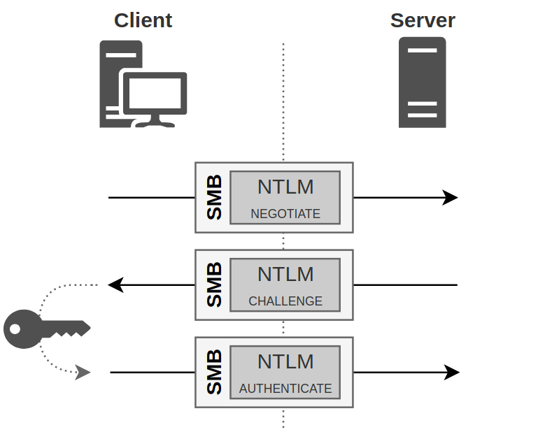
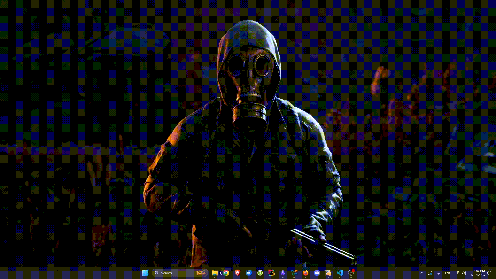
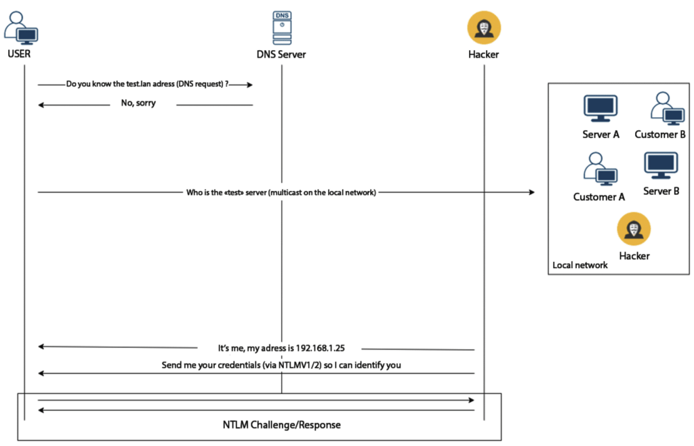

In today's blog post, we will cover questions such as what NTLM is, what it is used for, along with their answers.

### What is the NTLM?
NTLM (NT LAN Manager) is an authentication protocol developed by Microsoft for Windows systems.
It should not be considered a standalone security layer.
Instead, it acts as an authentication mechanism that other protocols—such as *SMB*, *RDP*, or *HTTP*—can rely on when they need to verify a user's identity.
You can think of NTLM as a service that other protocols call upon to handle authentication behind the scenes.
NTLMv1 was introduced in the early 1990s with Windows NT 3.1.
Due to security weaknesses, NTLMv2 was released in 1996, offering stronger protection against attacks like replay and brute-force.
Today, NTLMv1 is considered obsolete, and NTLMv2 is the minimum recommended version


### How it works?


<figure><figcaption></figcaption></figure>

#### 1.Negotiate Message
I tried to support what we have written with a diagram.
Now, let's first take a look at what happens on both the client and server sides during NTLM authentication.
At the beginning of the NTLM authentication process, the client sends a *hello* message to the server.
During this initial communication, the client indicates which NTLM version it supports, laying the groundwork for the authentication process.
The message sent is referred to as the 'Negotiate Message' or 'Type 1 Message'.

#### 2.Chanllenge Response
Then, the server sees the 'hello' message and responds.
If the client's NTLM version is compatible with the server's version, the server responds and asks the client to prove its identity.
The server also sends a unique challenge called the 'ServerChallenge'.
At this point, the client is required to use the ServerChallenge to prove its identity.
The presence of the ServerChallenge helps prevent replay attacks, especially when using NTLMv2. NTLMv2’s challenge-response mechanism provides stronger security because it uses complex hashes and additional information.
This part is known as the 'Challenge-Response' or 'Type 2 Message'.

At this point, we can practically analyze the server's Challenge-Response message.
Although there are many tools available, I will use the DUMPNTLMinfo tool, which comes embedded with Impacket in Kali Linux, to do this.

```zsh
➜  ~ impacket-DumpNTLMInfo 192.168.1.100
Impacket v0.12.0 - Copyright Fortra, LLC and its affiliated companies 

[*] Defaulting to SMB protocol.
[*] Using target: 192.168.1.100, IP: 192.168.1.100, Port: 445, Protocol: SMB
[+] SMBv1 Enabled   : False
[+] Prefered Dialect: SMB 3.0
[+] Server Security : SIGNING_ENABLED (not required)
[+] Max Read Size   : 8.0 MB (8388608 bytes)
[+] Max Write Size  : 8.0 MB (8388608 bytes)
[+] Current Time    : 2025-04-27 07:51:44.147193+00:00
[+] Name            : HOMEPC
[+] Domain          : HOMEPC
[+] DNS Domain Name : HomePC
[+] DNS Host Name   : HomePC
[+] OS              : Windows NT 10.0 Build 22621
[+] Null Session    : False
```

I've explained this with my own non-domain PC, but testing with domain-connected devices would be better. 
As we can see, we came across a lot of information. Let's try to explain what a few of these mean:

1. **[+] SMBv1 Enabled : False**
    It's good news that this outdated protocol is not enabled. Or is it bad? I'm not sure; is your job about exploiting or protecting? Ahahaha
    
2. **[+] Server Security : SIGNING_ENABLED (not required)**
    Here we have both good and bad news from a security perspective.
    Let's say our server supports signing, which is good. However, the "not required" part is bad.
    This means communication is possible even without signing.
    
3. **[+] Null Session : False**
    With a null session, we could gather information about some shares and domain settings (user groups, password policy, etc.).
    It's good that this is disabled.
    Besides, information about the OS, NDS name, and NETBIOS could also be obtained.


#### 3. AUTHENTICATE_MESSAGE
This message is the final message of the NTLM authentication process and is sent by the client to prove its identity to the server.


### NTLMv1 and NLTMv2 structure

Let's provide example NTLMv1 and NTLMv2 hashes and examine their structure.

`User::HostName:LmChallengeResponse:NtChallengeResponse:ServerChallenge`:

```zsh
[SMB] NTLMv1 Client   : 10.0.3.5
[SMB] NTLMv1 Username : Example_User
[SMB] NTLMv1 Hash     : Example_User::WIN-KFPWQK92K2C:abcdef1234567890abcdef12:fedcba0987654321fedcba09:9876543210abcdef
```

**We are seeing an example NTLMv1 hash value that we captured with Responder.**


`User::Domain:ServerChallenge:Response:NTLMv2_CLIENT_CHALLENGE`:

```zsh
[SMB] NTLMv2-SSP Client   : 10.0.3.50
[SMB] NTLMv2-SSP Username : HARDDOMAIN\Example_User2
[SMB] NTLMv2-SSP Hash     : Example_User2::HARDDOMAIN:fedcba9876543210:1234567890abcdef:03030000000000001122334455667788aabbccddeeff0000000005000c0061006e006f00740068006500720070000600100061006e006f007400680065007200700063002e006c006f0063006100080008001a2b3c4d5e6f8090
```

As seen in the example, NTLMv2 is a more advanced and more complex authentication mechanism.

In the GIF below, you see an example of capturing a hash with Responder.

First, let's run our Responder tool in poison mode.

```zsh
➜  ~ sudo responder -I eth0                        
```

<figure><figcaption></figcaption></figure>

Now, let's explain how this mechanism works.


<figure><figcaption></figcaption></figure>

What happens here is also known as LLMNR poisoning. The main issue occurs when a client tries to resolve a non-existent DNS name. The process works as follows: The client first asks the DNS server who owns the IP address corresponding to this name. Since there is no matching IP for the given name, the client mistakenly sends this query to the local network. At this point, we step in, reply with 'This IP is ours, let's authenticate,' and capture the hash.

Since it's an NTLMv2 hash, if the user is using a complex password, it might be impossible to crack it. Therefore, instead of cracking the hash, it might be more practical to perform relaying.


We will cover relaying and some more complex topics in our upcoming posts. This was a quick overview of NTLM.


